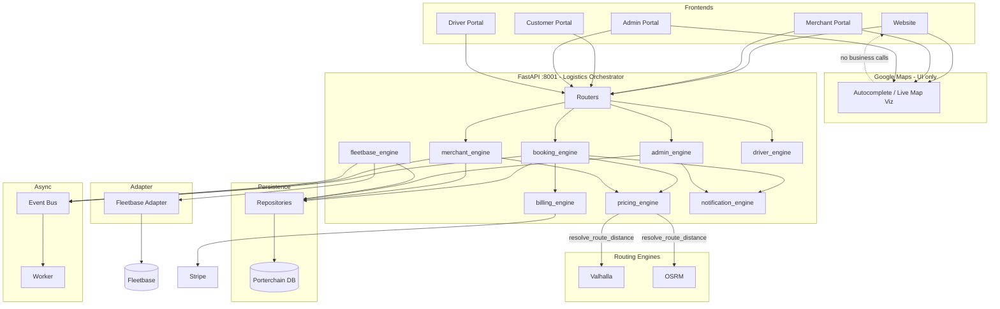

# Porterchain — API Flow Diagram

**Date:** June 30, 2026 · **Reference:** [masterrule.md](./masterrule.md) §7

---

## Canonical request flow



---

## Merchant booking flow

```
Merchant UI (Google autocomplete)
  → POST /v1/merchant/bookings
  → MerchantBookingService
  → resolve_route_distance() → Valhalla/OSRM
  → pricing_engine.calculate_merchant()
  → Order created
  → transition_to_dispatch_ready()
  → order.dispatch_requested + order.dispatch_ready
  → Event bus → BookingSyncService → FleetbaseAdapter → Fleetbase
```

---

## Retail customer flow

```
Website (Google autocomplete + quote preview Valhalla/OSRM)
  → POST /v1/quotes (server revalidates distance)
  → Booking draft → Stripe Checkout
  → POST /webhooks/stripe
  → BookingConfirmationService → order.dispatch_ready
  → Fleetbase sync (event-driven)
  → GET /v1/orders/{tracking}/tracking (adapter read)
```

---

## Admin live map flow

```
Admin UI (Google Maps viz)
  → WS /v1/admin/operations/live-map/ws
  → LiveMapService.snapshot() — Porterchain DB mirror
  → Never Fleetbase HTTP
```

---

## Driver flow

```
Driver UI
  → BFF /api/driver → /driver-api/v1/*
  → DriverAuthService / StopsService / DriverFleetbaseBridge
  → FleetbaseAdapter (GPS, POD) — execution only
  → order_transitions → Event bus
```

---

## Anti-shortcut verification

| Shortcut                             | Allowed?                     |
| ------------------------------------ | ---------------------------- |
| Frontend → Fleetbase                 | ❌                           |
| Frontend → Valhalla/OSRM for payment | ❌ (preview only on website) |
| Router → Fleetbase HTTP              | ❌                           |
| Service → Fleetbase without adapter  | ❌                           |
| Google Maps → pricing                | ❌                           |
