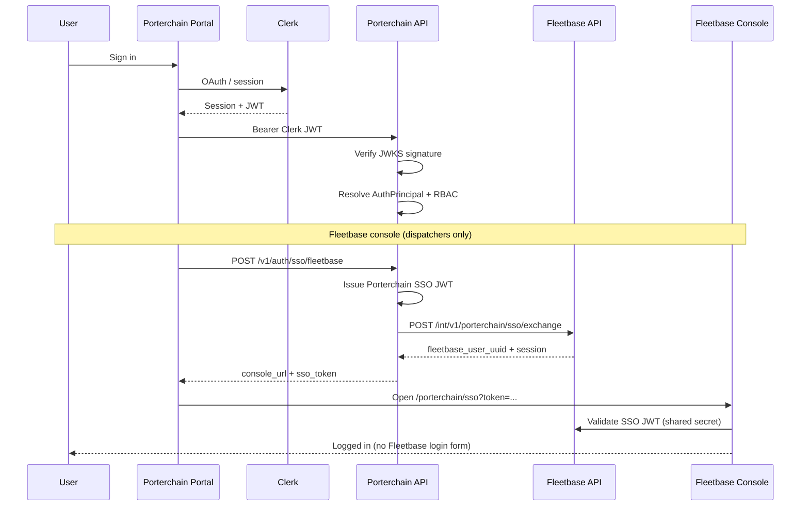

# Porterchain — Authentication Flow

**Version:** 2.0  
**Date:** June 29, 2026  
**Identity provider:** Clerk (single sign-on for all Porterchain users)

---

## Principle

**Authenticate once with Clerk.** Porterchain API validates every request. Fleetbase trusts Porterchain-issued SSO tokens — Porterchain users never use the Fleetbase login screen.

| Rule | Implementation |
|------|----------------|
| No duplicate users | `identity_links.clerk_user_id` maps to one platform record |
| No duplicate passwords | Clerk holds credentials; Fleetbase has no Porterchain user passwords |
| JWT passed securely | HTTPS only; short-lived Porterchain SSO JWT (default 5 min) |
| RBAC server-side | Permissions enforced in Porterchain API, synced to Fleetbase |

---

## User types

| User | Portal | Clerk | Fleetbase console |
|------|--------|-------|-------------------|
| **Merchant** | Merchant portal :3001 | Organization membership | No access |
| **Customer** | Website / retail dashboard | User account | No access |
| **Driver** | Mobile app (Clerk or Porterchain JWT) | Optional `clerk_user_id` on driver record | No access |
| **Dispatcher** | Admin portal :3002 | Admin user role `dispatcher` | SSO only |
| **Admin** | Admin portal | Admin user role `admin` | SSO only |
| **Support** | Admin portal | `support` / `support_lead` | SSO read-only |
| **Sales** | Admin portal | `sales` / `sales_manager` | No Fleetbase console |

---

## Flow diagram



---

## Step-by-step flows

### 1. Merchant / Admin portal login

1. User opens merchant portal (`:3001`) or admin portal (`:3002`)
2. Clerk middleware protects routes (`clerkMiddleware`)
3. Client obtains Clerk session JWT via `getToken()`
4. API requests include `Authorization: Bearer <clerk_jwt>`
5. Porterchain API:
   - Verifies JWT against `CLERK_JWKS_URL`
   - Extracts `ClerkClaims` (`sub`, `email`, `org_id`, metadata)
   - Resolves `AuthPrincipal` via `PrincipalResolver`
   - Enforces RBAC (`require_module`, merchant `require_module`)

### 2. Session introspection

```
GET /v1/auth/me
Authorization: Bearer <clerk_jwt>
```

Returns roles, permissions, `fleetbase_console_eligible`.

### 3. Fleetbase console SSO (dispatcher / admin / support)

```
POST /v1/auth/sso/fleetbase
Authorization: Bearer <clerk_jwt>
```

Response:

```json
{
  "sso_token": "<porterchain-signed-jwt>",
  "expires_in": 300,
  "console_url": "http://localhost:4200/porterchain/sso?token=...",
  "fleetbase_user_uuid": "...",
  "roles": ["dispatcher"],
  "permissions": ["dispatch:manage", "order:read"]
}
```

Admin portal **Operations** page: **Open Fleetbase Console (SSO)** opens `console_url` in a new tab.

### 4. Driver authentication

| Mode | Flow |
|------|------|
| **Clerk (target)** | Driver record linked via `drivers.clerk_user_id`; same Clerk JWT flow |
| **Porterchain JWT (legacy)** | `/auth/login` issues Porterchain JWT for mobile app |

Drivers never receive Fleetbase console access.

### 5. Retail customer

1. Anonymous quote on website (no auth)
2. Clerk sign-in at booking continuation
3. `customers.clerk_user_id` links session
4. API validates Clerk JWT on dashboard routes

---

## Token types

| Token | Issuer | Lifetime | Audience | Use |
|-------|--------|----------|----------|-----|
| Clerk session JWT | Clerk | Session | Porterchain API | All portal API calls |
| Porterchain SSO JWT | Porterchain API | 300s default | `fleetbase` | Fleetbase console SSO |
| Fleetbase Sanctum | Fleetbase | Session | Fleetbase API | Issued by SSO exchange (bridge) |
| Porterchain driver JWT | Porterchain API | 15–60 min | Driver API | Mobile execution |

---

## Security controls

| Control | Detail |
|---------|--------|
| HTTPS | Required in production for all token transport |
| JWKS rotation | Clerk keys fetched from `CLERK_JWKS_URL`; cached in API |
| SSO secret | `SSO_JWT_SECRET` shared only between Porterchain API and Fleetbase SSO bridge |
| Short TTL | SSO tokens expire in 5 minutes |
| No Fleetbase passwords | Porterchain users provisioned in Fleetbase without password auth |
| Server-side RBAC | Client displays UI; API rejects unauthorized actions |

---

## Environment variables

| Variable | Purpose |
|----------|---------|
| `CLERK_PUBLISHABLE_KEY` | Frontend Clerk SDK |
| `CLERK_SECRET_KEY` | Server Clerk API |
| `CLERK_JWKS_URL` | JWT verification |
| `CLERK_DEV_BYPASS` | Local dev without Clerk |
| `SSO_JWT_SECRET` | Sign Porterchain → Fleetbase SSO JWT |
| `JWT_SECRET` | Fallback signing secret |
| `SSO_TOKEN_TTL_SECONDS` | SSO token lifetime (default 300) |
| `FLEETBASE_CONSOLE_URL` | Console base URL for SSO redirect |
| `FLEETBASE_SSO_ENABLED` | Enable/disable SSO exchange |

---

## Code map

| Component | Path |
|-----------|------|
| Clerk verification | `apps/api/.../auth/clerk.py` |
| Principal resolution | `apps/api/.../auth/principal_resolver.py` |
| SSO service | `apps/api/.../auth/sso_service.py` |
| Identity links | `apps/api/.../identity_models.py` |
| Auth routes | `apps/api/.../routers/auth.py` |
| Fleetbase SSO client | `services/fleetbase/porterchain_fleetbase/sso/` |
| Admin RBAC | `apps/api/.../admin_engine/rbac.py` |
| Merchant RBAC | `apps/api/.../merchant_engine/rbac.py` |

---

## Related documents

- [SSO.md](./SSO.md) — Fleetbase trust bridge
- [RBAC.md](./RBAC.md) — Role and permission matrix
- [ROLE_PERMISSIONS.md](./ROLE_PERMISSIONS.md) — Full permission tables
