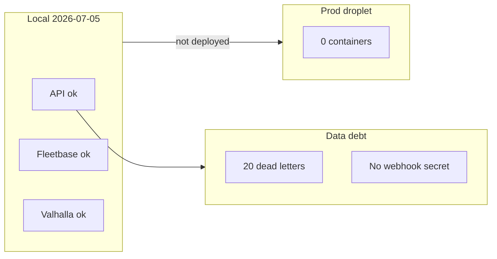

# CTO Documentation vs Implementation Audit Report

**Type:** CANONICAL
**masterrule:** [§21](./masterrule.md#21-simplification--essential-complexity)
**Last verified:** 2026-07-09

**Method:** 12 audit bunches + **191-file rollout** in [masterrule Appendix C](./masterrule.md#appendix-c--documentation-simplification-program) (39 groups × 5).  
**Authority:** [masterrule.md](./masterrule.md) §21

| Metric                                  | Value                                                                             |
| --------------------------------------- | --------------------------------------------------------------------------------- |
| Markdown files in repo                  | 283                                                                               |
| Pointer-only docs (`**pointer**` stubs) | 61                                                                                |
| Canonical platform docs audited         | 60 (12 × 5)                                                                       |
| API route handlers (`@router.*`)        | **483** across 20 router modules                                                  |
| Alembic head                            | `s2t3u4v5w6x7`                                                                    |
| Local audit remediation                 | **In progress** — see [Remediation log](#remediation-log); dev-layer guards in CI |

---

## TL;DR for leadership

| Question                  | Answer                                                                                                       |
| ------------------------- | ------------------------------------------------------------------------------------------------------------ |
| Is the architecture real? | **Yes** — engines, Fleetbase adapter, event bus, Clerk multi-portal auth are implemented, not aspirational.  |
| Can we ship today?        | **No** — production droplet has **zero containers**; Porterchain API down.                                   |
| Is local dev healthy?     | **Yes** — API, Fleetbase, Valhalla, Postgres/Redis all responding.                                           |
| Biggest code–ops gap?     | **Fleetbase sync backlog** — 1/31 orders linked; 20 dead-letter rows; webhook secret unset.                  |
| Biggest doc gap?          | **API surface** — README lists ~10 endpoints; OpenAPI has 483.                                               |
| What unblocks go-live?    | Redeploy droplet → migrations → Stripe webhook → worker → Fleetbase env (see [Go-live gate](#go-live-gate)). |

---

## How to read this report

| Column       | Meaning                                                                     |
| ------------ | --------------------------------------------------------------------------- |
| **Status**   | `OK` · `DRIFT` · `GAP` · `FIXED` · `POINTER`                                |
| **Severity** | `P0` production blocker · `P1` E2E blocker · `P2` ops/config · `P3` hygiene |

**Bunch summary (60 files):** 38 OK · 8 DRIFT · 2 GAP · 7 FIXED · 5 POINTER

---

## Live verification snapshot

_Probes run 2026-07-05 ~08:20 local time._

### Local dev

| Probe                             | Result                                                            |
| --------------------------------- | ----------------------------------------------------------------- |
| `GET localhost:8001/health/ready` | `ok` — database, redis, stripe, **fleetbase: bridge_enabled**     |
| `GET localhost:8000/health`       | **200**                                                           |
| `GET localhost:8002/status`       | **200** (Valhalla)                                                |
| Docker (Porterchain + Fleetbase)  | **13** containers running                                         |
| Dev frontends                     | website, merchant, admin, driver, customer dev servers active     |
| `apps/api/.env`                   | `fleetbase_dispatch_bridge=true` (overrides code default `false`) |
| `FLEETBASE_WEBHOOK_SECRET`        | **Empty**                                                         |
| `PORTERCHAIN_PUSH_SEND`           | **false** (FCM dry-run)                                           |

### Fleetbase sync (PostgreSQL)

| Metric                               | Value  |
| ------------------------------------ | ------ |
| Orders total                         | 31     |
| With `fleetbase_order_id`            | **1**  |
| Successful syncs (audit)             | 8      |
| Failed sync attempts (audit)         | 56     |
| Dead-letter rows (exhausted retries) | **20** |
| Pending retry queue                  | 0      |

> Failed count (56) includes retries; dead letters (20) are the subset that hit max attempts (`fleetbase_order_id_not_returned` from historical bad env).

### Production droplet (`68.183.103.49`)

| Probe                       | Result          |
| --------------------------- | --------------- |
| SSH                         | Reachable       |
| Running containers          | **0**           |
| `GET localhost:8001/health` | **Down**        |
| Disk                        | ~7.6 GB / 48 GB |

### CI / deploy history

| Run                                                                         | Date                 | Result     | Notes                                                        |
| --------------------------------------------------------------------------- | -------------------- | ---------- | ------------------------------------------------------------ |
| [#28704187095](https://github.com/porterchain/PCD/actions/runs/28704187095) | 2026-07-04 11:04 UTC | Success    | Smoke test passed (`booking-drafts OK`) — stack was deployed |
| [#28697708884](https://github.com/porterchain/PCD/actions/runs/28697708884) | 2026-07-04 06:28 UTC | **Failed** | `booking_drafts` missing — migrations before smoke test      |
| Hardening (local, uncommitted)                                              | 2026-07-05           | **FIXED**  | `deploy.yml` exits 1 on migration failure + table check      |

**Interpretation:** Deploy succeeded Jul 4, then the droplet was **emptied afterward** (manual wipe or `docker compose down`). Redeploy required; commit audit fixes first so hardened workflow ships.

### Prod stack when deployed (`docker-compose.prod.yml`)

| Service  | Container      | Port (internal) |
| -------- | -------------- | --------------- |
| postgres | `pcd-postgres` | 5432            |
| redis    | `pcd-redis`    | 6379            |
| api      | `pcd-api`      | 8001            |
| website  | `pcd-website`  | 3000            |
| merchant | `pcd-merchant` | 3001            |
| admin    | `pcd-admin`    | 3002            |
| driver   | `pcd-driver`   | 3003            |
| customer | `pcd-customer` | 3004            |
| caddy    | `pcd-caddy`    | 80/443          |

**Not in prod compose:** worker, Fleetbase, Valhalla, Firebase credentials on API.

---

## Go-live gate

| #   | Gate                           | Status                         | Owner action                                                                  |
| --- | ------------------------------ | ------------------------------ | ----------------------------------------------------------------------------- |
| G1  | Droplet stack running          | **FAIL**                       | `workflow_dispatch` deploy or push to `main` after CI                         |
| G2  | Migrations at head             | **FAIL** (prod) / PASS (local) | `repair_and_migrate.py` in deploy script                                      |
| G3  | Stripe webhook registered      | Unknown                        | `stripe listen` locally; `porterchain.com/webhooks/stripe` in prod            |
| G4  | Clerk production keys          | Unknown                        | Per-portal keys in API env                                                    |
| G5  | Worker consuming queues        | **FAIL**                       | Add worker to compose or separate process                                     |
| G6  | Fleetbase dispatch             | **FAIL** (prod)                | Deploy Fleetbase or set `FLEETBASE_DISPATCH_BRIDGE=false` + accept manual ops |
| G7  | Firebase push                  | **FAIL**                       | Credentials + `PORTERCHAIN_PUSH_SEND=true`                                    |
| G8  | Fleetbase sync backlog cleared | **FAIL** (local)               | Replay 20 dead letters; fix webhook secret                                    |
| G9  | Audit remediation committed    | **FAIL**                       | Commit local changes from this audit                                          |

---

## Executive scorecard

| Dimension              | Grade  | Rationale                                                                    |
| ---------------------- | ------ | ---------------------------------------------------------------------------- |
| Architecture fidelity  | **A-** | masterrule patterns implemented; thin `order_engine` / `reporting_engine`    |
| Documentation accuracy | **C+** | Canonical docs mostly right; 61 pointers; API underspecified                 |
| Production readiness   | **F**  | Droplet empty; worker/Fleetbase/Firebase not in prod path                    |
| Frontend parity        | **B-** | Website/merchant strong; tracking maps missing on customer/website           |
| Security posture       | **B**  | Clerk + RBAC solid; `jwt_secret` dev default; rate limits portal-scoped only |
| Operational runbooks   | **B**  | `docker:fleetbase:verify` works; deploy README honest about gaps             |



---

## Open issue register

| ID   | Sev | Issue                             | Evidence                                          | Action                              |
| ---- | --- | --------------------------------- | ------------------------------------------------- | ----------------------------------- |
| O-01 | P0  | Prod droplet offline              | 0 containers; API down                            | Redeploy (prod layer — FND-G5)      |
| O-02 | P1  | Fleetbase sync backlog            | 1/31 linked; 20 dead letters                      | Admin replay + fix env              |
| O-03 | P1  | Inbound Fleetbase webhooks        | `FLEETBASE_WEBHOOK_SECRET` empty                  | Set secret + Fleetbase console URL  |
| O-04 | P1  | ~~No worker in prod~~             | `docker-compose.prod.yml`                         | **FIXED** — worker service added    |
| O-05 | P1  | FCM dry-run                       | `push_send=false`                                 | Firebase creds in PCD path          |
| O-06 | P2  | ~~`route.optimized` not emitted~~ | M-009                                             | **FIXED** — §0.6.6                  |
| O-07 | P2  | ~~No tracking maps (web retail)~~ | M-006/M-007                                       | **FIXED** — TrackRouteMap §0.6.4    |
| O-08 | P2  | ~~API docs thin~~                 | 483 routes vs README ~10                          | **FIXED** — OpenAPI + Partner guide |
| O-09 | P2  | ~~Customer Stripe return URL~~    | Prod `RETAIL_CHECKOUT_SUCCESS_URL` → website only | **FIXED** — §0.6.5                  |
| O-10 | P3  | ~~Model sprawl~~                  | 9+ model modules                                  | **FIXED** — §0.6.8 strangler split  |
| O-11 | P3  | ~~Orphan `services/booking.py`~~  | Zero imports                                      | **FIXED** — deleted §0.6.9          |

---

## Remediation log

| ID   | Status                    | Change                                                                                                 |
| ---- | ------------------------- | ------------------------------------------------------------------------------------------------------ |
| R-01 | **FIXED** _(uncommitted)_ | Deploy: migration hard-fail + `booking_drafts` table check                                             |
| R-02 | **FIXED** _(uncommitted)_ | Exempt `/webhooks/` in rate-limit middleware _(defensive — webhooks were never in `_PREFIXES` anyway)_ |
| R-03 | **FIXED** _(uncommitted)_ | `fleetbase_dispatch_bridge` default `false`; local `.env` still `true`                                 |
| R-04 | **FIXED** _(uncommitted)_ | Customer `/book/success` + `syncBookingCheckout`                                                       |
| R-05 | **FIXED** _(uncommitted)_ | TECH_STACK, DOCKER_*, PORT_CONFIGURATION, PRODUCTION_READINESS, CONNECTIONS, BOOKING_FLOW              |
| R-06 | OPEN                      | Replay Fleetbase dead letters (prod)                                                                   |
| R-07 | **FIXED**                 | Prod compose: worker + Firebase + Fleetbase API env documented in RUNBOOK                              |
| R-08 | **FIXED** _(dev)_         | Pointer stubs ≤20 — `validate:doc-pointers` + `docs/archive/pointer-stubs/`                            |
| R-09 | **FIXED** _(dev)_         | §0.6 P2–P3 closed; §11 enterprise security + audit export; investor/monopoly metrics                   |

---

## Bunch audits (condensed)

<details>
<summary><strong>Bunch 1 — Foundation</strong> (masterrule, REPOSITORY_STRUCTURE, FOLDER_STRUCTURE, TECH_STACK, PLATFORM_FOUNDATION)</summary>

| File                    | Status  | Notes                                 |
| ----------------------- | ------- | ------------------------------------- |
| masterrule.md           | OK      | Engines + Fleetbase adapter enforced  |
| REPOSITORY_STRUCTURE.md | OK      | Ports and aliases correct             |
| FOLDER_STRUCTURE.md     | POINTER | → REPOSITORY_STRUCTURE                |
| TECH_STACK.md           | FIXED   | Python 3.13                           |
| PLATFORM_FOUNDATION.md  | DRIFT   | Worker missing from prod compose (P1) |

</details>

<details>
<summary><strong>Bunch 2 — Readiness</strong> (PRODUCTION_READINESS, GAP_ANALYSIS, MISSING_INTEGRATIONS, MODULE_SCORECARD, ARCHITECTURE_ALIGNMENT)</summary>

| File                             | Status  | Notes                                                 |
| -------------------------------- | ------- | ----------------------------------------------------- |
| PRODUCTION_READINESS_REPORT.md   | FIXED   | `STRIPE_SECRET`; partial Postgres; worker note        |
| GAP_ANALYSIS.md                  | OK      | Driver router, merchant→admin, expiration worker open |
| MISSING_INTEGRATIONS.md          | OK      | M-009, M-012, maps confirmed                          |
| MODULE_SCORECARD.md              | DRIFT   | Mobile % conflicts across docs (P3)                   |
| ARCHITECTURE_ALIGNMENT_REPORT.md | POINTER | —                                                     |

</details>

<details>
<summary><strong>Bunch 3 — Integrations</strong> (INTEGRATIONS, INTEGRATION_AUDIT, CONNECTIONS, integrations.yaml, SSO)</summary>

| File                 | Status  | Notes                                     |
| -------------------- | ------- | ----------------------------------------- |
| INTEGRATIONS.md      | OK      | Matrix matches code                       |
| INTEGRATION_AUDIT.md | POINTER | —                                         |
| CONNECTIONS.md       | FIXED   | `pop-photo` documented as not implemented |
| integrations.yaml    | OK      | `firebase_fcm: partial` accurate          |
| SSO.md               | OK      | `JWT_SECRET` deploy alias                 |

</details>

<details>
<summary><strong>Bunch 4 — Fleetbase</strong></summary>

All adapter/webhook docs **OK** except FLEETBASE_WEBHOOKS (POINTER, secret empty) and FLEETBASE_USAGE (DRIFT — gitignored vendor tree).

</details>

<details>
<summary><strong>Bunch 5 — Docker / env</strong></summary>

DOCKER_SETUP, DOCKER_ARCHITECTURE, PORT_CONFIGURATION **FIXED**. deploy/README and env/README **OK**. Prod gaps: no worker, no `FIREBASE_*` on API.

</details>

<details>
<summary><strong>Bunches 6–12</strong> — Architecture flows, Auth, Maps, Merchant, Driver/Mobile, DB/Events, Notifications</summary>

| Area                | Verdict                                                                       |
| ------------------- | ----------------------------------------------------------------------------- |
| Architecture flows  | OK; BOOKING_FLOW FIXED (`sync-checkout`); FLEETBASE_FLOW inbound blocked (P1) |
| Auth / RBAC         | OK; `jwt_secret` dev default risk                                             |
| Maps / Route Center | OK docs; GAP — no live map on website/customer `/track/*`                     |
| Merchant            | OK; GAP-H02 coupling remains                                                  |
| Driver / mobile     | OK; driver-portal BFF undocumented (P3)                                       |
| DB / events         | OK; model sprawl (P3)                                                         |
| Notifications       | DRIFT — worker required; SECURITY rate-limit note corrected                   |

</details>

---

## API surface (483 handlers)

| Router            |   Count | Router                 | Count |
| ----------------- | ------: | ---------------------- | ----: |
| admin.py          |     100 | merchant.py            |   100 |
| driver.py         |      74 | crm.py                 |    50 |
| merchants.py      |      25 | route_center.py        |    24 |
| operations.py     |      22 | drivers_admin.py       |    20 |
| diagnostics.py    |      16 | notifications.py       |     9 |
| auth.py           |       8 | quotes.py              |     6 |
| booking_drafts.py |       5 | merchant_api.py        |     5 |
| orders.py         |       3 | webhooks.py            |     2 |
| customers.py      |       4 | payments.py            |     1 |
| security.py       |       1 | notifications_admin.py |     8 |
| **Total**         | **483** |                        |       |

OpenAPI: `http://localhost:8001/docs` · Production: `https://api.porterchain.com/docs` (when stack is up)

---

## Local vs production

| Capability           | Local                               | Production     |
| -------------------- | ----------------------------------- | -------------- |
| Porterchain API      | Up                                  | **Down**       |
| Postgres + Redis     | Up                                  | **Down**       |
| Fleetbase            | Up `:8000`                          | Not deployed   |
| Valhalla pricing     | Up `:8002`                          | Not deployed   |
| Stripe E2E           | `STRIPE_MOCK=false` + sync-checkout | N/A            |
| Fleetbase order sync | Bridge on; 20 dead letters          | N/A            |
| Firebase push        | Dry-run                             | Not configured |
| Worker               | `pnpm dev:worker`                   | Not in compose |
| Portals              | `:3000–3004`                        | Not deployed   |

---

## Recommended next steps

1. **Execute [masterrule Appendix C](./masterrule.md#appendix-c--documentation-simplification-program)** — 39 groups × 5 files; mark groups `Done` when merged.
2. **Commit** audit remediation (deploy.yml, config, customer success, §21 doc headers on 191 files).
3. **Redeploy** droplet — verify go-live gates G1–G2.
4. **Replay** Fleetbase dead letters; set `FLEETBASE_WEBHOOK_SECRET`.
5. **Code simplification** per [§21.3](./masterrule.md#213-code-simplification-priorities) — thin routers, Fleetbase sync UX, one customer surface.

---

## Verification commands

```bash
# Health
curl -s http://localhost:8001/health/ready | python3 -m json.tool
curl -s -o /dev/null -w "fleetbase:%{http_code} valhalla:%{http_code}\n" \
  http://localhost:8000/health http://localhost:8002/status

# Fleetbase + schema
pnpm docker:fleetbase:verify
cd apps/api && alembic current

# Sync monitor (admin auth required in prod)
curl -s http://localhost:8001/v1/admin/diagnostics/fleetbase-sync | python3 -m json.tool

# Production
ssh root@68.183.103.49 'docker ps -a; curl -s -o /dev/null -w "api:%{http_code}\n" http://localhost:8001/health'
```

---

## Related documents

| Document                                                         | Role                   |
| ---------------------------------------------------------------- | ---------------------- |
| [docs/README.md](docs/README.md)                                 | Documentation index    |
| [PRODUCTION_READINESS_REPORT.md](PRODUCTION_READINESS_REPORT.md) | Go/no-go certification |
| [GAP_ANALYSIS.md](GAP_ANALYSIS.md)                               | Open platform gaps     |
| [MISSING_INTEGRATIONS.md](MISSING_INTEGRATIONS.md)               | Integration backlog    |

---

## Changelog

| Date              | Change                                                                                            |
| ----------------- | ------------------------------------------------------------------------------------------------- |
| 2026-07-05 pass 1 | Initial 12-bunch audit + remediation                                                              |
| 2026-07-05 pass 2 | Scorecard, open register, API count, local vs prod matrix                                         |
| 2026-07-05 pass 4 | masterrule §21 Fowler simplification; Appendix C 39 groups; Type headers on 191 platform MD files |
| 2026-07-05 pass 5 | Appendix C Phase 1 complete — 62 pointers, 91 canonical, 15 reports, 22 READMEs                   |

---

## Governance

| Document                                   | Role              |
| ------------------------------------------ | ----------------- |
| [masterrule.md](masterrule.md)             | Architecture SSOT |
| [CTO_AUDIT_REPORT.md](CTO_AUDIT_REPORT.md) | Doc vs code audit |
