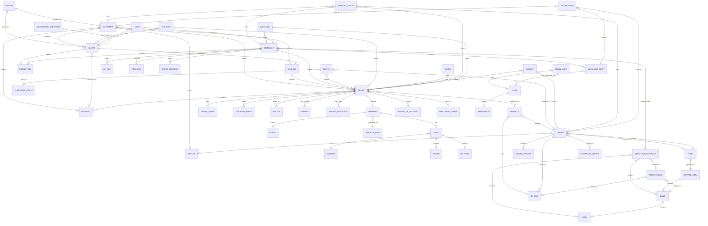
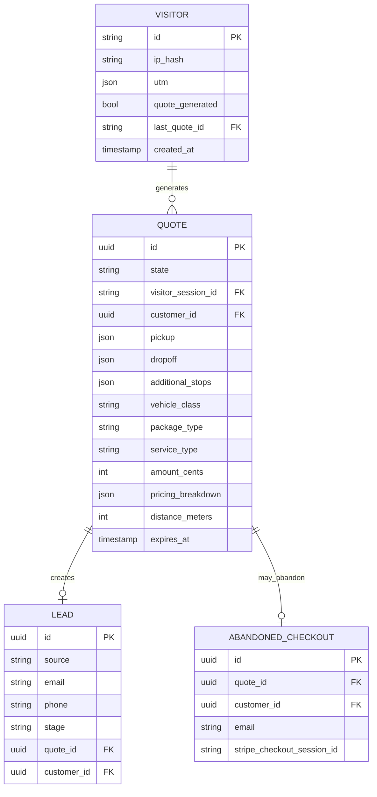
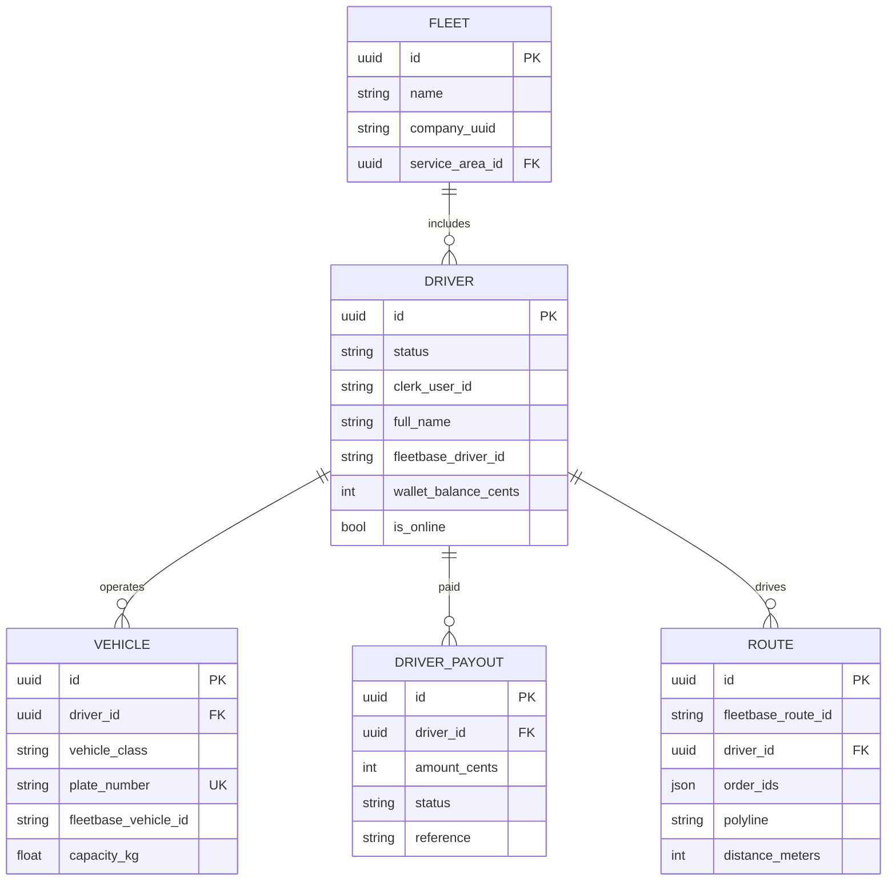
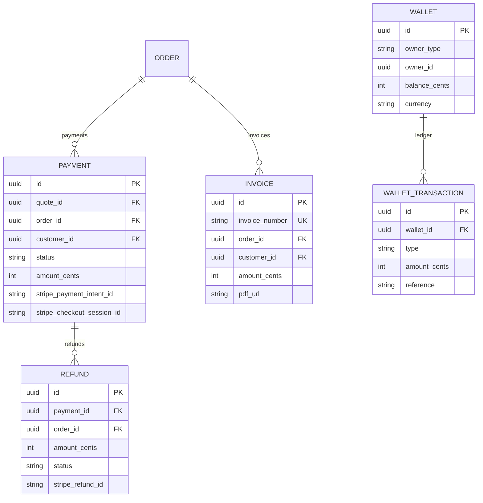
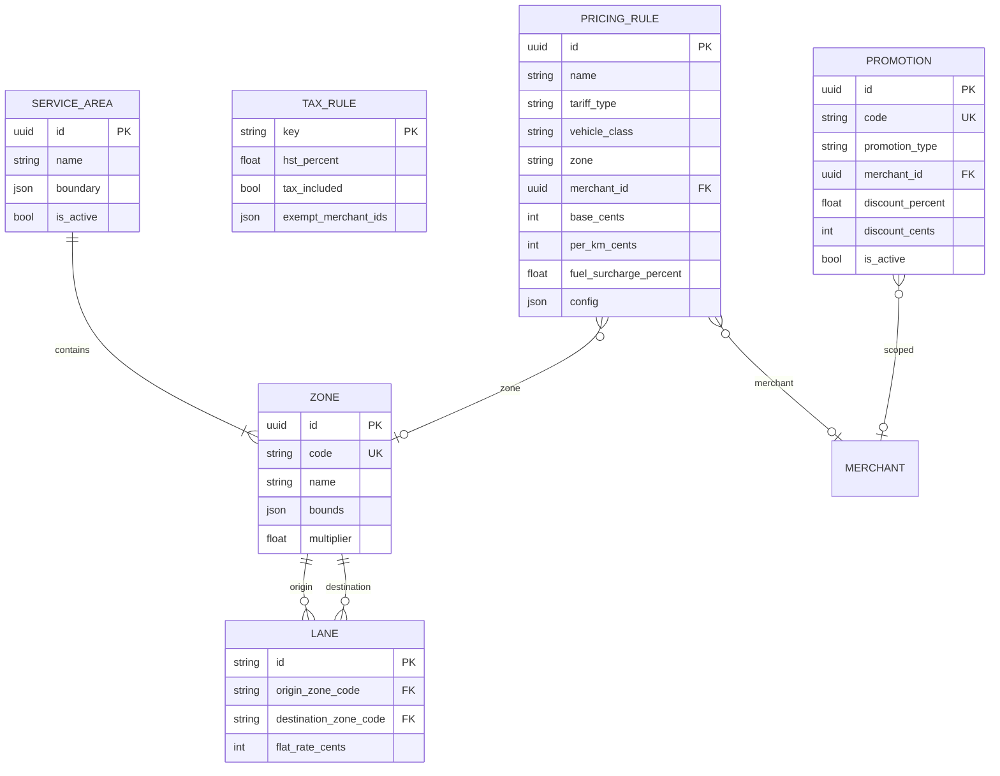
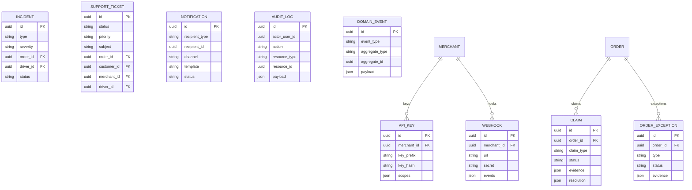
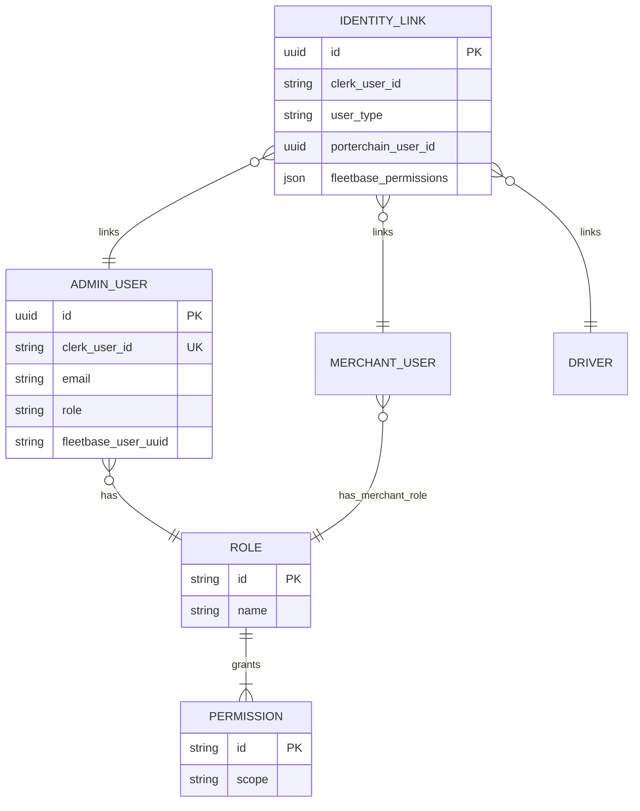

# Porterchain — Entity Relationship Model

**Document version:** 2.0  
**Date:** June 29, 2026  
**Status:** Canonical — aligned with [DOMAIN_MODEL.md](./DOMAIN_MODEL.md)

---

## Data ownership

| Store                      | Owner                                | Entities                                 |
| -------------------------- | ------------------------------------ | ---------------------------------------- |
| **Porterchain PostgreSQL** | Porterchain API                      | All entities below except Fleetbase refs |
| **Fleetbase MySQL**        | Fleetbase (read-only to Porterchain) | Operational orders, drivers, routes, GPS |
| **Redis**                  | Infrastructure                       | Queues, cache, rate limits               |
| **Object storage**         | Porterchain                          | POD images, invoice PDFs, documents      |
| **Clerk**                  | Clerk                                | Credentials, org memberships             |
| **Stripe**                 | Stripe                               | Payment intents, refunds, invoices       |

**Golden rule:** `order.id` and `tracking_number` are customer-facing. `fleetbase_order_id` is an operational foreign key — never exposed as primary identity.

---

## Master ER diagram



---

## Acquisition context



---

## Commercial context

```mermaid
erDiagram
    CUSTOMER {
        uuid id PK
        string clerk_user_id UK
        string email
        string phone
        string visitor_session_id
    }

    BOOKING {
        uuid id PK
        string booking_number UK
        string state
        uuid quote_id FK UK
        uuid customer_id FK
        uuid order_id FK UK
    }

    MERCHANT {
        uuid id PK
        string status
        string company_name
        string clerk_org_id UK
        string payment_terms
        int credit_limit_cents
        json pricing_config
    }

    MERCHANT_USER {
        uuid id PK
        uuid merchant_id FK
        string clerk_user_id UK
        string role
        string email
    }

    MERCHANT_CONTRACT {
        uuid id PK
        uuid merchant_id FK
        string name
        json rules
        int minimum_monthly_commitment_cents
        bool is_active
        timestamp effective_from
        timestamp effective_to
    }

    CUSTOMER ||--o{ BOOKING : confirms
    MERCHANT ||--o{ MERCHANT_USER : has
    MERCHANT ||--o{ MERCHANT_CONTRACT : signs
```

---

## Fulfillment context

```mermaid
erDiagram
    ORDER {
        uuid id PK
        string order_number UK
        string tracking_number UK
        string state
        uuid quote_id FK
        uuid customer_id FK
        uuid merchant_id FK
        string payment_terms
        int amount_cents
        string fleetbase_order_id
        json pickup
        json dropoff
        timestamp scheduled_at
    }

    SHIPMENT {
        uuid id PK
        uuid order_id FK UK
        string service_type
        string status
        string fleetbase_payload_id
    }

    PARCEL {
        uuid id PK
        uuid shipment_id FK
        string package_type
        float weight_kg
        json dimensions
        int declared_value_cents
    }

    STOP {
        uuid id PK
        uuid shipment_id FK
        int sequence
        string type
        json address
        string status
        timestamp completed_at
    }

    DISPATCH {
        uuid id PK
        uuid order_id FK
        uuid driver_id FK
        uuid vehicle_id FK
        string status
        timestamp assigned_at
    }

    ORDER_EVENT {
        uuid id PK
        uuid order_id FK
        string event_type
        string from_state
        string to_state
        string actor_type
        timestamp occurred_at
    }

    TRACKING_EVENT {
        uuid id PK
        uuid order_id FK
        string event_type
        float latitude
        float longitude
        timestamp occurred_at
        string source
    }

    PROOF_OF_DELIVERY {
        uuid id PK
        uuid order_id FK
        string type
        string storage_url
        float gps_lat
        float gps_lng
        bool verified
    }

    ORDER ||--|| SHIPMENT : has
    SHIPMENT ||--|{ PARCEL : contains
    SHIPMENT ||--|{ STOP : has
    ORDER ||--o| DISPATCH : dispatch
    ORDER ||--o{ ORDER_EVENT : events
    ORDER ||--o{ TRACKING_EVENT : tracking
    ORDER ||--o{ PROOF_OF_DELIVERY : pod
```

---

## Fleet context



---

## Billing context



---

## Pricing context



---

## Support & governance context



---

## Identity & RBAC



---

## Fleetbase external references

| Porterchain entity | Fleetbase entity | FK field               |
| ------------------ | ---------------- | ---------------------- |
| Order              | order            | `fleetbase_order_id`   |
| Driver             | driver           | `fleetbase_driver_id`  |
| Vehicle            | vehicle          | `fleetbase_vehicle_id` |
| Route              | route / tracker  | `fleetbase_route_id`   |
| ProofOfDelivery    | proof            | `fleetbase_proof_id`   |
| Fleet              | company          | `company_uuid`         |
| Shipment           | order payload    | `fleetbase_payload_id` |

**No Porterchain business entity is stored only in Fleetbase.**

---

## Cardinality summary

| Relationship        | Cardinality | Notes                                |
| ------------------- | ----------- | ------------------------------------ |
| Visitor → Quote     | 1:N         | Session may generate multiple quotes |
| Quote → Booking     | 1:1         | Retail conversion                    |
| Booking → Order     | 1:1         | Post-payment                         |
| Order → Shipment    | 1:1         | MVP; future 1:N                      |
| Shipment → Stop     | 1:N         | Min 2 (pickup + delivery)            |
| Shipment → Parcel   | 1:N         | MVP often 1                          |
| Order → Payment     | 1:N         | Retries, partial (future)            |
| Order → Invoice     | 1:N         | Adjustments, merchant statements     |
| Merchant → Contract | 1:N         | Historical versions                  |
| Merchant → Order    | 1:N         | B2B volume                           |
| Driver → Vehicle    | 1:N         | Partner may have multiple            |
| Driver → Dispatch   | 1:N         | Over time                            |
| Order → Dispatch    | 1:1         | Active assignment                    |
| Promotion → Quote   | N:1         | One code per quote                   |
| Zone → Lane         | N:M         | Via origin/destination codes         |

---

## Persistence mapping (current implementation)

| Logical entity    | Physical table                      | Status                          |
| ----------------- | ----------------------------------- | ------------------------------- |
| Visitor           | `visitor_sessions`                  | Live                            |
| Customer          | `customers`                         | Live                            |
| Quote             | `quotes`                            | Live                            |
| Booking           | `bookings`                          | Live                            |
| Order             | `orders`                            | Live                            |
| Payment           | `payments`                          | Live                            |
| Invoice           | `invoices`                          | Live                            |
| OrderEvent        | `order_events`                      | Live                            |
| DomainEvent       | `domain_events`                     | Live                            |
| OrderException    | `order_exceptions`                  | Live                            |
| Lead              | `leads`                             | Live                            |
| AbandonedCheckout | `abandoned_checkouts`               | Live                            |
| Merchant          | `merchants`                         | Live                            |
| MerchantUser      | `merchant_users`                    | Live                            |
| MerchantContract  | `merchant_contracts`                | Live                            |
| ApiKey            | `merchant_api_keys`                 | Live                            |
| Webhook           | `merchant_webhooks`                 | Live                            |
| Driver            | `drivers`                           | Live                            |
| Vehicle           | `vehicles`                          | Live                            |
| DriverPayout      | `driver_payouts`                    | Live                            |
| Promotion         | `promotions`                        | Live                            |
| PricingRule       | `pricing_tariffs`                   | Live                            |
| Zone              | `pricing_zones`                     | Live                            |
| TaxRule           | `system_config` (key=`pricing_tax`) | Live                            |
| Claim             | `claims`                            | Live                            |
| SupportTicket     | `support_tickets`                   | Live                            |
| AuditLog          | `admin_audit_logs`                  | Live                            |
| Shipment          | —                                   | Target (`shipments`)            |
| Parcel            | —                                   | Target (`parcels`)              |
| Stop              | —                                   | Target (`stops`)                |
| Dispatch          | —                                   | Target (`dispatches`)           |
| TrackingEvent     | —                                   | Target (extend `order_events`)  |
| ProofOfDelivery   | —                                   | Target (`proof_of_delivery`)    |
| Refund            | —                                   | Target (`refunds`)              |
| Wallet            | —                                   | Target (`wallets`)              |
| Incident          | —                                   | Target (`incidents`)            |
| Notification      | —                                   | Target (`notifications`)        |
| Route             | —                                   | Target (`routes`)               |
| Fleet             | —                                   | Target (`fleets`)               |
| ServiceArea       | —                                   | Target (`service_areas`)        |
| Lane              | —                                   | Embedded in contract/rules JSON |

---

## Recommended indexes

| Table             | Index                              | Purpose          |
| ----------------- | ---------------------------------- | ---------------- |
| `orders`          | `(state, scheduled_at)`            | Dispatch queue   |
| `orders`          | `(tracking_number)` UNIQUE         | Public tracking  |
| `orders`          | `(merchant_id, created_at)`        | Merchant list    |
| `orders`          | `(customer_id, created_at)`        | Customer history |
| `orders`          | `(fleetbase_order_id)`             | Webhook lookup   |
| `quotes`          | `(visitor_session_id)`             | Session merge    |
| `quotes`          | `(expires_at) WHERE state='QUOTE'` | Expiry job       |
| `dispatches`      | `(driver_id, status)`              | Driver app       |
| `tracking_events` | `(order_id, occurred_at)`          | Timeline         |
| `domain_events`   | `(aggregate_type, aggregate_id)`   | Event replay     |
| `promotions`      | `(code)` UNIQUE                    | Redemption       |
| `pricing_zones`   | `(code)` UNIQUE                    | Zone lookup      |

---

## Anonymous session merge

```
visitor_sessions.id (cookie)
    → quotes.visitor_session_id
    → customers.visitor_session_id (on Clerk auth)
    → UPDATE quotes, abandoned_checkouts SET customer_id = :id
    → EMIT visitor.session_merged
```

---

## Related documents

- [DOMAIN_MODEL.md](./DOMAIN_MODEL.md) — Aggregate boundaries, validation, lifecycle
- [BUSINESS_GLOSSARY.md](./BUSINESS_GLOSSARY.md) — Term definitions
- [ORDER_LIFECYCLE.md](./ORDER_LIFECYCLE.md)
- [DATABASE_ARCHITECTURE.md](./DATABASE_ARCHITECTURE.md)
- [EVENT_FLOW.md](./EVENT_FLOW.md)

---

_Logical ER model for Porterchain-owned data. Fleetbase schema governed by upstream._
