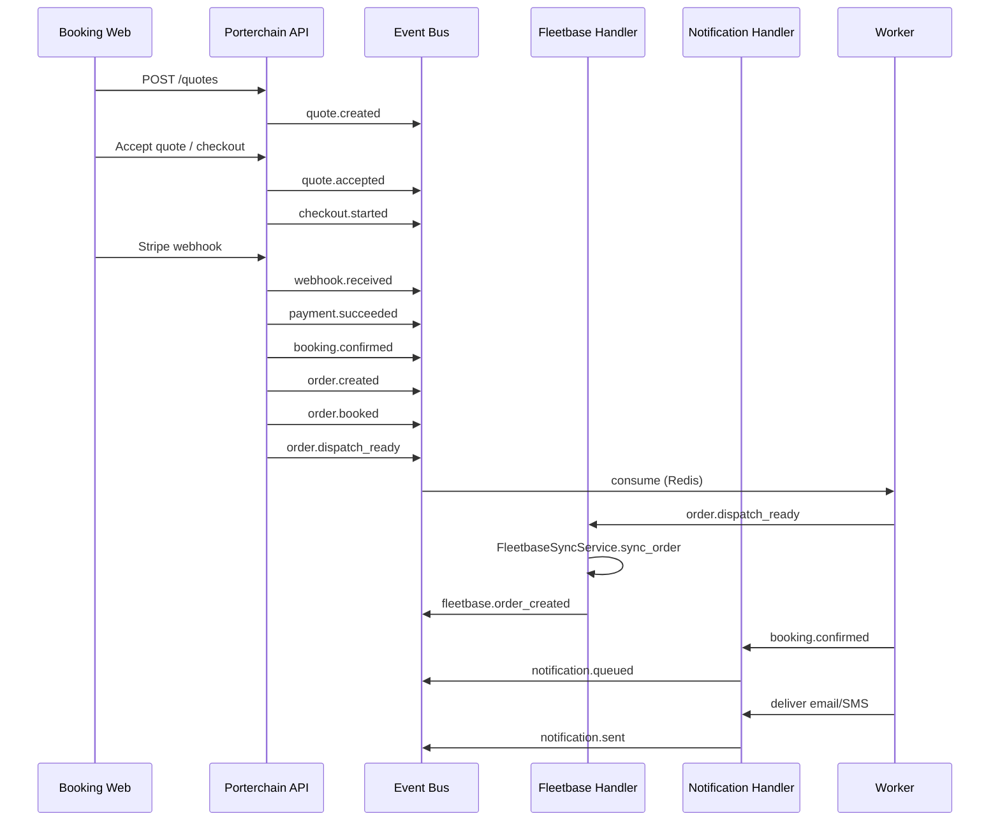
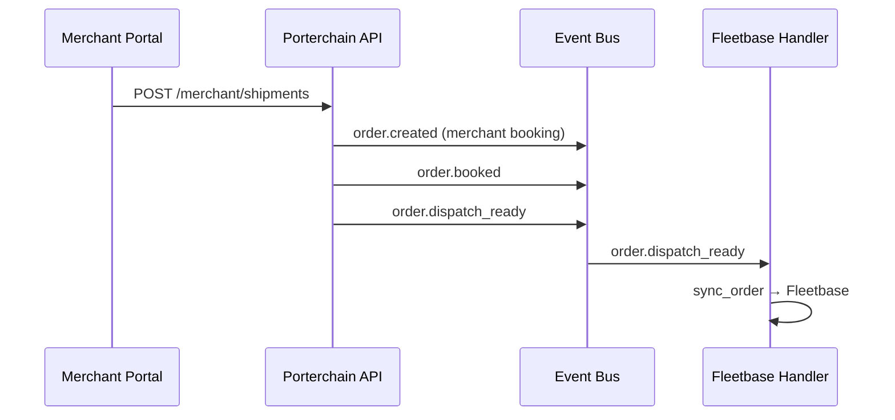
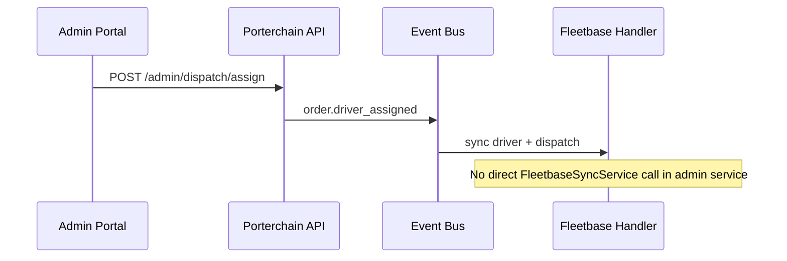
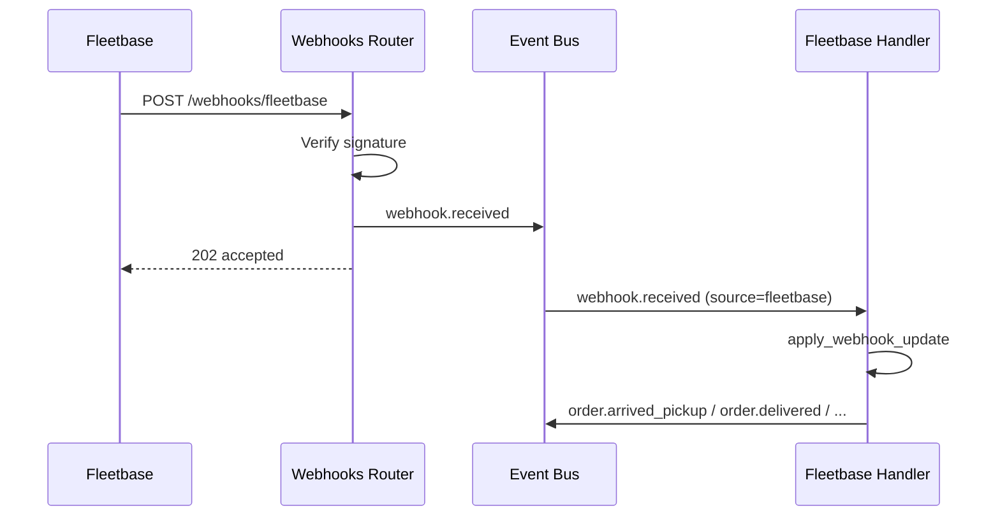

# Porterchain — Event Flow

**Document version:** 2.0  
**Date:** June 29, 2026

---

## Principles

1. **Every module publishes events; no module calls another module directly.**
2. **Fleetbase is reached only via event handlers** (`fleetbase_sync_handler`), never from booking or admin services.
3. **All events are immutable** — persisted to `domain_events` table plus Redis stream.
4. **At-least-once delivery** — idempotency keys prevent duplicate side effects.

---

## B2C booking flow



### Event chain (B2C)

| Step | Event                     | Publisher                |
| ---- | ------------------------- | ------------------------ |
| 1    | `quote.created`           | Quote service            |
| 2    | `quote.accepted`          | Quote service            |
| 3    | `checkout.started`        | Booking service          |
| 4    | `webhook.received`        | Webhooks router (Stripe) |
| 5    | `payment.succeeded`       | Payment service          |
| 6    | `booking.confirmed`       | Confirmation service     |
| 7    | `order.created`           | Confirmation service     |
| 8    | `order.booked`            | Confirmation service     |
| 9    | `order.dispatch_ready`    | Order transitions        |
| 10   | `fleetbase.order_created` | Fleetbase sync handler   |
| 11   | `notification.queued`     | Notification handler     |
| 12   | `notification.sent`       | Notification worker      |

---

## B2B merchant booking flow



Merchant bookings skip payment events (`payment_terms = NET_*`). Fleetbase sync is triggered solely by `order.dispatch_ready`.

---

## Dispatch & driver assignment



---

## Fleetbase inbound webhooks



Webhook ingress **only validates and emits**. State transitions happen in the handler.

---

## Payment & billing

| Event                   | Trigger                         | Downstream                      |
| ----------------------- | ------------------------------- | ------------------------------- |
| `payment.succeeded`     | Stripe webhook / mark succeeded | Billing queue → settlement      |
| `order.invoiced`        | Billing job                     | Email invoice, merchant webhook |
| `merchant.billed`       | Net-terms cycle                 | AR system, dunning              |
| `driver.payout_created` | Payout batch                    | Stripe Connect / payroll        |
| `refund.requested`      | Customer/ops                    | Finance review queue            |
| `refund.issued`         | Finance approval                | Stripe refund API               |

---

## Claims & exceptions

| Event            | Trigger                  | Downstream                          |
| ---------------- | ------------------------ | ----------------------------------- |
| `claim.opened`   | Customer/merchant report | Compliance, finance hold            |
| `claim.resolved` | Ops resolution           | Customer notify, billing adjustment |

---

## Notification pipeline

```
Domain event
    → notification_handler (queues)
    → notification.queued
    → worker (email / SMS / push queue)
    → provider API
    → notification.sent
```

---

## Merchant webhook fan-out

Any `order.*` event is enqueued to the webhooks queue for merchant-configured endpoints:

```
order.delivered → webhook queue → POST merchant URL
```

---

## Correlation IDs

| Flow                 | correlation_id           |
| -------------------- | ------------------------ |
| Quote → order        | `quote_id`               |
| Order → invoice      | `order_id`               |
| Order → payment      | `quote_id` or `order_id` |
| Booking confirmation | `order_id`               |

Use `event_id` for idempotency; use `correlation_id` for distributed tracing.

---

## Failure handling

```
Handler throws
  → retry (exponential backoff, max 3)
  → still failing
  → DLQ (porterchain:events:dlq)
  → ops alert + manual replay
```

Duplicate delivery (Redis redelivery):

```
event_id already in idempotency store → skip handler
```

---

## Module decoupling checklist

| Before (coupled)                                           | After (event-driven)              |
| ---------------------------------------------------------- | --------------------------------- |
| `confirmation_service` → `FleetbaseSyncService.sync_order` | `order.dispatch_ready` → handler  |
| `confirmation_service` → `NotificationService.send_*`      | `booking.confirmed` → handler     |
| `merchant booking` → `FleetbaseSyncService.sync_order`     | `order.dispatch_ready` → handler  |
| `admin assign_driver` → `FleetbaseSyncService`             | `order.driver_assigned` → handler |
| `webhooks/fleetbase` → `apply_webhook_update`              | `webhook.received` → handler      |

---

## Related documents

- [EVENT_BUS.md](./EVENT_BUS.md) — bus implementation
- [EVENT_CATALOG.md](./EVENT_CATALOG.md) — full event reference
- [DOMAIN_MODEL.md](./DOMAIN_MODEL.md) — aggregates and bounded contexts
