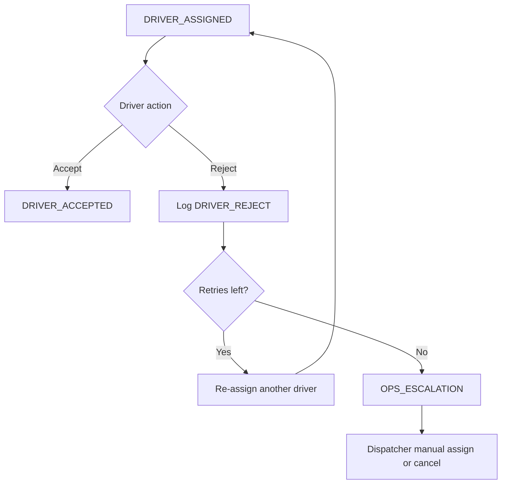

# Porterchain — Exception Workflows

**Type:** CANONICAL
**masterrule:** [§21](./masterrule.md#21-simplification--essential-complexity)
**Last verified:** 2026-07-05

---

## Principles

1. **Every exception is a first-class record** linked to an order.
2. **State + exception type** both updated — never silent failure.
3. **Actor, reason code, evidence** required for audit.
4. **Recovery paths** defined per type (reassign, reschedule, refund, claim).
5. **Customer notification** mandatory for customer-impacting exceptions.

---

## Exception taxonomy

| Code                   | Category     | Typical state transition      |
| ---------------------- | ------------ | ----------------------------- |
| `DRIVER_REJECT`        | Driver       | `DRIVER_ASSIGNED` → re-assign |
| `DRIVER_TIMEOUT`       | Driver       | `DRIVER_ASSIGNED` → re-assign |
| `DRIVER_UNAVAILABLE`   | Driver       | Hold / re-assign              |
| `VEHICLE_BREAKDOWN`    | Driver       | `IN_TRANSIT` → `FAILED`       |
| `DRIVER_CANCEL`        | Driver       | → `CANCELLED` / `FAILED`      |
| `CUSTOMER_UNAVAILABLE` | Customer     | `AT_DESTINATION` → `FAILED`   |
| `WRONG_ADDRESS`        | Customer/Ops | Hold → correct → re-dispatch  |
| `PARCEL_DAMAGED`       | Parcel       | → `DAMAGED` → `CLAIM_OPEN`    |
| `PARCEL_LOST`          | Parcel       | → `LOST` → `CLAIM_OPEN`       |
| `FAILED_DELIVERY`      | Delivery     | → `FAILED`                    |
| `RETURN_TO_SENDER`     | Delivery     | → `RETURN_TO_SENDER`          |
| `INSURANCE_CLAIM`      | Financial    | → `CLAIM_OPEN`                |
| `REFUND_REQUEST`       | Financial    | → `REFUNDED`                  |
| `OPS_ESCALATION`       | Operations   | Manual review queue           |

---

## Workflow: driver rejects assignment

| Step | Owner      | Action                                      |
| ---- | ---------- | ------------------------------------------- |
| 1    | Driver     | Tap reject + reason                         |
| 2    | System     | Log exception; increment reject count       |
| 3    | System     | Auto-assign next eligible driver            |
| 4    | Dispatcher | If 3 failures → manual queue                |
| 5    | Support    | Notify customer if delay &gt; SLA threshold |

---

## Workflow: driver timeout (no accept)

| Step | Action                                                        |
| ---- | ------------------------------------------------------------- |
| 1    | Timer fires on `DRIVER_ASSIGNED`                              |
| 2    | Exception `DRIVER_TIMEOUT` created                            |
| 3    | Unassign driver; return to `DISPATCH_READY` or auto re-assign |
| 4    | Ops dashboard alert                                           |

---

## Workflow: customer unavailable

| Step | Owner             | Action                                         |
| ---- | ----------------- | ---------------------------------------------- |
| 1    | Driver            | Arrives; cannot reach customer                 |
| 2    | Driver            | Report `CUSTOMER_UNAVAILABLE` + photo          |
| 3    | System            | State → `FAILED` (attempt 1)                   |
| 4    | Support           | Call customer; reschedule window               |
| 5a   | Success           | New schedule → `DISPATCH_READY`                |
| 5b   | Fail max attempts | `RETURN_TO_SENDER` or `CANCELLED` + fee policy |

---

## Workflow: wrong address

| Step | Owner             | Action                                           |
| ---- | ----------------- | ------------------------------------------------ |
| 1    | Driver / Customer | Report wrong address                             |
| 2    | Support           | Verify via Maps geocode + customer confirm       |
| 3    | Ops               | Update address; recalculate price if zone change |
| 4    | Dispatcher        | Re-release job if not yet picked up              |
| 5    | Billing           | Surcharge if customer error per policy           |

---

## Workflow: parcel damaged

| Step | Owner             | Action                                  |
| ---- | ----------------- | --------------------------------------- |
| 1    | Driver / Customer | Report damage                           |
| 2    | System            | State → `DAMAGED`                       |
| 3    | Driver            | Upload photos (existing POD flow)       |
| 4    | Ops               | Create `CLAIM_OPEN`                     |
| 5    | Finance           | Assess refund / replacement / insurance |
| 6    | Resolution        | `REFUNDED` or partial credit → `CLOSED` |

---

## Workflow: parcel lost

| Step | Owner                  | Action                                 |
| ---- | ---------------------- | -------------------------------------- |
| 1    | Ops / System           | No scan/GPS gap triggers investigation |
| 2    | State → `LOST`         |                                        |
| 3    | `CLAIM_OPEN`           | Insurance documentation                |
| 4    | Customer communication | Proactive status updates               |
| 5    | Resolution             | Refund per policy → `REFUNDED`         |

---

## Workflow: return to sender

| Step | Action                                                              |
| ---- | ------------------------------------------------------------------- |
| 1    | Trigger: failed delivery max attempts or merchant request           |
| 2    | State → `RETURN_TO_SENDER`                                          |
| 3    | New leg created: return pickup/dropoff (may be new Fleetbase order) |
| 4    | Billing: RTS fees per merchant contract or retail policy            |
| 5    | Close when returned + POD                                           |

---

## Workflow: refund

| Step | Owner              | Action                                           |
| ---- | ------------------ | ------------------------------------------------ |
| 1    | Support / System   | Approve refund request                           |
| 2    | Finance            | Stripe refund (retail) or credit note (merchant) |
| 3    | State → `REFUNDED` |
| 4    | Order → `CLOSED`   |
| 5    | Audit              | Link refund id to exception record               |

---

## Workflow: insurance claim

| Step | Action                                                       |
| ---- | ------------------------------------------------------------ |
| 1    | `CLAIM_OPEN` from DAMAGED or LOST                            |
| 2    | Collect: POD, photos, value proof, police report if required |
| 3    | External insurer process (tracked status field)              |
| 4    | Payout or denial recorded                                    |
| 5    | Customer + merchant notified                                 |

---

## Workflow: operations escalation

**Triggers:**

- SLA breach imminent
- 3+ driver rejects
- High-value order flag
- Customer VIP / merchant tier 1

| Step | Action                                 |
| ---- | -------------------------------------- |
| 1    | Ticket in support queue with priority  |
| 2    | Dispatcher + support lead assigned     |
| 3    | Resolution logged with root cause code |
| 4    | Post-mortem tag for reporting          |

---

## Exception record schema (logical)

| Field                       | Purpose                         |
| --------------------------- | ------------------------------- |
| `exception_id`              | UUID                            |
| `order_id`                  | FK                              |
| `type`                      | Taxonomy code                   |
| `status`                    | open / investigating / resolved |
| `reported_by`               | actor                           |
| `assigned_to`               | support/dispatcher              |
| `evidence_urls`             | photos, notes                   |
| `resolution_code`           |                                 |
| `financial_impact`          | refund amount                   |
| `created_at`, `resolved_at` |                                 |

---

## Notifications per exception

Delivered via the notification engine (`order.*` / `claim.*` events → `notification.queued`). Email and push are live; **SMS is log-only** until a transactional SMS provider is selected (see [EVENT_BUS.md](./EVENT_BUS.md)).

| Exception       | Customer          | Merchant     | Driver | Ops        |
| --------------- | ----------------- | ------------ | ------ | ---------- |
| Delay           | Email/push (SMS*) | Email        | —      | Dashboard  |
| Failed delivery | Email/push (SMS*) | Email        | —      | Ticket     |
| Refund          | Email             | Email        | —      | —          |
| Claim           | Email             | Email if B2B | —      | Case owner |

\* SMS channel currently log-only.

---

## Related documents

| Document                                       | Purpose                   |
| ---------------------------------------------- | ------------------------- |
| [ORDER_LIFECYCLE.md](./ORDER_LIFECYCLE.md)     | Canonical states          |
| [EVENT_CATALOG.md](./EVENT_CATALOG.md)         | Exception/claim events    |
| [BUSINESS_WORKFLOW.md](./BUSINESS_WORKFLOW.md) | Business processes        |
| [RBAC_MATRIX.md](./RBAC_MATRIX.md)             | Who can act on exceptions |

---

## Governance

| Document                                   | Role              |
| ------------------------------------------ | ----------------- |
| [masterrule.md](masterrule.md)             | Architecture SSOT |
| [CTO_AUDIT_REPORT.md](CTO_AUDIT_REPORT.md) | Doc vs code audit |
