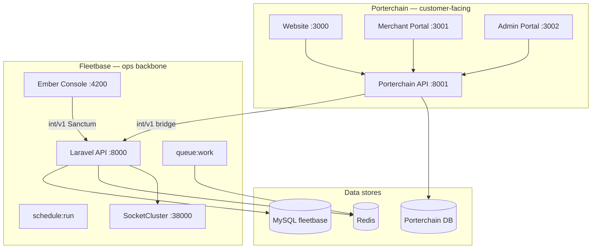

# Fleetbase Analysis — Porterchain Integration

**Document version:** 1.0  
**Date:** June 29, 2026  
**Fleetbase version analyzed:** v0.7.40 (OSS, AGPL-3.0)  
**Location:** `apps/fleetbase/`  
**Status:** Read-only architecture analysis — no code modified

---

## Executive summary

Fleetbase is a **modular logistics operating system** (LSOS): a thin Laravel 10 API shell plus an Ember 5 console, with all domain logic shipped as Composer/npm extension packages. For Porterchain it is the **internal dispatch and fleet-execution engine** — not a customer-facing product surface.

| Layer                            | Porterchain role                                                             |
| -------------------------------- | ---------------------------------------------------------------------------- |
| **Customer / merchant / retail** | Porterchain owns UX, auth (Clerk), pricing, billing, CRM                     |
| **Operations / dispatch**        | Fleetbase console (port 4200) + FleetOps engine                              |
| **Integration**                  | Porterchain API (:8001) is the **only** bridge to Fleetbase API (:8000)      |
| **Data**                         | Dual stores: PostgreSQL (Porterchain) + MySQL `fleetbase` (Fleetbase) |

### Strategic recommendation

| Action                     | Scope                                                                                       |
| -------------------------- | ------------------------------------------------------------------------------------------- |
| **Keep unchanged**         | Upstream Fleetbase OSS packages, Docker stack, console for ops                              |
| **Use directly**           | Dispatch, routing (Valhalla/VROOM), live map, driver GPS, POD capture, orchestration        |
| **Extend (not fork)**      | Porterchain bridge routes, webhook consumers, driver/order sync mappers                     |
| **Replace in Porterchain** | End-user auth, merchant CRM, pricing, invoicing, customer notifications, public tracking UX |

---

## Repository structure

```
apps/fleetbase/
├── api/                 # Laravel shell — health route only; logic in Composer packages
├── console/             # Ember 5 shell — loads engines from npm
├── packages/            # Git submodules (empty unless initialized)
├── docker/              # Dockerfiles, Apache, crontab
├── infra/helm/          # Kubernetes chart
├── database.mmd         # Full ERD (authoritative table list)
├── docker-compose.yml   # MySQL, Redis, SocketCluster, API, queue, scheduler, console, httpd
└── scripts/             # docker-install.sh
```

**Important:** `packages/*` submodules and `api/vendor/` are **not populated** in a default clone. Runtime logic lives inside the Docker image `fleetbase/fleetbase-api:latest` and locked Composer/npm packages.

### Locked extension versions (`api/composer.lock`)

| Package                     | Version | Role                                                          |
| --------------------------- | ------- | ------------------------------------------------------------- |
| `fleetbase/core-api`        | 1.6.47  | Platform: auth, IAM, webhooks, files, chat, schedules         |
| `fleetbase/fleetops-api`    | 0.6.48  | Fleet ops: orders, drivers, dispatch, tracking, orchestration |
| `fleetbase/storefront-api`  | 0.4.14  | Headless commerce (bundled, not Porterchain-critical)         |
| `fleetbase/ledger-api`      | 0.0.3   | Accounting extension                                          |
| `fleetbase/registry-bridge` | 0.1.9   | Extension marketplace                                         |
| `fleetbase/valhalla-api`    | 0.0.4   | Valhalla routing integration                                  |
| `fleetbase/vroom-api`       | 0.0.4   | VROOM vehicle routing optimization                            |

---

## Runtime architecture



### Docker services

| Service       | Image / build                    | Port                       | Purpose                  |
| ------------- | -------------------------------- | -------------------------- | ------------------------ |
| `database`    | `mysql:8.0-oracle`               | 3307 (Porterchain overlay) | Primary persistence      |
| `cache`       | `redis:4-alpine`                 | internal                   | Cache + queue backend    |
| `socket`      | SocketCluster v17                | 38000                      | Real-time broadcasts     |
| `application` | `fleetbase/fleetbase-api:latest` | internal                   | Laravel API              |
| `queue`       | same                             | internal                   | `php artisan queue:work` |
| `scheduler`   | same                             | internal                   | Cron → `schedule:run`    |
| `httpd`       | Apache reverse proxy             | 8000                       | Public API entry         |
| `console`     | Ember build                      | 4200                       | Ops UI                   |

---

## API surfaces

Fleetbase exposes **two authenticated API planes**:

| Prefix      | Middleware                                                    | Consumers                               |
| ----------- | ------------------------------------------------------------- | --------------------------------------- |
| `/int/v1/*` | `fleetbase.protected` (Sanctum session)                       | Ember console, internal tools           |
| `/v1/*`     | `fleetbase.api` (API credentials `flb_live_*` / `flb_test_*`) | SDK, Navigator driver app, integrations |

Public groups: installer, onboard, lookup, two-fa, partial auth.

---

## Porterchain bridge (current state)

Porterchain already implements a bridge in:

- `apps/api/src/porterchain_api/booking_engine/fleetbase_sync_service.py`
- `apps/api/src/porterchain_api/services/fleetbase_bridge.py`
- `services/python/porterchain_services/fleetbase/service.py`

The bridge POSTs to **`/int/v1/porterchain/*`** endpoints:

| Endpoint                                       | Purpose                       |
| ---------------------------------------------- | ----------------------------- |
| `POST /int/v1/porterchain/orders`              | Create/sync operational order |
| `POST /int/v1/porterchain/drivers`             | Sync driver record            |
| `POST /int/v1/porterchain/vehicles`            | Sync vehicle record           |
| `GET /int/v1/porterchain/orders/{id}/tracking` | Pull live tracking snapshot   |

**Gap:** These `porterchain/*` routes are **not present** in upstream Fleetbase OSS `fleetops` v0.6.48 `routes.php`. They are a **planned Porterchain extension** — implement as a Fleetbase PHP extension or thin proxy layer without modifying upstream packages (per project constraint: no Fleetbase source edits; use extension/registry pattern).

**Interim alternative:** Use standard consumable APIs:

- `POST /v1/orders` with API key
- `POST /v1/drivers`, `POST /v1/vehicles`
- `GET /v1/orders/{id}/tracker`

Store `fleetbase_order_id` on Porterchain `Order` (already modeled).

---

## Data ownership matrix

From `packages/types/src/ownership.ts` and `PRODUCT_REQUIREMENTS.md`:

| Domain                               | Owner                   | Fleetbase tables                           |
| ------------------------------------ | ----------------------- | ------------------------------------------ |
| Quotes, pricing, contracts, invoices | **Porterchain**         | —                                          |
| Merchants, CRM, retail customers     | **Porterchain** (Clerk) | —                                          |
| Commercial order lifecycle           | **Porterchain**         | Mirror in `fleetbase_orders`               |
| Dispatch execution, GPS, routes      | **Fleetbase**           | `orders`, `drivers`, `positions`, `routes` |
| POD artifacts                        | **Fleetbase** (capture) | `proofs`                                   |
| Customer tracking UX                 | **Porterchain**         | Reads Fleetbase tracking                   |

---

## Module-by-module Porterchain decisions

See [FLEETBASE_MODULES.md](./FLEETBASE_MODULES.md) for the full per-module breakdown.

| Module         | Use directly?         | Unchanged?        | Extend?                         | Replace?                             |
| -------------- | --------------------- | ----------------- | ------------------------------- | ------------------------------------ |
| Authentication | Ops console only      | ✅ Fleetbase IAM  | Bridge service auth             | ✅ Clerk for all Porterchain portals |
| Users          | Ops staff in console  | ✅                | Sync ops users if needed        | ✅ Merchant/retail identity          |
| Drivers        | Execution + GPS       | ✅                | ✅ Porterchain ↔ Fleetbase sync | Driver onboarding UX in Porterchain  |
| Vehicles       | Fleet registry        | ✅                | ✅ Sync from admin approval     | —                                    |
| Fleet          | Grouping / assignment | ✅                | —                               | —                                    |
| Orders         | Operational layer     | ✅                | ✅ Dual-ID bridge               | Commercial order in Porterchain      |
| Dispatch       | Core strength         | ✅                | Webhook status back             | —                                    |
| Tracking       | GPS + statuses        | ✅                | Poll/webhook → Porterchain      | Public tracking page                 |
| POD            | Capture + storage     | ✅                | Surface in Porterchain admin    | —                                    |
| Maps           | Ops live map          | ✅ Console        | Google Maps for customers       | —                                    |
| Routing        | Valhalla/VROOM/OSRM   | ✅                | Share Valhalla :8002            | Quote routing in Porterchain         |
| Notifications  | Driver/ops alerts     | Partial           | Webhook-driven customer email   | ✅ Porterchain notification service  |
| Places         | Order stops           | ✅ On sync        | Google Places at booking        | —                                    |
| Contacts       | Order customers       | Optional mirror   | Map merchant → contact          | ✅ Porterchain CRM                   |
| Locations      | Driver positions      | ✅                | —                               | —                                    |
| Webhooks       | Status sync           | ✅ Subscribe      | Porterchain webhook router      | —                                    |
| API            | Integration           | ✅ v1 + bridge    | ✅ `porterchain/*` extension    | —                                    |
| Extensions     | Add Porterchain pack  | ✅ Registry       | ✅ Porterchain bridge ext       | —                                    |
| Events         | Real-time ops         | ✅ SocketCluster  | Consume via webhooks            | Porterchain event bus                |
| Jobs / Queues  | Async Fleetbase work  | ✅ Separate Redis | —                               | Porterchain worker queue             |

---

## AGPL compliance note

Fleetbase OSS is **AGPL-3.0**. Porterchain must:

- Not expose Fleetbase console to merchants or end customers
- Keep Fleetbase as internal infrastructure
- If distributing modified Fleetbase code, comply with AGPL source-offer requirements
- Prefer **extensions** and **API integration** over embedding Fleetbase UI in customer products

---

## Gaps and risks

| Risk                                          | Mitigation                                                                           |
| --------------------------------------------- | ------------------------------------------------------------------------------------ |
| `porterchain/*` routes missing in OSS         | Implement Fleetbase extension or use `v1` API until extension ships                  |
| Port 8000 conflict (Porterchain vs Fleetbase) | Porterchain API on :8001 (current); Fleetbase on :8000                               |
| Dual order truth                              | Porterchain `order.id` + `fleetbase_order_id`; webhook sync for status               |
| Empty git submodules                          | Use `composer.lock` + Docker image; run `git submodule update --init` for deep dives |
| Scheduler container unhealthy                 | Monitor; non-blocking for API (see `SERVICE_STATUS.md`)                              |
| Separate auth systems                         | Never merge Clerk users into Fleetbase users for merchants                           |

---

## Related documents

| Document                                                         | Contents                          |
| ---------------------------------------------------------------- | --------------------------------- |
| [FLEETBASE_MODULES.md](./FLEETBASE_MODULES.md)                   | Per-module deep dive              |
| [FLEETBASE_APIS.md](./FLEETBASE_APIS.md)                         | Route catalog                     |
| [FLEETBASE_EVENTS.md](./FLEETBASE_EVENTS.md)                     | Laravel + broadcast events        |
| [FLEETBASE_WEBHOOKS.md](./FLEETBASE_WEBHOOKS.md)                 | Outbound/inbound webhooks         |
| [FLEETBASE_DATABASE.md](./FLEETBASE_DATABASE.md)                 | Schema reference                  |
| [FLEETBASE_EXTENSION_POINTS.md](./FLEETBASE_EXTENSION_POINTS.md) | How to extend without forking     |
| [FLEETBASE_INSTALL.md](./FLEETBASE_INSTALL.md)                   | Docker install runbook            |
| [SYSTEM_ARCHITECTURE.md](./SYSTEM_ARCHITECTURE.md)               | Porterchain platform architecture |

---

## Recommended integration sequence

1. Complete Fleetbase console onboarding → obtain `FLEETBASE_DEFAULT_COMPANY_UUID`
2. Create Fleetbase API credentials (`flb_live_*`) for Porterchain bridge
3. Wire order sync on `ORDER_DISPATCH_READY` → Fleetbase order create
4. Register Fleetbase webhooks → Porterchain `/v1/webhooks/fleetbase` handler
5. Sync approved drivers/vehicles from Porterchain admin → Fleetbase
6. Ops uses Fleetbase console for dispatch; merchants never see it
7. Implement or deploy `porterchain` Fleetbase extension for tailored bridge payloads
