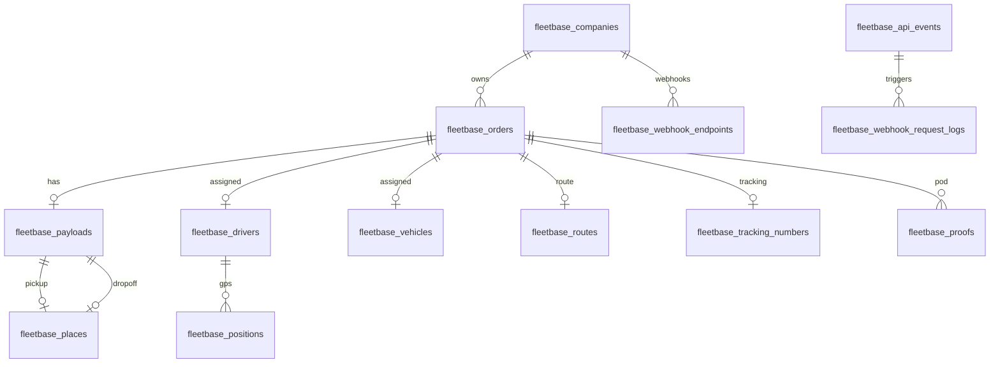

# Fleetbase Database — Schema Reference

**Engine:** MySQL 8.0  
**Primary database:** `fleetbase`  
**Sandbox database:** `fleetbase_sandbox` (test API keys)  
**Table prefix:** `fleetbase_`  
**Spatial extension:** `fleetbase/laravel-mysql-spatial` (GEOMETRY columns)  
**ERD source:** `apps/fleetbase/database.mmd` (+ `erd.svg`)

---

## Bootstrap sequence

From `apps/fleetbase/api/deploy.sh`:

```
php artisan mysql:createdb
php artisan migrate --force
php artisan sandbox:migrate --force
php artisan fleetbase:seed
php artisan fleetbase:create-permissions
php artisan registry:init
```

**Porterchain overlay:** MySQL exposed on `127.0.0.1:3307` (see `infrastructure/docker/fleetbase.porterchain.override.yml`).

---

## Schema overview

| Domain              | Table count | Prefix                                   |
| ------------------- | ----------- | ---------------------------------------- |
| Platform / IAM      | ~35         | `fleetbase_`                             |
| FleetOps            | ~30         | `fleetbase_`                             |
| Developer / API     | 5           | `fleetbase_api_*`, `fleetbase_webhook_*` |
| Registry            | 5           | `fleetbase_registry_*`                   |
| Storefront          | 18          | `fleetbase_storefront_*`                 |
| Future WMS (Pallet) | —           | `fixflo_*` (in ERD, not active)          |

**Total active `fleetbase_*` tables:** ~90

---

## Platform tables (core-api)

### Identity & tenancy

| Table                     | Purpose         | Key columns                           |
| ------------------------- | --------------- | ------------------------------------- |
| `fleetbase_users`         | Console users   | uuid, email, name, phone, status      |
| `fleetbase_companies`     | Organizations   | uuid, name, public_id, options (JSON) |
| `fleetbase_company_users` | User ↔ company  | company_uuid, user_uuid, role         |
| `fleetbase_invites`       | Pending invites | email, role, token                    |
| `fleetbase_user_devices`  | Push devices    | user_uuid, token, platform            |

### IAM (Spatie + Fleetbase)

| Table                             | Purpose                  |
| --------------------------------- | ------------------------ |
| `fleetbase_roles`                 | Named roles              |
| `fleetbase_permissions`           | Permission strings       |
| `fleetbase_policies`              | Policy documents         |
| `fleetbase_groups`                | User groups              |
| `fleetbase_group_users`           | Group membership         |
| `fleetbase_model_has_roles`       | Model ↔ role pivot       |
| `fleetbase_model_has_permissions` | Model ↔ permission pivot |
| `fleetbase_model_has_policies`    | Model ↔ policy pivot     |
| `fleetbase_role_has_permissions`  | Role ↔ permission pivot  |

### Extensions & config

| Table                           | Purpose                      |
| ------------------------------- | ---------------------------- |
| `fleetbase_extensions`          | Installed extension registry |
| `fleetbase_extension_installs`  | Per-company installs         |
| `fleetbase_settings`            | Key-value settings           |
| `fleetbase_categories`          | Taxonomy                     |
| `fleetbase_custom_fields`       | EAV field definitions        |
| `fleetbase_custom_field_values` | EAV values                   |
| `fleetbase_types`               | Typed enums                  |

### Collaboration

| Table                         | Purpose              |
| ----------------------------- | -------------------- |
| `fleetbase_chat_channels`     | Chat rooms           |
| `fleetbase_chat_participants` | Members              |
| `fleetbase_chat_messages`     | Messages             |
| `fleetbase_chat_attachments`  | File attachments     |
| `fleetbase_chat_receipts`     | Read receipts        |
| `fleetbase_chat_logs`         | Audit                |
| `fleetbase_comments`          | Polymorphic comments |

### Files & activity

| Table                     | Purpose                   |
| ------------------------- | ------------------------- |
| `fleetbase_files`         | Uploaded files (S3/local) |
| `fleetbase_activity`      | Spatie activity log       |
| `fleetbase_notifications` | In-app notifications      |

### Scheduling & reporting

| Table                                          | Purpose                |
| ---------------------------------------------- | ---------------------- |
| `fleetbase_dashboards`                         | Custom dashboards      |
| `fleetbase_dashboard_widgets`                  | Widget config          |
| `fleetbase_reports`                            | SQL report definitions |
| `fleetbase_monitored_scheduled_tasks`          | Cron monitor           |
| `fleetbase_monitored_scheduled_task_log_items` | Cron run logs          |

### Auth tokens

| Table                              | Purpose              |
| ---------------------------------- | -------------------- |
| `fleetbase_personal_access_tokens` | Sanctum tokens       |
| `fleetbase_login_attempts`         | Brute-force tracking |
| `fleetbase_verification_codes`     | SMS/email codes      |

### Infrastructure

| Table                   | Purpose            |
| ----------------------- | ------------------ |
| `fleetbase_migrations`  | Laravel migrations |
| `fleetbase_failed_jobs` | Queue failures     |

---

## FleetOps tables

### Fleet resources

| Table                          | Purpose                    | Porterchain relevance            |
| ------------------------------ | -------------------------- | -------------------------------- |
| `fleetbase_drivers`            | Driver registry + live GPS | **High** — sync approved drivers |
| `fleetbase_vehicles`           | Vehicle registry           | **High**                         |
| `fleetbase_fleets`             | Fleet groupings            | Medium                           |
| `fleetbase_fleet_drivers`      | Fleet ↔ driver             | Medium                           |
| `fleetbase_fleet_vehicles`     | Fleet ↔ vehicle            | Medium                           |
| `fleetbase_vendors`            | Carrier vendors            | Low                              |
| `fleetbase_integrated_vendors` | 3rd-party integrations     | Low                              |

**`fleetbase_drivers` key columns:** uuid, company_uuid, vehicle_uuid, user_uuid, `GEOMETRY location`, online, status, auth_token, meta (JSON)

**`fleetbase_vehicles` key columns:** uuid, company_uuid, make, model, year, plate_number, vin, meta

### Orders & execution

| Table                      | Purpose               | Porterchain relevance    |
| -------------------------- | --------------------- | ------------------------ |
| `fleetbase_orders`         | Operational orders    | **Critical**             |
| `fleetbase_order_configs`  | Workflow templates    | Medium                   |
| `fleetbase_payloads`       | Pickup/dropoff bundle | **High**                 |
| `fleetbase_entities`       | Parcels/items         | Medium                   |
| `fleetbase_waypoints`      | Route stops           | Medium                   |
| `fleetbase_routes`         | Route geometry        | Medium                   |
| `fleetbase_purchase_rates` | Rate snapshots        | Low (Porterchain prices) |

**`fleetbase_orders` key columns:**

| Column                | Type     | Notes                                 |
| --------------------- | -------- | ------------------------------------- |
| uuid                  | CHAR     | Primary external reference            |
| public_id             | VARCHAR  | Human ID (`order_xxx`)                |
| company_uuid          | CHAR FK  | Tenant                                |
| payload_uuid          | CHAR FK  | Pickup/dropoff                        |
| route_uuid            | CHAR FK  | Computed route                        |
| driver_assigned_uuid  | CHAR FK  | Assigned driver                       |
| vehicle_assigned_uuid | CHAR FK  | Assigned vehicle                      |
| tracking_number_uuid  | CHAR FK  | Public tracking                       |
| dispatched            | BIT      | Dispatch flag                         |
| started               | BIT      | In-progress flag                      |
| pod_required          | BIT      | POD enforcement                       |
| scheduled_at          | DATETIME | Schedule                              |
| status                | VARCHAR  | Workflow status                       |
| meta                  | JSON     | **Store `porterchain_order_id` here** |
| options               | JSON     | Order options                         |

### Locations & tracking

| Table                         | Purpose                           |
| ----------------------------- | --------------------------------- |
| `fleetbase_places`            | Addresses + `GEOMETRY location`   |
| `fleetbase_positions`         | GPS history (subject polymorphic) |
| `fleetbase_tracking_numbers`  | Public tracking IDs               |
| `fleetbase_tracking_statuses` | Status timeline                   |
| `fleetbase_zones`             | Zones within service areas        |
| `fleetbase_service_areas`     | Service polygons                  |

**`fleetbase_positions`:** coordinates (GEOMETRY), subject_uuid/type, order_uuid, heading, speed

### POD & proof

| Table              | Purpose                    |
| ------------------ | -------------------------- |
| `fleetbase_proofs` | Signature/photo/QR records |

Links: order_uuid, subject_uuid, file_uuid, data (JSON)

### Pricing (Fleetbase-native)

| Table                                | Purpose          | Porterchain           |
| ------------------------------------ | ---------------- | --------------------- |
| `fleetbase_service_rates`            | Rate cards       | Do not use for quotes |
| `fleetbase_service_rate_fees`        | Fee rules        | —                     |
| `fleetbase_service_rate_parcel_fees` | Parcel fees      | —                     |
| `fleetbase_service_quotes`           | Generated quotes | —                     |
| `fleetbase_service_quote_items`      | Quote line items | —                     |

### Operations support

| Table                         | Purpose                      |
| ----------------------------- | ---------------------------- |
| `fleetbase_contacts`          | Customer/facilitator records |
| `fleetbase_issues`            | Issue tickets                |
| `fleetbase_fuel_reports`      | Fuel reporting               |
| `fleetbase_transactions`      | Payments (FleetOps)          |
| `fleetbase_transaction_items` | Line items                   |

### Telematics & maintenance

| Table                             | Purpose          |
| --------------------------------- | ---------------- |
| `fleetbase_vehicle_devices`       | Hardware devices |
| `fleetbase_vehicle_device_events` | Device events    |

Maintenance tables (work orders, parts, etc.) ship with fleetops but may not appear in base ERD until migrations run.

---

## Developer / API tables

| Table                            | Purpose                               |
| -------------------------------- | ------------------------------------- |
| `fleetbase_api_credentials`      | API keys (`key`, `secret`, test_mode) |
| `fleetbase_api_events`           | Event audit log                       |
| `fleetbase_api_request_logs`     | HTTP access log                       |
| `fleetbase_webhook_endpoints`    | Outbound webhook config               |
| `fleetbase_webhook_request_logs` | Webhook delivery log                  |

---

## Registry tables

| Table                                    | Purpose                |
| ---------------------------------------- | ---------------------- |
| `fleetbase_registry_extensions`          | Marketplace extensions |
| `fleetbase_registry_extension_bundles`   | Extension bundles      |
| `fleetbase_registry_extension_installs`  | Installs               |
| `fleetbase_registry_extension_purchases` | Purchases              |
| `fleetbase_registry_users`               | Registry accounts      |

---

## Storefront tables (bundled, not Porterchain)

18 tables prefixed `fleetbase_storefront_*`: stores, products, carts, checkouts, gateways, networks, reviews, etc.

**Porterchain stance:** Do not use — Porterchain merchant portal replaces this domain.

---

## Entity relationships (core flows)



---

## Spatial columns

| Table                     | Column      | Type     |
| ------------------------- | ----------- | -------- |
| `fleetbase_drivers`       | location    | GEOMETRY |
| `fleetbase_places`        | location    | GEOMETRY |
| `fleetbase_positions`     | coordinates | GEOMETRY |
| `fleetbase_service_areas` | border      | GEOMETRY |
| `fleetbase_zones`         | border      | GEOMETRY |
| `fleetbase_routes`        | polyline    | GEOMETRY |

---

## Porterchain ↔ Fleetbase ID mapping

| Porterchain             | Fleetbase                       | Storage                                     |
| ----------------------- | ------------------------------- | ------------------------------------------- |
| `Order.id`              | `fleetbase_orders.uuid`         | `Order.fleetbase_order_id` (Porterchain DB) |
| `Order.tracking_number` | `fleetbase_tracking_numbers`    | Both sides                                  |
| Driver partner ID       | `fleetbase_drivers.uuid`        | `meta.porterchain_driver_id` on driver      |
| Vehicle ID              | `fleetbase_vehicles.uuid`       | `meta.porterchain_vehicle_id`               |
| Merchant org            | `fleetbase_contacts` (optional) | Not required for MVP                        |

**Rule:** Porterchain PostgreSQL is authoritative for commercial data. Fleetbase MySQL is authoritative for dispatch execution.

---

## Dual database architecture

| Store       | Engine              | Owner           | Port (dev)  |
| ----------- | ------------------- | --------------- | ----------- |
| Porterchain | PostgreSQL | Porterchain API | 5432 |
| Fleetbase   | MySQL 8             | Fleetbase API   | 3307        |

No shared database. Sync via API + webhooks only.

---

## Backup commands

```bash
# MySQL dump
docker exec porterchain-fleetbase-mysql mysqldump -uroot -p fleetbase > fleetbase-backup.sql

# API storage volume
docker run --rm -v porterchain-fleetbase-api-storage:/data -v $(pwd):/backup alpine \
  tar czf /backup/fleetbase-storage.tar.gz -C /data .
```

See [RUNBOOK.md](./RUNBOOK.md).

---

## Migrations source

Migrations ship inside Composer packages (not in `apps/fleetbase/api/database/`). Each service provider loads package migrations at boot. To inspect:

```bash
docker exec porterchain-fleetbase-application php artisan migrate:status
```

---

## Related documents

- [FLEETBASE_ANALYSIS.md](./FLEETBASE_ANALYSIS.md) — integration overview
- [FLEETBASE_MODULES.md](./FLEETBASE_MODULES.md) — module ownership
- `apps/fleetbase/database.mmd` — full ERD source
