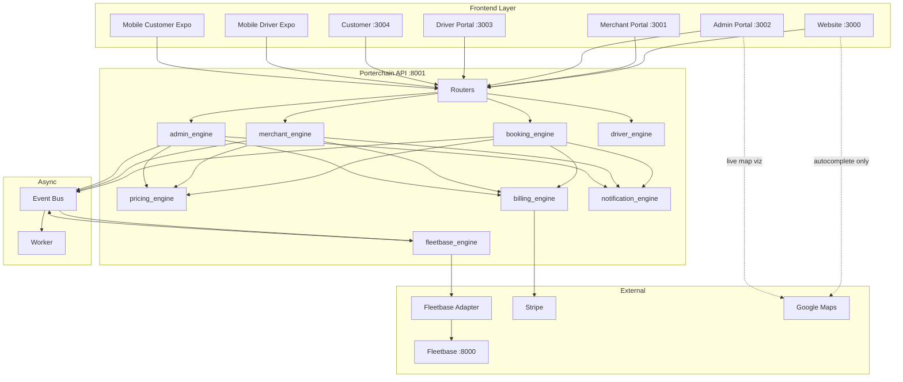

# Porterchain — Module Dependency Graph

**Type:** CANONICAL
**masterrule:** [§21](./masterrule.md#21-simplification--essential-complexity)
**Last verified:** 2026-07-05

**Reference:** [masterrule.md](./masterrule.md) §1 locked topology

---

## Locked architecture (verified)



---

## Orders hub (Step 4 verification)

| Connection    | Status | Path                                                      |
| ------------- | ------ | --------------------------------------------------------- |
| Booking       | ✅     | `confirmation_service` creates order from quote           |
| Booking Draft | ✅     | Draft → payment → confirmation                            |
| Customer      | ✅     | `order.customer_id`                                       |
| Merchant      | ✅     | `merchant_engine/booking_service`                         |
| CRM           | ⚠️     | Order links to merchant/customer; no CRM ticket auto-link |
| Pricing       | ✅     | `quote.amount_cents` on order                             |
| Payments      | ✅     | Stripe → `Payment` row                                    |
| Invoices      | ✅     | `Invoice` on confirmation                                 |
| Driver        | ✅     | `assigned_driver_id`, admin assign                        |
| Vehicle       | ⚠️     | Via driver assignment                                     |
| Fleetbase     | ✅     | Event-driven sync                                         |
| Tracking      | ✅     | `TrackingService` + webhooks                              |
| Claims        | ✅     | `AdminClaimsService`, webhook auto-open                   |
| Support       | ✅     | Ticket `order_id` link                                    |
| Notifications | ⚠️     | Booked/confirmed only                                     |
| Reports       | ✅     | Order aggregates                                          |
| Documents     | ✅     | Invoice PDF, POD proofs                                   |
| Audit         | ✅     | `OrderEvent`, `DomainEvent`                               |
| Timeline      | ✅     | Order 360 timeline                                        |

---

## Merchant hub (Step 5)

| Connection | Status                                        |
| ---------- | --------------------------------------------- |
| CRM        | ⚠️ Merchant profile; CRM company link partial |
| Orders     | ✅                                            |
| Invoices   | ✅                                            |
| Payments   | ✅                                            |
| Pricing    | ✅ Contracts                                  |
| Contracts  | ✅                                            |
| CSV/Bulk   | ✅                                            |
| Recipients | ✅                                            |
| Support    | ❌ No merchant portal UI                      |
| Claims     | ❌ No merchant portal UI                      |
| Reports    | ✅                                            |
| Documents  | ❌                                            |
| Analytics  | ⚠️ Dashboard only                             |

---

## Driver hub (Step 6)

| Connection  | Status                                   |
| ----------- | ---------------------------------------- |
| Fleetbase   | ✅ Bridge                                |
| Vehicle     | ⚠️ API stub; page missing                |
| Orders      | ✅ Stops/routes                          |
| Tracking    | ✅ Location ping                         |
| Claims      | ⚠️ Incidents API                         |
| Support     | ⚠️ API stub                              |
| Performance | ⚠️ API stub                              |
| Documents   | ⚠️ API exists; mobile POD upload partial |
| Incidents   | ✅ driver-platform                       |

---

## Fleet hub (Step 7)

| Connection  | Status      |
| ----------- | ----------- |
| Drivers     | ✅          |
| Vehicles    | ✅          |
| Maintenance | ❌          |
| Insurance   | ⚠️ API stub |
| Orders      | ✅          |
| Fleetbase   | ✅          |
| Tracking    | ✅          |
| GPS         | ✅          |
| Dispatch    | ✅          |

---

## Finance hub (Step 8)

| Connection    | Status                 |
| ------------- | ---------------------- |
| Orders        | ✅                     |
| Invoices      | ✅                     |
| Stripe        | ✅                     |
| Merchant      | ✅ NET billing         |
| Driver Payout | ❌ Roadmap             |
| Refunds       | ⚠️ Stripe webhook only |
| Credit Notes  | ❌ Roadmap             |
| Claims        | ⚠️ Link only           |
| Reports       | ✅                     |

---

## Pricing hub (Step 9)

| Connection         | Status                     |
| ------------------ | -------------------------- |
| Quotes             | ✅                         |
| Booking Draft      | ✅                         |
| Booking            | ✅ Revalidation at payment |
| Merchant Contracts | ✅                         |
| Orders             | ✅                         |
| Finance            | ✅                         |
| Reports            | ✅                         |

---

## Support hub (Step 10)

| Connection | Status                  |
| ---------- | ----------------------- |
| Orders     | ✅                      |
| Claims     | ⚠️ Separate modules     |
| Customer   | ✅                      |
| Merchant   | ✅                      |
| Driver     | ✅                      |
| Finance    | ⚠️ Payment dispute type |
| CRM        | ⚠️                      |
| Documents  | ✅ Attachments          |

---

## Claims hub (Step 11)

| Connection | Status               |
| ---------- | -------------------- |
| Orders     | ✅                   |
| Driver     | ✅                   |
| Merchant   | ✅                   |
| Customer   | ✅                   |
| Fleet      | ⚠️                   |
| Support    | ⚠️                   |
| Finance    | ⚠️                   |
| Insurance  | ⚠️ Claim type exists |
| Documents  | ⚠️                   |

---

## Reports hub (Step 12)

| Source module  | Feeds reports? |
| -------------- | -------------- |
| Orders         | ✅             |
| Finance        | ✅             |
| Merchants      | ✅             |
| Drivers        | ✅             |
| Claims         | ✅             |
| Support        | ✅             |
| Booking drafts | ✅             |
| Pricing        | ✅             |
| Operations     | ✅             |
| Documents      | ❌             |
| Analytics      | ✅ (overlap)   |

**Business logic in reports:** ❌ None — read-only aggregates ✅

---

## Live Map hub (Step 13)

| Input     | Source                          | Direct Fleetbase? |
| --------- | ------------------------------- | ----------------- |
| Drivers   | `Driver` + `DriverLocationPing` | ❌                |
| Vehicles  | `Vehicle`                       | ❌                |
| Orders    | `Order` mirror                  | ❌                |
| Tracking  | Webhook mirror                  | ❌                |
| Fleetbase | Synced IDs only                 | ❌                |
| Traffic   | Google Maps layer               | ❌ (viz only)     |
| Geofences | ⚠️ Partial                      | ❌                |
| Incidents | ⚠️ Partial                      | ❌                |
| Realtime  | WebSocket via FastAPI           | ✅                |

---

## Dependency layers (no circular violations)

```
Layer 0: External (Fleetbase, Stripe, Google Maps viz, Clerk)
Layer 1: Adapters (fleetbase-adapter, stripe_service)
Layer 2: Engines (booking, merchant, admin, fleetbase, driver, billing, notification, pricing)
Layer 3: Event bus + Worker
Layer 4: Routers
Layer 5: UI apps
```

**Rule:** Lower layers never import UI. Fleetbase never imports Porterchain engines. ✅ Verified.
---

## Governance

| Document                                   | Role              |
| ------------------------------------------ | ----------------- |
| [masterrule.md](masterrule.md)             | Architecture SSOT |
| [CTO_AUDIT_REPORT.md](CTO_AUDIT_REPORT.md) | Doc vs code audit |
