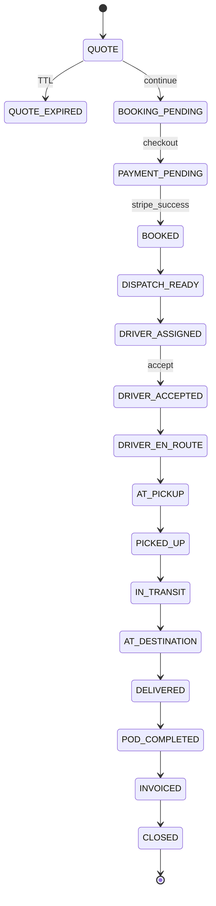

# Porterchain — Order Lifecycle


**Type:** CANONICAL
**masterrule:** [§21](./masterrule.md#21-simplification--essential-complexity)
**Last verified:** 2026-07-05

**Implementation:** `apps/api/src/porterchain_api/booking_engine/` (state machine + transitions)

---

## Canonical state machine

Porterchain owns the **canonical order state**. Fleetbase operational status maps to these states via the dispatch bridge. All transitions are **append-only** in the event log.

---

## State definitions

### Pre-order (quote & booking)

| State             | Description                            | Entry trigger                          | Exit triggers                        |
| ----------------- | -------------------------------------- | -------------------------------------- | ------------------------------------ |
| `QUOTE`           | Anonymous or identified estimate valid | Pricing engine success                 | TTL expiry, continue booking, cancel |
| `QUOTE_EXPIRED`   | Quote TTL elapsed                      | Cron / TTL job                         | New quote created                    |
| `BOOKING_PENDING` | User continued; contact captured       | Continue booking + Clerk session start | Payment started, abandon, cancel     |
| `PAYMENT_PENDING` | Stripe session created                 | Checkout created                       | Paid, failed, abandoned, cancel      |

### Confirmed & dispatch

| State             | Description                                           | Entry trigger                    | Exit triggers                   |
| ----------------- | ----------------------------------------------------- | -------------------------------- | ------------------------------- |
| `BOOKED`          | Payment confirmed (retail) or merchant order accepted | Stripe webhook / merchant submit | Dispatch queue, cancel          |
| `DISPATCH_READY`  | Ready for assignment                                  | Ops rules / auto after BOOKED    | Driver assigned, cancel         |
| `DRIVER_ASSIGNED` | Driver + vehicle linked                               | Dispatcher / auto-assign         | Accept, reject, timeout, cancel |
| `DRIVER_ACCEPTED` | Driver confirmed job                                  | Driver accept in app             | En route, reject (late), cancel |
| `DRIVER_REJECTED` | Driver declined (transient — may re-assign)           | Driver reject                    | Re-assign → `DRIVER_ASSIGNED`   |

### Execution

| State             | Description                       | Entry trigger            | Exit triggers             |
| ----------------- | --------------------------------- | ------------------------ | ------------------------- |
| `DRIVER_EN_ROUTE` | Heading to pickup                 | Driver start / GPS       | At pickup, exception      |
| `AT_PICKUP`       | Arrived at pickup                 | Geofence / manual arrive | Picked up, exception      |
| `PICKED_UP`       | Goods in vehicle                  | Pickup confirm           | In transit, exception     |
| `IN_TRANSIT`      | En route to destination           | Depart pickup            | At destination, exception |
| `AT_DESTINATION`  | Arrived at dropoff                | Geofence / manual arrive | Delivered, exception      |
| `DELIVERED`       | Handoff complete (pre-POD verify) | Driver deliver tap       | POD completed, exception  |
| `POD_COMPLETED`   | Photo/signature/GPS verified      | POD validation pass      | Invoiced                  |

### Financial close

| State      | Description            | Entry trigger       | Exit triggers                             |
| ---------- | ---------------------- | ------------------- | ----------------------------------------- |
| `INVOICED` | Invoice/receipt issued | Billing job         | Paid (merchant) / closed (retail prepaid) |
| `CLOSED`   | Terminal success       | Settlement complete | —                                         |

### Terminal / exception states

| State              | Description                          | Recoverable?             |
| ------------------ | ------------------------------------ | ------------------------ |
| `CANCELLED`        | Cancelled before or during execution | No                       |
| `FAILED`           | Delivery attempt failed              | Maybe → re-dispatch      |
| `RETURN_TO_SENDER` | RTS initiated                        | Ends in CLOSED or CLAIM  |
| `DAMAGED`          | Damage recorded                      | Claim path               |
| `LOST`             | Loss recorded                        | Claim path               |
| `CLAIM_OPEN`       | Insurance claim active               | Yes → REFUNDED or CLOSED |
| `REFUNDED`         | Money returned                       | Terminal                 |

---

## State diagram (happy path)



---

## Merchant order entry (alternate entry)

Merchant orders **skip** quote/payment retail states when on Net terms:

```
Merchant submit → BOOKED (payment_terms=NET_30) → DISPATCH_READY → ...
```

Optional per-order Stripe:

```
Merchant submit → PAYMENT_PENDING → BOOKED → ...
```

---

## Transition rules

### Who can trigger transitions

| Transition                  | Retail | Merchant | Driver | Dispatcher | System     |
| --------------------------- | ------ | -------- | ------ | ---------- | ---------- |
| → `QUOTE`                   | ✓      | ✓        | —      | —          | ✓          |
| → `BOOKED`                  | Stripe | ✓        | —      | —          | ✓          |
| → `DRIVER_ASSIGNED`         | —      | —        | —      | ✓          | ✓ auto     |
| → `DRIVER_ACCEPTED`         | —      | —        | ✓      | —          | —          |
| → `PICKED_UP` … `DELIVERED` | —      | —        | ✓      | —          | —          |
| → `POD_COMPLETED`           | —      | —        | ✓      | —          | ✓ validate |
| → `CANCELLED`               | ✓*     | ✓*       | —      | ✓          | ✓          |
| → `FAILED` / exceptions     | —      | —        | ✓      | ✓          | ✓          |

\* Subject to cancellation policy window.

### Invalid transitions

- Cannot go from `QUOTE` directly to `BOOKED` without payment (retail).
- Cannot skip `POD_COMPLETED` before `CLOSED` (compliance).
- `CLOSED` is terminal — no outbound transitions.

---

## Fleetbase mapping

| Porterchain state               | Fleetbase operational equivalent |
| ------------------------------- | -------------------------------- |
| `DISPATCH_READY`                | Order created, unassigned        |
| `DRIVER_ASSIGNED`               | Driver linked to order           |
| `DRIVER_EN_ROUTE` … `DELIVERED` | Stop status progression          |
| `POD_COMPLETED`                 | POD entities attached            |

Sync: **bidirectional** with Porterchain as source of truth for customer-facing status.

---

## Timers & SLAs

| State             | Timer           | Action on expiry             |
| ----------------- | --------------- | ---------------------------- |
| `QUOTE`           | 30 min (config) | → `QUOTE_EXPIRED`            |
| `PAYMENT_PENDING` | 24 h (config)   | Abandon + remarketing        |
| `DRIVER_ASSIGNED` | 5 min (config)  | → reject timeout → re-assign |
| `AT_PICKUP`       | Policy max wait | Surge / cancel fee           |
| `IN_TRANSIT`      | SLA deadline    | Ops alert                    |

---

## Data retained per state change

Each transition records:

- `from_state`, `to_state`
- `actor_type`, `actor_id`
- `timestamp` (UTC)
- `metadata` (GPS, reason code, Fleetbase sync id)
- `correlation_id` (quote → order chain)

---

## Related documents

| Document | Purpose |
| -------- | ------- |
| [EXCEPTION_WORKFLOWS.md](./EXCEPTION_WORKFLOWS.md) | Exception state paths |
| [EVENT_CATALOG.md](./EVENT_CATALOG.md) | Order lifecycle events |
| [docs/architecture/EVENT_BUS_FLOW.md](./docs/architecture/EVENT_BUS_FLOW.md) | End-to-end event sequences |
| [ENTITY_RELATIONSHIP_MODEL.md](./ENTITY_RELATIONSHIP_MODEL.md) | Order data model |
| [docs/archive/ORDER_LIFECYCLE_REPORT.md](./docs/archive/ORDER_LIFECYCLE_REPORT.md) | Historical order source/type audit |
---

## Governance

| Document | Role |
| -------- | ---- |
| [masterrule.md](masterrule.md) | Architecture SSOT |
| [CTO_AUDIT_REPORT.md](CTO_AUDIT_REPORT.md) | Doc vs code audit |
