# Porterchain — System Sequence Diagrams

**Type:** CANONICAL
**masterrule:** [§21](./masterrule.md#21-simplification--essential-complexity)
**Last verified:** 2026-07-05

---

## 1. Instant quote (anonymous)

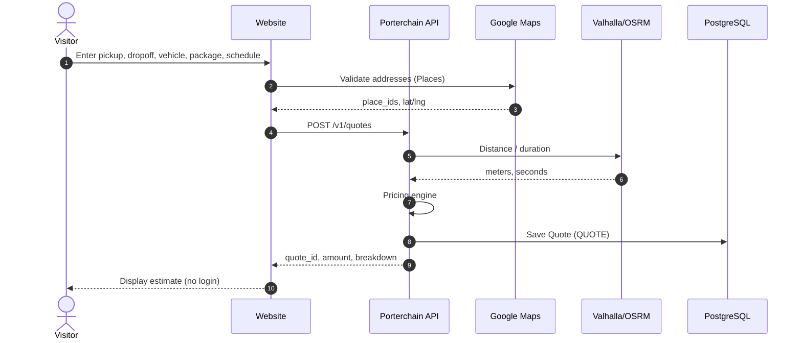

---

## 2. Retail booking — continue, Clerk, Stripe

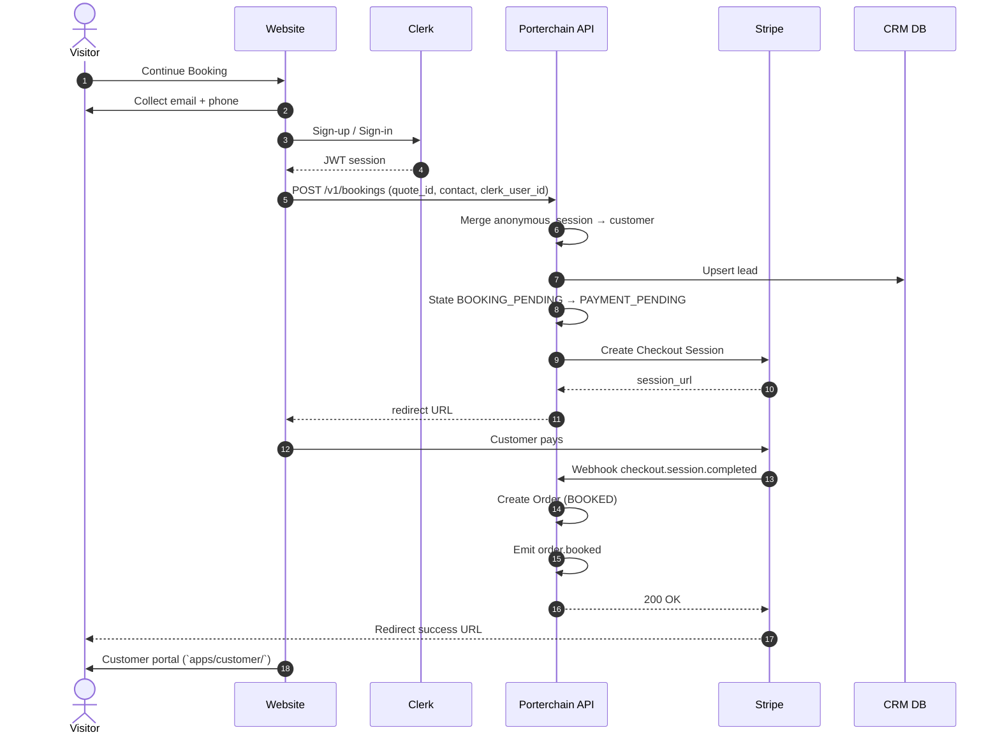

---

## 3. Abandoned checkout

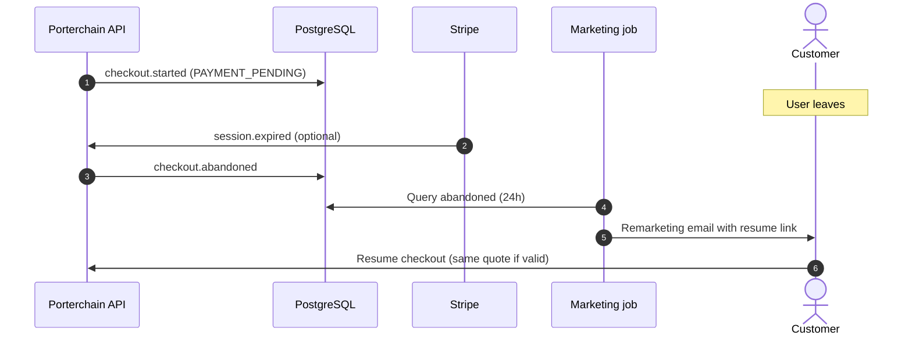

---

## 4. Order → Fleetbase dispatch

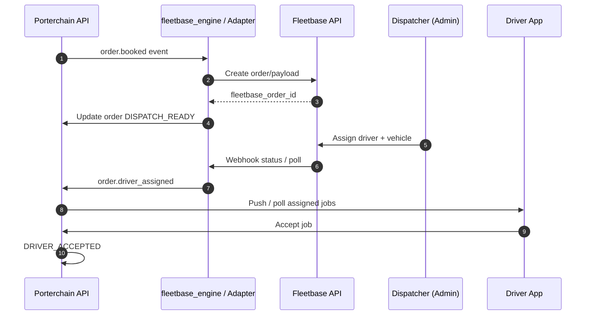

---

## 5. Driver execution & POD

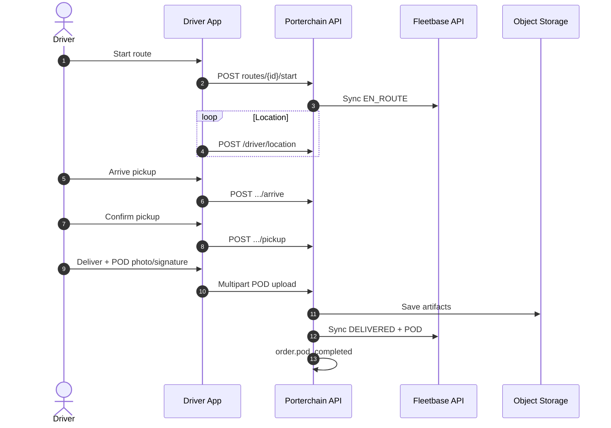

---

## 6. Merchant onboarding

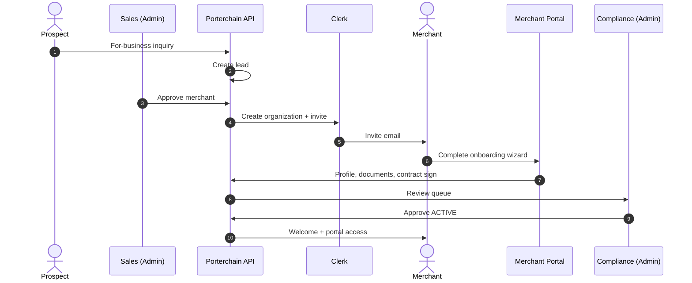

---

## 7. Merchant shipment (Net 30)

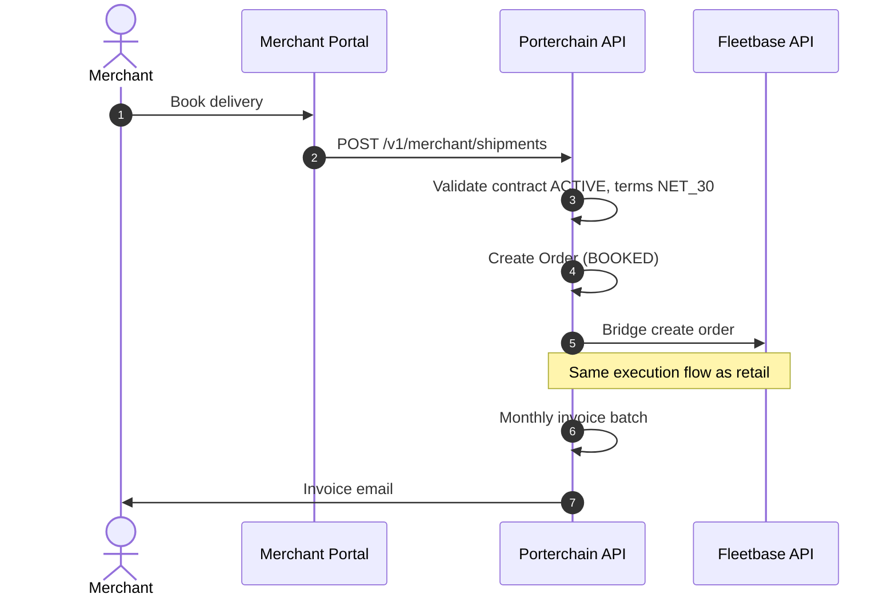

---

## 8. Exception — driver reject & reassign

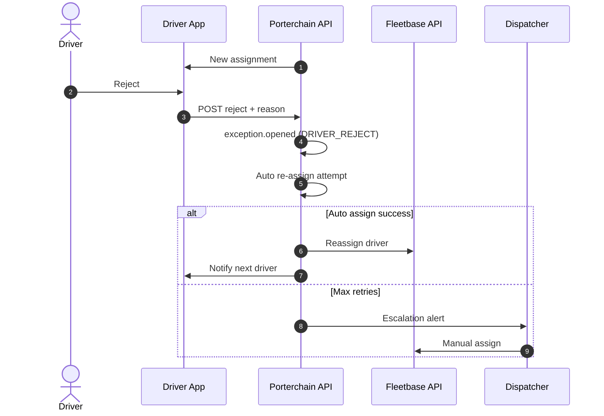

---

## 9. Refund workflow

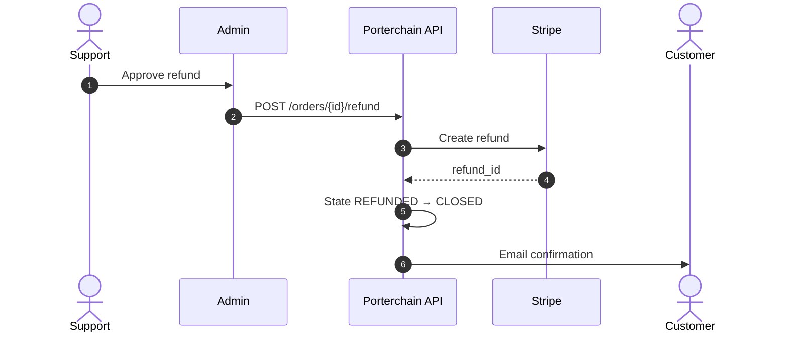

---

## 10. Customer tracking (read path)

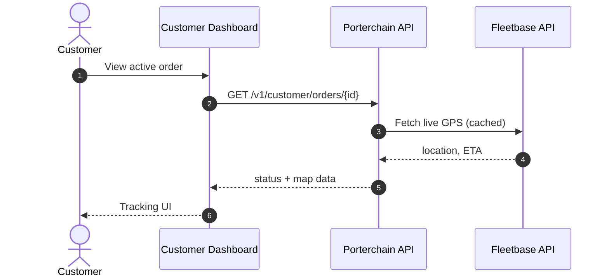

---

## Component context

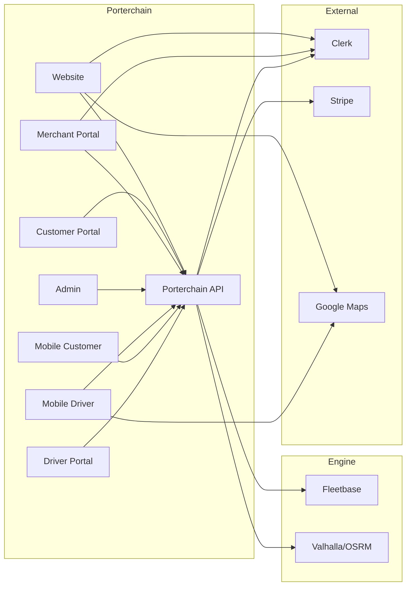

---

## Related documents

- [BUSINESS_WORKFLOW.md](./BUSINESS_WORKFLOW.md)
- [docs/architecture/SYSTEM_ARCHITECTURE.md](./docs/architecture/SYSTEM_ARCHITECTURE.md)
- [ORDER_LIFECYCLE.md](./ORDER_LIFECYCLE.md)
- [EVENT_BUS.md](./EVENT_BUS.md)

---

## Governance

| Document                                   | Role              |
| ------------------------------------------ | ----------------- |
| [masterrule.md](masterrule.md)             | Architecture SSOT |
| [CTO_AUDIT_REPORT.md](CTO_AUDIT_REPORT.md) | Doc vs code audit |
