# Admin Control Tower


**Type:** CANONICAL
**masterrule:** [§21](../../masterrule.md#21-simplification--essential-complexity)
**Last verified:** 2026-07-05

**Source:** `routers/admin.py`, `routers/operations.py`, `routers/route_center.py`, `admin_engine/control_tower_service.py`  
**See also:** [DISPATCH_FLOW.md](./DISPATCH_FLOW.md) · [REALTIME_FLOW.md](./REALTIME_FLOW.md) · [ROUTE_CENTER_INTEGRATION.md](../../ROUTE_CENTER_INTEGRATION.md)

---

## Overview

The Admin Portal (`:3002`) is the **business control tower**. It communicates exclusively with `/v1/admin/*`, `/v1/admin/operations/*`, and `/v1/admin/route-center/*`. It never calls Fleetbase HTTP directly — only SSO to open the Fleetbase console (`:4200`).

## Control Tower (`ControlTowerService`)

Central ops hub at `/v1/admin/operations/`:

| Endpoint | Purpose |
| -------- | ------- |
| `GET /stats` | KPI counters (orders, SLA, exceptions) |
| `GET /board` | Dispatch board columns |
| `POST /board/move` | Move order between board columns |
| `GET /queue` | Dispatch-ready queue |
| `POST /queue/optimize` | Queue optimization suggestions |
| `POST /queue/assign-batch` | Batch driver assignment |
| `GET /assignable-drivers` | Drivers available for assignment |
| `GET /orders` | Active operational orders |
| `GET /exceptions` | `OrderException` list |
| `GET /sla` | SLA breach metrics |
| `GET /activity` | Recent domain events |
| `GET /ai` | AI ops insights (if configured) |
| `POST /sync/process` | Fleetbase retry queue processor |
| `GET /sync/health` | Sync job health |

Driver assignment execution remains on `POST /v1/admin/dispatch/orders/{id}/assign` (`admin.py`).

## Live Map (`LiveMapService`)

| Endpoint | Purpose |
| -------- | ------- |
| `GET /map`, `/live-map` | Map snapshot data |
| `GET /live-map/search` | Entity search |
| `GET /live-map/detail/{type}/{id}` | Order/driver detail |
| `GET /live-map/playback` | Historical playback |
| `GET /live-map/nearest-drivers` | Proximity query |
| `WS /live-map/ws` | 5s realtime snapshots (Clerk JWT) |

Full WebSocket path: `/v1/admin/operations/live-map/ws`.

## Route Center (`RouteCenterService`)

Planning and multi-stop optimization at `/v1/admin/route-center/*` — creates `route_center_plans`, simulates routes via Valhalla/OSRM, dispatches through Fleetbase adapter (never direct Fleetbase HTTP from UI).

## Module Communication

```
Admin Portal
    ├── Dashboard → AdminDashboardService (aggregates all modules)
    ├── Orders → AdminOrdersService → order_transitions, Fleetbase via events
    ├── Dispatch → AdminOperationsService.assign_driver()
    ├── Operations → ControlTowerService + LiveMapService
    ├── Route Center → RouteCenterService → MapsService + fleetbase_engine
    ├── Finance → AdminFinanceService → billing_engine
    ├── Pricing → AdminPricingService → pricing_engine
    ├── CRM → CrmSalesService
    ├── Merchants → AdminMerchantService + Merchant360Service
    ├── Drivers → AdminDriverService + Driver360Service
    ├── Claims → AdminClaimsService → claim.opened events
    ├── Support → AdminSupportService → support.ticket_created events
    ├── Settings → AdminSettingsService (integration health)
    ├── Reports → AdminReportsService (aggregates all)
    └── Diagnostics → AdminDiagnosticsService (health / E2E probes)
```

## RBAC

`admin_engine/rbac.py` — `require_module()` guards per route (e.g. `dispatch`, `finance`, `crm`, `map`).

## Diagram

```mermaid
flowchart TB
  ADMIN[Admin Portal :3002] --> API["/v1/admin/*"]

  subgraph ControlTower["Control Tower — operations.py"]
    CT[ControlTowerService]
    LM[LiveMapService]
    STATS["/operations/stats"]
    BOARD["/operations/board"]
    QUEUE["/operations/queue"]
    EXC["/operations/exceptions"]
    SLA["/operations/sla"]
    AI["/operations/ai"]
    WS["WS /live-map/ws"]
  end

  subgraph RouteCenter["Route Center — route_center.py"]
    RC[RouteCenterService]
    PLANS[route_center_plans]
  end

  subgraph Modules["Admin Engine Modules"]
    DASH[AdminDashboardService]
    ORD[AdminOrdersService]
    DISP[AdminOperationsService]
    FIN[AdminFinanceService]
    PRC[AdminPricingService]
    CLM[AdminClaimsService]
    SUP[AdminSupportService]
    CRM[CrmSalesService]
    MER[AdminMerchantService / Merchant360]
    DRV[AdminDriverService / Driver360]
    SET[AdminSettingsService]
    REP[AdminReportsService]
    BD[AdminBookingDraftService]
    DIAG[AdminDiagnosticsService]
  end

  subgraph Execution["Downstream"]
    FBE[fleetbase_engine]
    EB[Event Bus]
    BLE[billing_engine]
    NE[notification_engine]
    PE[pricing_engine]
    MAPS[MapsService Valhalla/OSRM]
  end

  API --> DASH & ORD & DISP & CT & LM & RC & FIN & PRC & CLM & SUP & CRM & MER & DRV & SET & REP & BD & DIAG
  CT --> ORD & FBE
  LM --> CT & FBE
  RC --> MAPS & FBE & PLANS
  DISP --> ORD
  ORD --> EB
  FIN --> BLE
  CLM & SUP --> NE
  PRC --> PE
  SET -->|"health checks"| FBE
```



## PlantUML

See [plantuml/admin_control_tower.puml](./plantuml/admin_control_tower.puml)
---

## Governance

| Document | Role |
| -------- | ---- |
| [masterrule.md](../../masterrule.md) | Architecture SSOT |
| [CTO_AUDIT_REPORT.md](../../CTO_AUDIT_REPORT.md) | Doc vs code audit |
