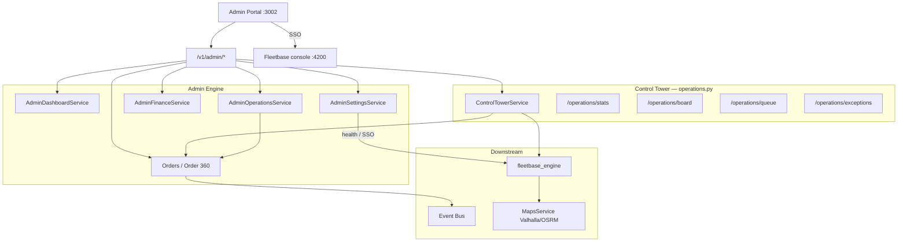

# Admin Control Tower

**Type:** CANONICAL  
**masterrule:** [§21](../../masterrule.md#21-simplification--essential-complexity)  
**Last verified:** 2026-08-07

**Source:** `routers/admin.py`, `routers/operations.py`, `admin_engine/control_tower_service.py`  
**See also:** [DISPATCH_FLOW.md](./DISPATCH_FLOW.md) · [ORDERS_MODULE.md](../ops/ORDERS_MODULE.md) · [SSO.md](../../SSO.md)

---

## Overview

The Admin Portal (`:3002`) is the **business control tower**. It talks only to `/v1/admin/*` and `/v1/admin/operations/*`. It never calls Fleetbase HTTP directly — use Admin SSO to open the Fleetbase console (`:4200`) for live GPS, fleet maps, and dispatch execution UI.

## Control Tower (`ControlTowerService`)

Ops hub at `/v1/admin/operations/`:

| Endpoint                   | Purpose                                |
| -------------------------- | -------------------------------------- |
| `GET /stats`               | KPI counters (orders, SLA, exceptions) |
| `GET /board`               | Dispatch board columns                 |
| `POST /board/move`         | Move order between board columns       |
| `GET /queue`               | Dispatch-ready queue                   |
| `POST /queue/assign-batch` | Batch driver assignment                |
| `GET /assignable-drivers`  | Drivers available for assignment       |
| `GET /orders`              | Active operational orders              |
| `GET /exceptions`          | `OrderException` list                  |
| `GET /sla`                 | SLA breach metrics                     |
| `GET /activity`            | Recent domain events                   |
| `GET /ai`                  | AI ops insights (if configured)        |
| `POST /sync/process`       | Fleetbase retry queue processor        |
| `GET /sync/health`         | Sync job health                        |

Driver assignment: `POST /v1/admin/dispatch/orders/{id}/assign`. Order 360: `/v1/admin/orders/{id}` (+ assist, documents, invoice).

## Maps & live tracking (Fleetbase-first)

PorterChain Admin does **not** host a live-map WebSocket or Route Center. Live fleet views, GPS, and route execution stay in **Fleetbase console** (SSO). Public/merchant tracking uses `TrackingService` + Fleetbase-backed APIs.

## Module communication

```
Admin Portal
    ├── Dashboard → AdminDashboardService
    ├── Orders / Order 360 → order platform detail + assist
    ├── Dispatch → AdminOperationsService.assign_driver()
    ├── Operations → ControlTowerService (board / queue / exceptions)
    ├── Finance → AdminFinanceService → billing_engine
    ├── Pricing → settings / pricing_engine (commercial; not Fleetbase)
    ├── CRM → CrmSalesService
    ├── Merchants → AdminMerchantService
    ├── Drivers → AdminDriverService
    ├── Claims / Support → claims & support services
    ├── Settings → AdminSettingsService (+ Fleetbase SSO link)
    └── Diagnostics → AdminDiagnosticsService
```

## RBAC

`admin_engine/rbac.py` — `require_module()` guards per route (e.g. `dispatch`, `finance`, `crm`).

## Diagram


