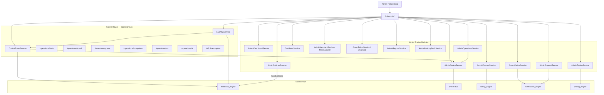

# Admin Control Tower

> **Source:** `routers/admin.py`, `routers/operations.py`, `admin_engine/control_tower_service.py`

## Overview

The Admin Portal is the **business control tower**. It communicates exclusively with `/v1/admin/*` and `/v1/admin/operations/*`. It never calls Fleetbase HTTP directly — only SSO to open the Fleetbase console.

## Control Tower (`ControlTowerService`)

Central ops hub at `/v1/admin/operations/`:

| Endpoint             | Purpose                                |
| -------------------- | -------------------------------------- |
| `GET /stats`         | KPI counters (orders, SLA, exceptions) |
| `GET /board`         | Dispatch board columns                 |
| `GET /queue`         | Dispatch-ready queue                   |
| `GET /orders`        | Active operational orders              |
| `GET /exceptions`    | `OrderException` list                  |
| `GET /sla`           | SLA breach metrics                     |
| `GET /activity`      | Recent domain events                   |
| `GET /ai`            | AI ops insights (if configured)        |
| `POST /sync/process` | Fleetbase retry queue processor        |
| `GET /sync/health`   | Sync job health                        |

## Live Map (`LiveMapService`)

| Endpoint                           | Purpose               |
| ---------------------------------- | --------------------- |
| `GET /map`, `/live-map`            | Map snapshot data     |
| `GET /live-map/search`             | Entity search         |
| `GET /live-map/detail/{type}/{id}` | Order/driver detail   |
| `GET /live-map/playback`           | Historical playback   |
| `GET /live-map/nearest-drivers`    | Proximity query       |
| `WS /live-map/ws`                  | 5s realtime snapshots |

## Module Communication

```
Admin Portal
    ├── Dashboard → AdminDashboardService (aggregates all modules)
    ├── Orders → AdminOrdersService → order_transitions, Fleetbase via events
    ├── Dispatch → AdminOperationsService.assign_driver()
    ├── Finance → AdminFinanceService → billing_engine
    ├── Pricing → AdminPricingService → pricing_engine
    ├── CRM → CrmSalesService
    ├── Merchants → AdminMerchantService + Merchant360Service
    ├── Drivers → AdminDriverService + Driver360Service
    ├── Claims → AdminClaimsService → claim.opened events
    ├── Support → AdminSupportService → support.ticket_created events
    ├── Settings → AdminSettingsService (integration health)
    └── Reports → AdminReportsService (aggregates all)
```

## RBAC

`admin_engine/rbac.py` — `require_module()` guards per route (e.g. `dispatch`, `finance`, `crm`).

## Diagram



## PlantUML

See [plantuml/admin_control_tower.puml](./plantuml/admin_control_tower.puml)
