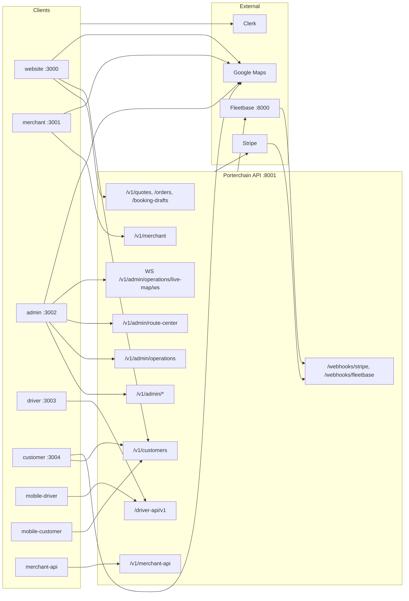

# API Dependency

**Type:** CANONICAL
**masterrule:** [§21](../../masterrule.md#21-simplification--essential-complexity)
**Last verified:** 2026-07-05

**Source:** Frontend `lib/api.ts` files, `apps/api/src/porterchain_api/routers/`  
**See also:** [API_FLOW_DIAGRAM.md](../../API_FLOW_DIAGRAM.md) · [APPLICATION_FLOW.md](./APPLICATION_FLOW.md)

> **Policy:** [masterrule.md](../../masterrule.md) §7

---

## Client → API matrix

| Client          | Base URL                | Auth                             | Key paths                                                                                                                         |
| --------------- | ----------------------- | -------------------------------- | --------------------------------------------------------------------------------------------------------------------------------- |
| Website         | `:8001/v1`              | Clerk bearer (booking)           | `/quotes`, `/bookings`, `/booking-drafts`, `/orders`, `/customers/me`, `/payments`                                                |
| Customer        | `:8001/v1`              | Clerk bearer                     | `/customers/me/dashboard`, `/customers/me/support`, `/customers/me/rebook/{id}`                                                   |
| Merchant        | `:8001/v1/merchant`     | Clerk bearer                     | `/dashboard`, `/bookings`, `/orders`, `/bulk`, `/billing`, `/api-keys`, `/integrations/webhooks`                                  |
| Merchant API    | `:8001/v1/merchant-api` | `X-Api-Key` + scopes             | `/bookings`, `/orders`, `/track/{tracking_number}`                                                                                |
| Admin           | `:8001/v1/admin`        | Clerk bearer                     | `/dashboard`, `/orders`, `/operations`, `/route-center`, `/crm`, `/merchants`, `/drivers`, `/finance`, `/reports`, `/diagnostics` |
| Driver portal   | `:8001/driver-api/v1`   | Porterchain JWT (via Next proxy) | `/auth/login`, `/routes`, `/stops`, `/location`, `/pod`                                                                           |
| mobile-driver   | `:8001/driver-api/v1`   | Clerk → Porterchain JWT          | Same as driver portal                                                                                                             |
| mobile-customer | `:8001/v1`              | Clerk bearer                     | `/customers/me/*`                                                                                                                 |
| Stripe          | `:8001/webhooks`        | HMAC                             | `/webhooks/stripe`                                                                                                                |
| Fleetbase       | `:8001/webhooks`        | HMAC                             | `/webhooks/fleetbase`                                                                                                             |

Webhooks are **not** under `/v1/` — router prefix is `/webhooks`.

---

## External API calls (server-side only)

| System          | Caller                                          | Target                         |
| --------------- | ----------------------------------------------- | ------------------------------ |
| Fleetbase       | `fleetbase_engine` / adapter                    | `FLEETBASE_API_URL` (:8000)    |
| Stripe          | `stripe_service`                                | Stripe REST                    |
| Valhalla / OSRM | `porterchain_services/maps`                     | `:8002` / `OSRM_HOST`          |
| Clerk           | `auth/clerk.py`                                 | JWKS URL(s)                    |
| Google Maps     | `@porterchain/maps`, `@porterchain/mobile-maps` | Browser / native SDK (UI only) |
| FCM             | notification engine                             | Firebase (when configured)     |
| SMTP            | notification engine                             | Zoho / configured SMTP         |

---

## No direct Fleetbase from UI

Admin opens Fleetbase console via `POST /v1/auth/sso/fleetbase` → SSO URL only. All execution sync goes through adapter + event bus.

---

## Diagram

---

## PlantUML

See [plantuml/api_dependency.puml](./plantuml/api_dependency.puml)

---

## Related

| Document                                             | Purpose          |
| ---------------------------------------------------- | ---------------- |
| [INTEGRATIONS.md](../../INTEGRATIONS.md)             | External systems |
| [PORT_CONFIGURATION.md](../../PORT_CONFIGURATION.md) | Ports            |

---

## Governance

| Document                                         | Role              |
| ------------------------------------------------ | ----------------- |
| [masterrule.md](../../masterrule.md)             | Architecture SSOT |
| [CTO_AUDIT_REPORT.md](../../CTO_AUDIT_REPORT.md) | Doc vs code audit |
