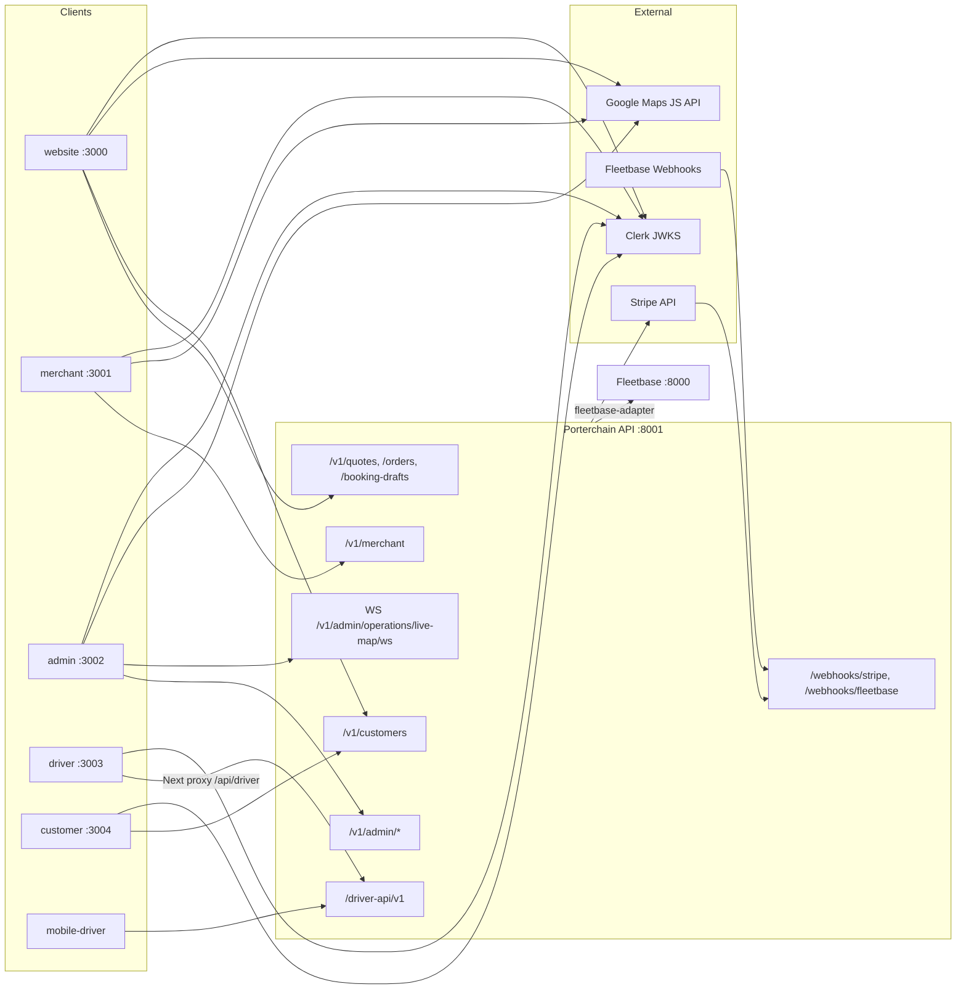

# API Dependency

> **Source:** Frontend `lib/api.ts` files, `apps/api/src/porterchain_api/routers/`

## Client → API Matrix

| Client    | Base URL              | Auth                             | Key paths                                                                                                                 |
| --------- | --------------------- | -------------------------------- | ------------------------------------------------------------------------------------------------------------------------- |
| Website   | `:8001/v1`            | Clerk bearer (booking)           | `/quotes`, `/bookings`, `/booking-drafts`, `/orders`, `/customers/me`, `/payments/retry`                                  |
| Customer  | `:8001/v1`            | Clerk bearer                     | `/customers/me/dashboard`, `/customers/me/support`, `/customers/me/rebook/{id}`                                           |
| Merchant  | `:8001/v1/merchant`   | Clerk + org headers              | `/dashboard`, `/bookings`, `/orders`, `/bulk`, `/billing`, `/profile`, `/team`, `/api-keys`                               |
| Admin     | `:8001/v1/admin`      | Clerk bearer                     | `/dashboard`, `/orders`, `/operations`, `/crm`, `/merchants`, `/drivers`, `/finance`, `/pricing`, `/reports`, `/settings` |
| Driver    | `:8001/driver-api/v1` | Porterchain JWT (via Next proxy) | `/auth/login`, `/routes`, `/stops`, `/availability`, `/location`                                                          |
| Stripe    | `:8001/webhooks`      | HMAC signature                   | `/webhooks/stripe`                                                                                                        |
| Fleetbase | `:8001/webhooks`      | HMAC signature                   | `/webhooks/fleetbase`                                                                                                     |

## External API Calls (Server-Side Only)

| System         | Caller                                 | Path                                 |
| -------------- | -------------------------------------- | ------------------------------------ |
| Fleetbase      | `fleetbase-adapter`                    | `settings.fleetbase_api_url` (:8000) |
| Stripe         | `services/stripe_service.py`           | Stripe REST API                      |
| OSRM           | `porterchain_services/maps/service.py` | `settings.osrm_url`                  |
| Valhalla       | `porterchain_services/maps/service.py` | `settings.valhalla_url` (:8002)      |
| Clerk          | `auth/clerk.py`                        | JWKS endpoint                        |
| Google Geocode | `website/src/lib/quote/geocode.ts`     | Server-only quote preview            |
| Google Maps    | `@porterchain/maps`                    | Browser JS API (viz/autocomplete)    |

## No Direct Fleetbase from UI

Admin opens Fleetbase console via `POST /v1/auth/sso/fleetbase` → SSO URL only.

## Diagram

## PlantUML

See [plantuml/api_dependency.puml](./plantuml/api_dependency.puml)
