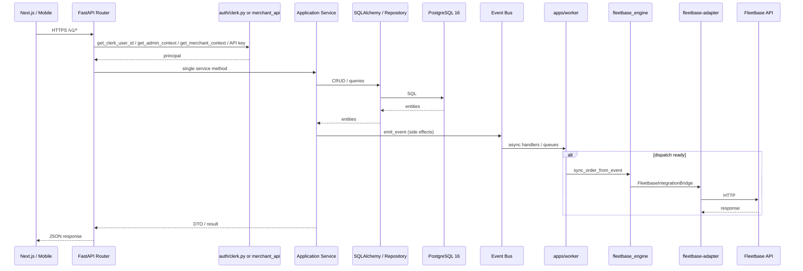

# Application Flow


**Type:** CANONICAL
**masterrule:** [§21](../../masterrule.md#21-simplification--essential-complexity)
**Last verified:** 2026-07-05

**Source:** `apps/api/src/porterchain_api/routers/`, `main.py`, `platform/bus.py`  
**See also:** [SYSTEM_ARCHITECTURE.md](./SYSTEM_ARCHITECTURE.md) · [AUTHENTICATION_FLOW.md](./AUTHENTICATION_FLOW.md) · [ORDER_LIFECYCLE.md](../../ORDER_LIFECYCLE.md)

---

## Request Path

Every frontend communicates exclusively with the Porterchain API at `NEXT_PUBLIC_PORTERCHAIN_API_URL` (default `http://localhost:8001`). No frontend performs direct Fleetbase HTTP calls.

| Surface | Port | API auth |
| ------- | ---- | -------- |
| Website | `:3000` | Clerk (retail quotes/bookings) |
| Customer portal | `:3004` | Clerk |
| Merchant portal | `:3001` | Clerk + org headers |
| Admin portal | `:3002` | Clerk + admin RBAC |
| Driver portal | `:3003` | Porterchain JWT via Next proxy |
| Mobile driver / customer | — | Same JWT / Clerk tokens as portals |

```
Website / Customer / Merchant / Admin / Driver / Mobile
        ↓  HTTPS /v1/*  (Driver: /driver-api/v1 via Next proxy)
FastAPI Router (Controller)
        ↓
Application Service (*_engine/*_service.py)
        ↓
Repository → PostgreSQL 16
        ↓ (async side effects)
Event Bus → apps/worker → Queues
        ↓ (logistics execution)
fleetbase_engine → fleetbase-adapter → Fleetbase
```

## Router → Service Mapping

| Router prefix | Auth | Primary engines |
| ------------- | ---- | ---------------- |
| `/v1/quotes`, `/v1/booking-drafts`, `/v1/orders`, `/v1/payments` | Clerk (optional/public on quotes) | `booking_engine` |
| `/v1/customers` | Clerk | `booking_engine.CustomerService` |
| `/v1/merchant` | Clerk + merchant context | `merchant_engine` |
| `/v1/merchant-api` | API key (`X-Api-Key`) + scopes | `merchant_engine` (via `gateway_engine`) |
| `/v1/admin`, `/v1/admin/operations` | Clerk + admin RBAC | `admin_engine` |
| `/v1/admin/crm`, `/merchants`, `/drivers` | Admin RBAC | `admin_engine`, `CrmSalesService` |
| `/driver-api/v1` | Porterchain JWT | `driver_engine`, `porterchain_driver` |
| `/webhooks/stripe`, `/webhooks/fleetbase` | Signature verify | `StripeWebhookService`, `WebhookIngressService` |

## Middleware (order applied)

1. `CORSMiddleware` — origins from `settings.cors_origin_list`
2. `RequestIdMiddleware` — `X-Request-ID` propagation (`platform/middleware.py`)
3. `PortalRateLimitMiddleware` — Redis sliding window on `/v1/admin/*`, `/v1/merchant/*`, `/v1/customers/*`, `/driver-api/*` (skipped in `local` env)
4. `MerchantApiGatewayMiddleware` — usage metering + per-key limits on `/v1/merchant-api/*`

## Diagram



## PlantUML

See [plantuml/application_flow.puml](./plantuml/application_flow.puml)
---

## Governance

| Document | Role |
| -------- | ---- |
| [masterrule.md](../../masterrule.md) | Architecture SSOT |
| [CTO_AUDIT_REPORT.md](../../CTO_AUDIT_REPORT.md) | Doc vs code audit |
