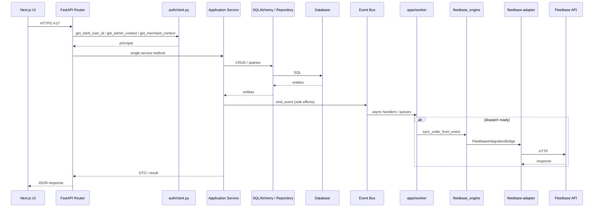

# Application Flow

> **Source:** `apps/api/src/porterchain_api/routers/`, `main.py`, `platform/bus.py`

## Request Path

Every frontend application communicates exclusively with the Porterchain API at `NEXT_PUBLIC_PORTERCHAIN_API_URL` (default `http://localhost:8001`). No frontend performs direct Fleetbase HTTP calls.

```
Website / Customer / Merchant / Admin / Driver
        ↓  HTTPS /v1/*  (Driver: /driver-api/v1 via Next proxy)
FastAPI Router (Controller)
        ↓
Application Service (*_engine/*_service.py)
        ↓
Repository → Database
        ↓ (async side effects)
Event Bus → Worker → Queues
        ↓ (logistics execution)
fleetbase_engine → fleetbase-adapter → Fleetbase
```

## Router → Service Mapping

| Router prefix                                                    | Auth                     | Primary engines                                      |
| ---------------------------------------------------------------- | ------------------------ | ---------------------------------------------------- |
| `/v1/quotes`, `/v1/booking-drafts`, `/v1/orders`, `/v1/payments` | Clerk (optional/public)  | `booking_engine`                                     |
| `/v1/customers`                                                  | Clerk                    | `booking_engine.CustomerService`                     |
| `/v1/merchant`                                                   | Clerk + merchant context | `merchant_engine`                                    |
| `/v1/admin`                                                      | Clerk + admin RBAC       | `admin_engine`                                       |
| `/v1/admin/operations`                                           | Admin RBAC               | `admin_engine.ControlTowerService`, `LiveMapService` |
| `/v1/admin/crm`, `/merchants`, `/drivers`                        | Admin RBAC               | `admin_engine`, `CrmSalesService`                    |
| `/driver-api/v1`                                                 | Porterchain JWT          | `driver_engine`, `porterchain_driver`                |
| `/webhooks`                                                      | Signature verify         | `StripeWebhookService`, `WebhookIngressService`      |

## Middleware

1. `CORSMiddleware` — origins from `settings.cors_origin_list`
2. `RequestIdMiddleware` — `X-Request-ID` propagation (`platform/middleware.py`)

## Diagram



## PlantUML

See [plantuml/application_flow.puml](./plantuml/application_flow.puml)
