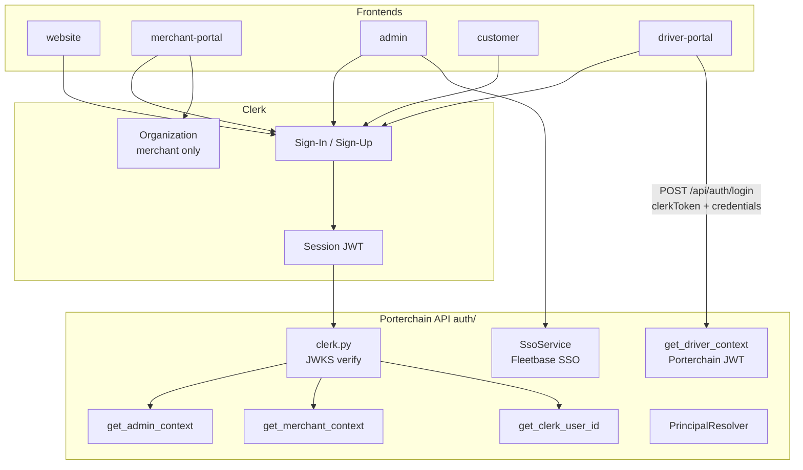

# Authentication Flow

> **Source:** `apps/api/src/porterchain_api/auth/`, frontend `middleware.ts` and auth providers

## Clerk (Retail, Merchant, Admin, Customer)

1. User signs in via Clerk hosted UI (`@clerk/nextjs`)
2. Frontend obtains session JWT via `getToken()`
3. API request: `Authorization: Bearer <jwt>`
4. `auth/clerk.py` fetches JWKS, verifies signature, returns `ClerkClaims`
5. Context resolution:
   - **Customer/Booking:** `get_clerk_user_id` → links to `Customer` record
   - **Admin:** `get_admin_context` → `AdminUser` + RBAC modules
   - **Merchant:** `get_merchant_context` → `MerchantUser` + `X-Merchant-Org-Id` header

## Dev Bypass

When Clerk not configured and `NODE_ENV=development`:

- Token `"dev"` accepted
- Admin auto-provisions dev user
- Merchant uses `dev_merchant_org`

## Driver Auth (Separate)

1. Driver signs in via Clerk on driver-portal login page
2. `POST /api/auth/login` → `POST /driver-api/v1/auth/login` with `clerkToken` + credentials
3. `DriverAuthService` issues **Porterchain access JWT**
4. Subsequent requests: cookie `driver_access_token` via Next.js proxy
5. `get_driver_context` decodes Porterchain JWT (not Clerk on each request)

## Fleetbase SSO (Admin Only)

`POST /v1/auth/sso/fleetbase` → `SsoService.exchange_fleetbase_session()` → opens Fleetbase console URL. Not a bypass of adapter for API calls.

## Identity Links

`identity_models.IdentityLink` maps Clerk user ↔ platform IDs ↔ Fleetbase IDs.

## Diagram

## PlantUML

See [plantuml/authentication_flow.puml](./plantuml/authentication_flow.puml)
