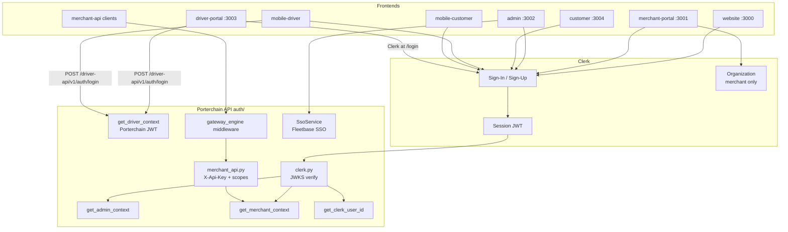

# Authentication Flow

**Type:** CANONICAL
**masterrule:** [§21](../../masterrule.md#21-simplification--essential-complexity)
**Last verified:** 2026-07-05

**Source:** `apps/api/src/porterchain_api/auth/`, frontend `middleware.ts` and auth providers  
**See also:** [AUTHENTICATION_ARCHITECTURE.md](../../AUTHENTICATION_ARCHITECTURE.md) · [SSO.md](../../SSO.md) · [RBAC.md](../../RBAC.md) · [SECURITY.md](../../SECURITY.md)

> **Root pointer:** [AUTHENTICATION_FLOW.md](AUTHENTICATION_FLOW.md) redirects here.

---

## Surfaces

| App             | Port / runtime | Auth                                        |
| --------------- | -------------- | ------------------------------------------- |
| Website         | :3000          | Clerk                                       |
| Merchant portal | :3001          | Clerk + org                                 |
| Admin           | :3002          | Clerk + RBAC                                |
| Driver portal   | :3003          | Clerk login → Porterchain JWT               |
| Customer portal | :3004          | Clerk                                       |
| Mobile driver   | Expo           | `@clerk/clerk-expo` → Porterchain JWT       |
| Mobile customer | Expo           | `@clerk/clerk-expo`                         |
| Merchant API    | HTTP           | `X-Api-Key` + scopes (`/v1/merchant-api/*`) |

---

## Clerk (retail, merchant, admin, customer)

1. User signs in via Clerk hosted UI (`@clerk/nextjs` or `@clerk/clerk-expo`)
2. Frontend obtains session JWT via `getToken()`
3. API request: `Authorization: Bearer <jwt>`
4. `auth/clerk.py` fetches JWKS (per-class or legacy URL), verifies signature, returns `ClerkClaims`
5. Context resolution:
   - **Customer / booking:** `get_clerk_user_id` → links to `Customer` record
   - **Admin:** `get_admin_context` → `AdminUser` + RBAC modules
   - **Merchant:** `get_merchant_context` → `MerchantUser` + `X-Merchant-Org-Id` header

Portal JWT routes are rate-limited in production via `PortalRateLimitMiddleware` (skipped when `APP_ENV=local`).

---

## Merchant API keys (`/v1/merchant-api/*`)

1. Integrations UI creates key via `MerchantApiKeyService` (hashed storage, scopes)
2. Client sends `X-Api-Key` header
3. `gateway_engine/middleware.py` validates key, enforces per-key rate limits, records usage
4. `auth/merchant_api.get_merchant_api_context` maps to `MerchantContext` for existing services
5. Scopes: e.g. `shipments:read`, `shipments:write` — missing scope → `403`

---

## Dev bypass

When `APP_ENV=local` **and** `CLERK_DEV_BYPASS=true`:

- Token `"dev"` accepted
- Admin auto-provisions dev user
- Merchant uses `dev_merchant_org`
- Driver email-only login allowed (local only)

Default: `CLERK_DEV_BYPASS=false`.

---

## Driver auth (session bridge)

1. Driver signs in via Clerk on driver-portal or mobile app
2. `POST /api/auth/login` → `POST /driver-api/v1/auth/login` with `clerkToken` + credentials
3. `DriverAuthService` issues **Porterchain access JWT**
4. Subsequent requests: cookie `driver_access_token` (web) or stored token (mobile)
5. `get_driver_context` decodes Porterchain JWT (not Clerk on each request)

---

## Fleetbase SSO (admin only)

`POST /v1/auth/sso/fleetbase` → `SsoService.exchange_fleetbase_session()` → opens Fleetbase console URL (`:4200`). Not a bypass of adapter for API calls.

---

## Identity links

`identity_models.IdentityLink` maps Clerk user ↔ platform IDs ↔ Fleetbase IDs.

---

## Diagram

---

## PlantUML

See [plantuml/authentication_flow.puml](./plantuml/authentication_flow.puml)

---

## Related

| Document                                                               | Purpose                            |
| ---------------------------------------------------------------------- | ---------------------------------- |
| [AUTHENTICATION_ARCHITECTURE.md](../../AUTHENTICATION_ARCHITECTURE.md) | Architecture and policy            |
| [SSO.md](../../SSO.md)                                                 | Fleetbase SSO exchange detail      |
| [RBAC.md](../../RBAC.md)                                               | Authorization after authentication |
| [APPLICATION_FLOW.md](./APPLICATION_FLOW.md)                           | Router → auth mapping              |

---
