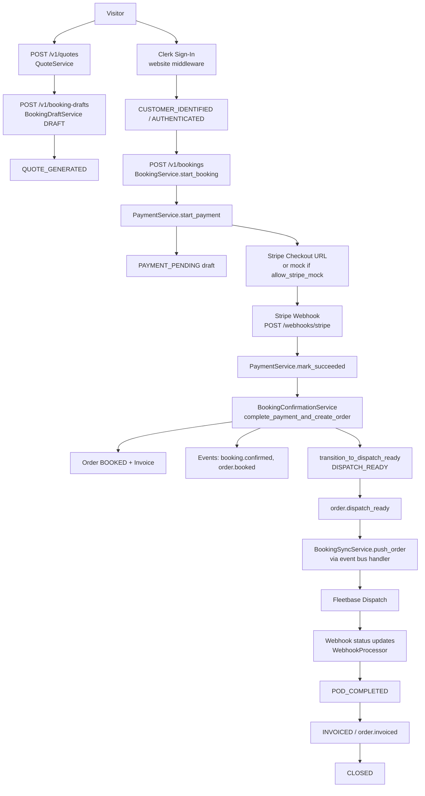

# Booking Flow (Retail)

> **Source:** `booking_engine/quote_service.py`, `booking_draft_service.py`, `booking_service.py`, `payment_service.py`, `confirmation_service.py`, `stripe_webhook_service.py`

## Lifecycle (Actual Implementation)

| Step         | Component                                                        | State / Event                                      |
| ------------ | ---------------------------------------------------------------- | -------------------------------------------------- |
| 1. Quote     | `QuoteService.create_quote()`                                    | `quote.created`                                    |
| 2. Draft     | `BookingDraftService.create_or_update()`                         | `DRAFT` → `QUOTE_GENERATED`                        |
| 3. Auth      | Clerk JWT on `POST /v1/bookings`                                 | `AUTHENTICATED`                                    |
| 4. Checkout  | `PaymentService.start_payment()`                                 | `PAYMENT_PENDING`, `payment.started`               |
| 5. Stripe    | Redirect to `checkout_url`                                       | External Stripe hosted page                        |
| 6. Webhook   | `StripeWebhookService`                                           | `checkout.session.completed` only trusted signal   |
| 7. Confirm   | `BookingConfirmationService.complete_payment_and_create_order()` | `Order` BOOKED, `booking.confirmed`                |
| 8. Dispatch  | `transition_to_dispatch_ready()`                                 | `order.dispatch_requested`, `order.dispatch_ready` |
| 9. Fleetbase | Event handler → `BookingSyncService.push_order()`                | `fleetbase.order_created`                          |
| 10. Delivery | Fleetbase webhooks → `WebhookProcessor`                          | State machine transitions                          |
| 11. Invoice  | On `POD_COMPLETED` path                                          | `order.invoiced`, `invoice.created`                |

## Dev Bypass

When `settings.allow_stripe_mock` is true: `POST /v1/bookings/mock-complete` skips Stripe.

## Diagram

## PlantUML

See [plantuml/booking_flow.puml](./plantuml/booking_flow.puml)
