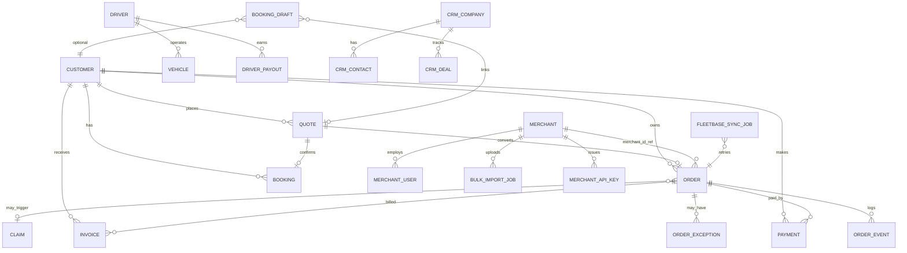

# Database Relationships

> **Source:** `models.py`, `merchant_models.py`, `admin_models.py`, `crm_models.py`, `booking_draft_models.py`, `fleetbase_models.py`, `driver_models.py`

## Core Booking Hub

```
Customer ──< Quote ──1:1──> Order ──< OrderEvent
   │            │              ├──< Payment
   │            └──1:1──> Booking ├──< Invoice
   │                              └──< OrderException
   └──< Order / Booking / Payment / Invoice
```

## Key Tables

| Module | Tables |
|--------|--------|
| Core | `customers`, `quotes`, `bookings`, `orders`, `payments`, `invoices`, `order_events`, `domain_events` |
| Drafts | `booking_drafts`, `booking_draft_audits` |
| Merchant | `merchants`, `merchant_users`, `saved_addresses`, `merchant_recipients`, `merchant_api_keys`, `bulk_import_jobs` |
| Admin/Ops | `admin_users`, `drivers`, `vehicles`, `support_tickets`, `claims`, `pricing_tariffs` |
| CRM | `crm_companies`, `crm_contacts`, `crm_deals`, `crm_contracts`, `crm_invoices` |
| Fleetbase sync | `fleetbase_sync_jobs`, `fleetbase_sync_audit` |
| Driver ops | `driver_location_pings`, `driver_wallet_transactions`, `driver_stop_meta` |
| Billing | `billing_ledger_entries` |
| Notifications | `notification_delivery_logs` |

## Order Metadata (migration d5f6a7b8c9d0)

- `orders.order_source` — WEBSITE, MERCHANT, CSV, API, …
- `orders.order_type` — INSTANT, CONTRACT, RECURRING, EXPRESS, SCHEDULED
- `merchants.billing_cycle` — NET terms

## Ownership Split (masterrule.md §9)

| Porterchain DB | Fleetbase DB |
|----------------|--------------|
| Customers, quotes, orders, payments, invoices, CRM | Operational drivers, dispatch, GPS traces, POD artifacts |

`orders.fleetbase_order_id` and `orders.assigned_driver_id` are cross-reference fields only.

## Diagram



## PlantUML

See [plantuml/database_relationship.puml](./plantuml/database_relationship.puml)
