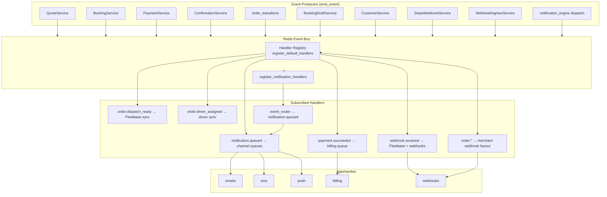

# Event Bus Flow

**Type:** CANONICAL
**masterrule:** [§21](../../masterrule.md#21-simplification--essential-complexity)
**Last verified:** 2026-07-05

**Source:** `shared/python/porterchain_shared/events/catalog.py`, `services/event-bus/porterchain_event_bus/handlers/__init__.py`, `notification_engine/event_router.py`  
**See also:** [EVENT_BUS.md](../../EVENT_BUS.md) · [EVENT_CATALOG.md](../../EVENT_CATALOG.md) · [NOTIFICATION_FLOW.md](./NOTIFICATION_FLOW.md)

---

## Transport

| Component    | Path / detail                                                             |
| ------------ | ------------------------------------------------------------------------- |
| Library      | `services/event-bus/porterchain_event_bus`                                |
| Backend      | Redis Streams (`porterchain:events`)                                      |
| Audit log    | `domain_events` table via `emit_event()`                                  |
| Registration | API lifespan `platform.bus.ensure_handlers_registered()` + worker startup |
| Consumer     | `apps/worker/run.py` — group `porterchain-workers`                        |

Without Redis (local dev): in-memory bus; handlers may run synchronously in the API process.

---

## Registered handlers (`register_default_handlers`)

| Event                    | Handler                           | Action                                       |
| ------------------------ | --------------------------------- | -------------------------------------------- |
| `order.dispatch_ready`   | `_handle_order_dispatch_ready`    | `sync_order_from_event` → Fleetbase push     |
| `order.driver_assigned`  | `_handle_driver_assigned`         | `sync_driver_assignment_from_event`          |
| `order.cancelled`        | `_handle_order_cancelled`         | `sync_cancellation_from_event`               |
| `claim.opened`           | `_handle_claim_opened`            | `sync_claim_from_event` (Fleetbase)          |
| `order.return_to_sender` | `_handle_order_return_to_sender`  | `sync_return_from_event`                     |
| `order.damaged`          | `_handle_order_damaged`           | `sync_damage_from_event`                     |
| `payment.succeeded`      | `_handle_payment_succeeded`       | Enqueue `billing` queue                      |
| `webhook.received`       | `_handle_webhook_received`        | Apply Fleetbase webhook + enqueue `webhooks` |
| `notification.queued`    | `_handle_notification_queued`     | Route to `emails` / `sms` / `push` queues    |
| `order.*` (wildcard)     | `_handle_merchant_webhook_fanout` | Merchant outbound webhook fan-out            |

## Notification routing (`register_notification_handlers`)

Subscribes **30+ domain events** to `notification_engine/event_router.handle_domain_event` — including `booking.confirmed`, `order.booked`, `payment.succeeded`, `driver_assigned`, `claim.opened`, `support.ticket_created`, Fleetbase status updates, and driver lifecycle events. Legacy wrappers in `booking_engine/notification_handler.py` delegate to the same router.

---

## Worker processors

| Queue      | Processor              | Notes                                         |
| ---------- | ---------------------- | --------------------------------------------- |
| `emails`   | `process_notification` | Email delivery                                |
| `sms`      | `process_notification` | SMS (log-only when provider unset)            |
| `push`     | `process_notification` | Firebase push                                 |
| `billing`  | `process_billing`      | Triggered by `payment.succeeded`              |
| `webhooks` | `process_webhook`      | Fleetbase ingress fan-out + merchant webhooks |
| `dispatch` | `process_dispatch`     | Dispatch job processor                        |
| `reports`  | stub (log only)        | No scheduled generation yet                   |

Background jobs in `apps/worker/run.py` also drain draft reconciliation every **300s** (not event-bus driven).

---

## Diagram

---

## PlantUML

See [plantuml/event_bus_flow.puml](./plantuml/event_bus_flow.puml)

---

## Related

| Document                                                         | Purpose                    |
| ---------------------------------------------------------------- | -------------------------- |
| [EVENT_BUS.md](../../EVENT_BUS.md)                               | Infrastructure, retry, DLQ |
| [EVENT_CATALOG.md](../../EVENT_CATALOG.md)                       | Event types                |
| [docs/archive/EVENT_BUS_AUDIT.md](../archive/EVENT_BUS_AUDIT.md) | Historical audit findings  |

---
