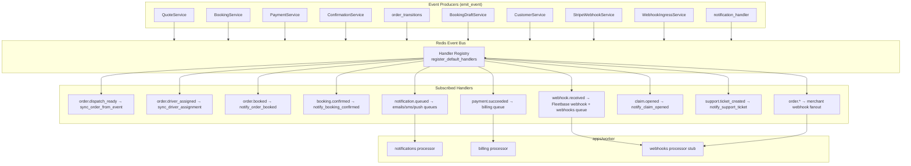

# Event Bus Flow

> **Source:** `shared/python/porterchain_shared/events/catalog.py`, `services/event-bus/porterchain_event_bus/handlers/__init__.py`, `booking_engine/_core.py`

## Transport

- Library: `services/event-bus/porterchain_event_bus`
- Backend: Redis (`porterchain_shared` config)
- Registration: API lifespan `platform.bus.ensure_handlers_registered()` + worker startup

## Domain Event Catalog (Implemented)

| Category      | Events                                                                                                                           |
| ------------- | -------------------------------------------------------------------------------------------------------------------------------- |
| Visitor       | `visitor.created`, `visitor.session_started`, `visitor.session_merged`                                                           |
| Quote/Booking | `quote.created`, `quote.accepted`, `booking.started`, `booking.confirmed`, `checkout.started`, `checkout.abandoned`              |
| Payment       | `payment.started`, `payment.succeeded`, `payment.failed`                                                                         |
| Orders        | `order.created`, `order.booked`, `order.dispatch_requested`, `order.dispatch_ready`, `order.driver_assigned`, … lifecycle events |
| Fleetbase     | `fleetbase.order_created`, `fleetbase.status_updated`, `fleetbase.pod_received`, `fleetbase.sync_failed`                         |
| Notifications | `notification.queued`, `notification.sent`                                                                                       |
| Webhooks      | `webhook.received`                                                                                                               |
| CRM/Support   | `claim.opened`, `support.ticket_created`, `lead.created`                                                                         |
| Merchant      | `merchant.approved`, `merchant.billed`                                                                                           |

## Registered Handlers

| Event                    | Action                                       |
| ------------------------ | -------------------------------------------- |
| `order.dispatch_ready`   | `sync_order_from_event` → Fleetbase push     |
| `order.driver_assigned`  | `sync_driver_assignment_from_event`          |
| `order.booked`           | `notify_order_booked`                        |
| `booking.confirmed`      | `notify_booking_confirmed`                   |
| `payment.succeeded`      | Enqueue `billing` queue                      |
| `webhook.received`       | Apply Fleetbase webhook + enqueue `webhooks` |
| `notification.queued`    | Route to `emails` / `sms` / `push`           |
| `claim.opened`           | `notify_claim_opened`                        |
| `support.ticket_created` | `notify_support_ticket_created`              |
| `order.*` (wildcard)     | Merchant webhook fanout                      |

## Persistence

Every `emit_event()` also writes to `domain_events` table for audit.

## Diagram

## PlantUML

See [plantuml/event_bus_flow.puml](./plantuml/event_bus_flow.puml)
