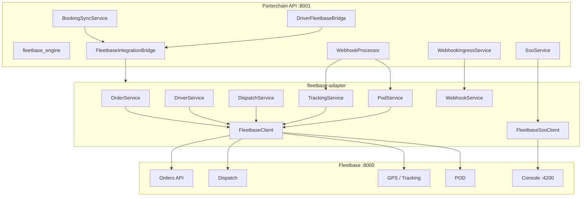

# Fleetbase Flow

**Type:** CANONICAL
**masterrule:** [§21](../../masterrule.md#21-simplification--essential-complexity)
**Last verified:** 2026-07-05

**Source:** `services/fleetbase-adapter/`, `fleetbase_engine/`, `services/fleetbase_integration.py`  
**See also:** [FLEETBASE_SERVICE_STATUS.md](../../FLEETBASE_SERVICE_STATUS.md) · [DISPATCH_FLOW.md](./DISPATCH_FLOW.md) · [FLEETBASE_INSTALL.md](../../FLEETBASE_INSTALL.md)

> **Vendor boundary:** `apps/fleetbase/**` is upstream Fleetbase — Porterchain integrates only via `fleetbase-adapter`. Do not document or modify vendor internals here.

---

## Adapter Boundary

**All Fleetbase HTTP** goes through `porterchain_fleetbase_adapter.FleetbaseAdapter`. Factory: `apps/api/src/porterchain_api/services/fleetbase_integration.py`.

Local stack: API `:8000`, console `:4200` — see [PORT_CONFIGURATION.md](../../PORT_CONFIGURATION.md). Porterchain API remains `:8001`.

## Adapter Modules

| Module | Responsibility |
| ------ | -------------- |
| `orders/` | Create, update, cancel orders |
| `drivers/` | Driver sync |
| `vehicles/` | Vehicle sync |
| `dispatch/` | Driver assignment |
| `tracking/` | Live tracking snapshots |
| `pod/` | Proof of delivery fetch |
| `routes/` | Route data |
| `webhooks/` | Inbound signature verify + parse |
| `auth/` | SSO session for admin console |
| `events/` | `EventTranslator` — status mapping |

## Outbound Triggers

| Trigger | Service | Adapter method |
| ------- | ------- | -------------- |
| `order.dispatch_ready` event | `BookingSyncService.push_order()` | `sync_order()` |
| `order.driver_assigned` event | `push_driver_assignment()` | dispatch API |
| `order.cancelled` / claim / damage / RTS events | Fleetbase sync handlers | respective cancel/sync APIs |
| Merchant cancel | `sync_cancellation()` (direct) | `cancel_order()` |
| Driver location | `DriverFleetbaseBridge` | tracking sync |
| Admin SSO | `SsoService.exchange_fleetbase_session()` | `FleetbaseSsoClient` |

## Inbound

`POST /webhooks/fleetbase` → `WebhookIngressService` → adapter `process_webhook()` → `webhook.received` event → `WebhookProcessor`

Skipped when `fleetbase_dispatch_bridge=false`.

## Retry

Failed outbound → `fleetbase_sync_jobs` table + `ErrorQueue` + `POST /v1/admin/operations/sync/process`

Verify stack: `pnpm docker:fleetbase:verify`

## Gated By

`settings.fleetbase_dispatch_bridge` (`FLEETBASE_DISPATCH_BRIDGE`) — when false, outbound push and webhook ingress are skipped.

## Diagram

## PlantUML

See [plantuml/fleetbase_flow.puml](./plantuml/fleetbase_flow.puml)
---

## Governance

| Document | Role |
| -------- | ---- |
| [masterrule.md](../../masterrule.md) | Architecture SSOT |
| [CTO_AUDIT_REPORT.md](../../CTO_AUDIT_REPORT.md) | Doc vs code audit |
