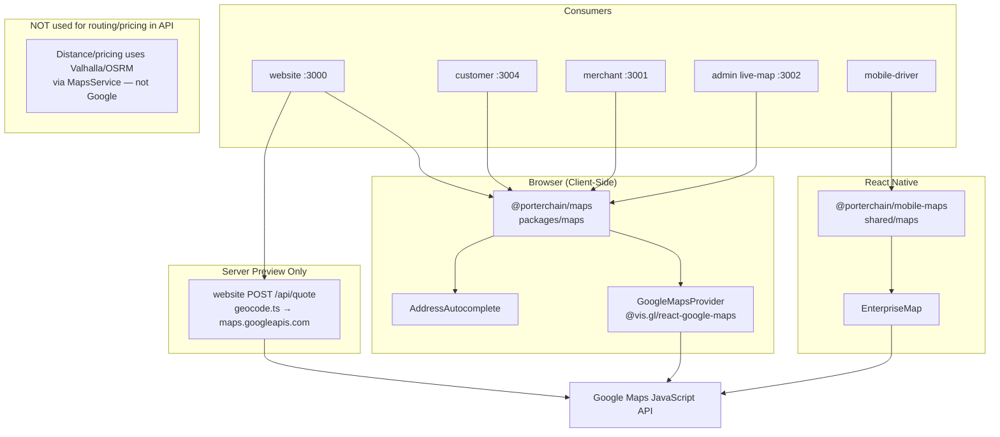

# Google Maps Flow

**Type:** CANONICAL
**masterrule:** [§21](../../masterrule.md#21-simplification--essential-complexity)
**Last verified:** 2026-07-05

**Source:** `packages/maps/`, `shared/maps/` (`@porterchain/mobile-maps`), `website/src/lib/quote/geocode.ts`  
**See also:** [GOOGLE_MAPS_USAGE.md](../../GOOGLE_MAPS_USAGE.md) · [MAPS_ARCHITECTURE_AUDIT.md](../../MAPS_ARCHITECTURE_AUDIT.md) · [shared/maps/MAP_MODULE.md](../../shared/maps/MAP_MODULE.md)

---

## Rule (masterrule.md)

Google Maps is used for **visualization and address autocomplete only**. Distance, ETA, and pricing use **OSRM/Valhalla** via `MapsService`. Route polylines on maps are **display-only** from Porterchain API data.

## Web Packages (`@porterchain/maps`)

| App             | Port    | Purpose                                         |
| --------------- | ------- | ----------------------------------------------- |
| Website         | `:3000` | Book flow autocomplete, map embed               |
| Customer portal | `:3004` | Book delivery autocomplete                      |
| Merchant portal | `:3001` | Book + tracking map viz                         |
| Admin           | `:3002` | Live map markers (`apps/admin/src/lib/maps.ts`) |
| Driver portal   | `:3003` | Navigation map chrome                           |

Package: `packages/maps/src/GoogleMapsProvider.tsx` wraps `@vis.gl/react-google-maps`.

Env: `NEXT_PUBLIC_GOOGLE_MAPS_API_KEY`

## Mobile (`@porterchain/mobile-maps`)

React Native maps in `shared/maps/` — `EnterpriseMap`, session adapters. Used by `apps/mobile-driver` and `apps/mobile-customer` for navigation/tracking visualization. **Not** used for pricing or dispatch routing.

## Server-Side (Website Quote Preview Only)

`website/src/app/api/quote/route.ts` → `geocode.ts` calls `maps.googleapis.com` for address → lat/lng. This is **estimation preview**; authoritative quotes use `POST /v1/quotes` (OSRM/Valhalla distance).

## NOT Google

- `QuoteService` / `PricingService` → `MapsService.route_distance_meters()` (Valhalla primary, OSRM when engine=osrm)
- Fleetbase execution routing

## Diagram

## PlantUML

See [plantuml/google_maps_flow.puml](./plantuml/google_maps_flow.puml)
---

## Governance

| Document                                         | Role              |
| ------------------------------------------------ | ----------------- |
| [masterrule.md](../../masterrule.md)             | Architecture SSOT |
| [CTO_AUDIT_REPORT.md](../../CTO_AUDIT_REPORT.md) | Doc vs code audit |
