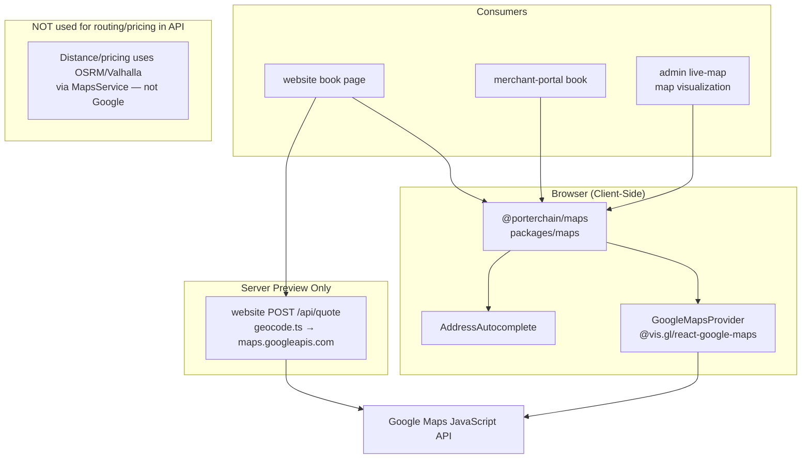

# Google Maps Flow

> **Source:** `packages/maps/`, `website/src/lib/quote/geocode.ts`, `apps/admin/src/lib/maps.ts`

## Rule (masterrule.md)

Google Maps is used for **visualization and address autocomplete only**. Distance, ETA, and pricing use **OSRM/Valhalla** via `MapsService`.

## Client-Side Usage

| App | File | Purpose |
|-----|------|---------|
| Website | `website/src/app/[locale]/book/` | Address autocomplete via `@porterchain/maps` |
| Merchant | `apps/merchant-portal/src/app/(portal)/book/` | Same shared package |
| Admin | `apps/admin/src/lib/maps.ts`, live-map pages | Map markers, driver positions |

Package: `packages/maps/src/GoogleMapsProvider.tsx` wraps `@vis.gl/react-google-maps`.

Env: `NEXT_PUBLIC_GOOGLE_MAPS_API_KEY`

## Server-Side (Website Quote Preview Only)

`website/src/app/api/quote/route.ts` → `geocode.ts` calls `maps.googleapis.com` for address → lat/lng. This is **estimation preview**; server re-validates at `POST /v1/quotes`.

## NOT Google

- `QuoteService` / `PricingService` → `MapsService.route_distance_meters()` (OSRM/Valhalla)
- Fleetbase execution routing

## Diagram

## PlantUML

See [plantuml/google_maps_flow.puml](./plantuml/google_maps_flow.puml)
