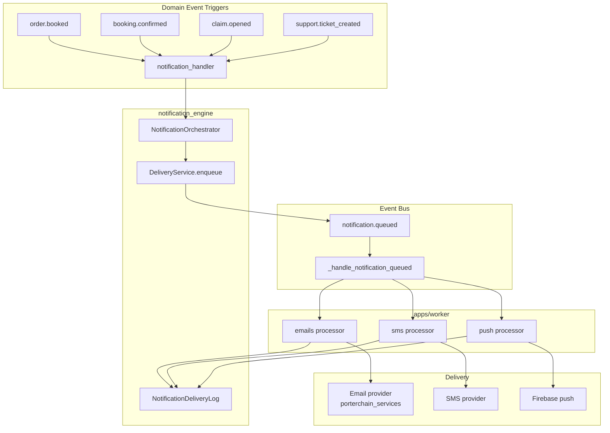

# Notification Flow

> **Source:** `notification_engine/`, `booking_engine/notification_handler.py`, `apps/worker/processors/notifications.py`

## Architecture

Notifications are **async** — domain events trigger handlers that enqueue delivery jobs. No synchronous email from routers.

## Flow

1. Domain event (`order.booked`, `booking.confirmed`, `claim.opened`, `support.ticket_created`)
2. `notification_handler.py` → `NotificationOrchestrator`
3. `DeliveryService.enqueue(channel, template, recipient, context)`
4. Emits `notification.queued`
5. Event handler routes to Redis queue: `emails`, `sms`, or `push`
6. Worker `processors/notifications.py` → `notification_engine.deliver_notification`
7. Logs to `notification_delivery_logs`

## Templates (Implemented)

| Template | Channel | Trigger |
|----------|---------|---------|
| `booking_confirmed` | email, sms | `booking.confirmed` |
| `order_booked` | email | `order.booked` |
| `checkout_recovery` | email | abandoned checkout |
| `claim_opened` | email | `claim.opened` |
| `support_ticket_created` | email | `support.ticket_created` |

## Diagram

## PlantUML

See [plantuml/notification_flow.puml](./plantuml/notification_flow.puml)
