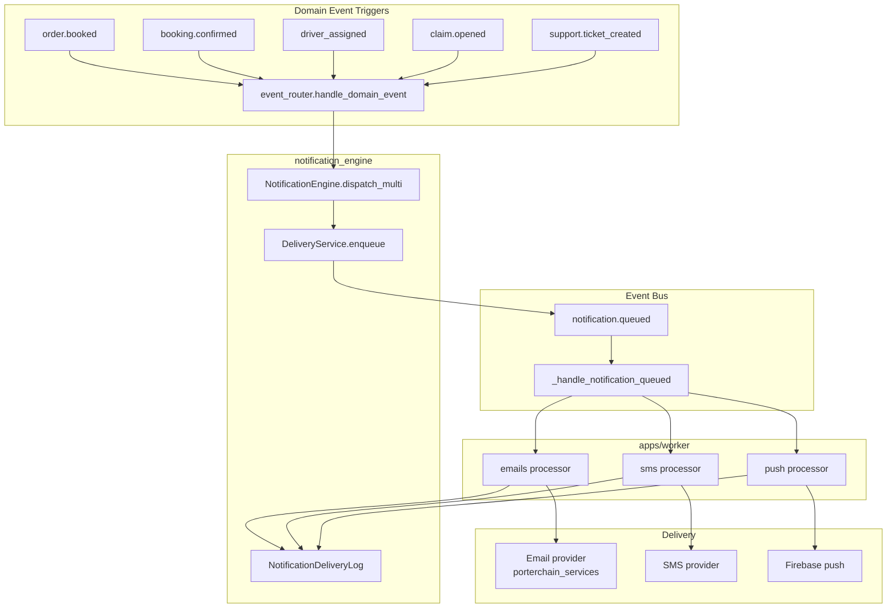

# Notification Flow

**Type:** CANONICAL
**masterrule:** [§21](../../masterrule.md#21-simplification--essential-complexity)
**Last verified:** 2026-07-05

**Source:** `notification_engine/`, `notification_engine/event_router.py`, `apps/worker/processors/notifications.py`  
**See also:** [EVENT_BUS_FLOW.md](./EVENT_BUS_FLOW.md) · [notifications/NOTIFICATION_ARCHITECTURE.md](../notifications/NOTIFICATION_ARCHITECTURE.md) · [notifications/FCM_CONFIGURATION.md](../notifications/FCM_CONFIGURATION.md)

---

## Architecture

Notifications are **async** — domain events trigger `event_router.handle_domain_event`, which enqueues delivery jobs via `NotificationEngine.dispatch_multi`. No synchronous email from routers.

## Flow

1. Domain event (`booking.confirmed`, `order.booked`, `driver_assigned`, etc.)
2. `event_router.py` → resolves recipients + channels per event type
3. `NotificationEngine.dispatch_multi()` → `DeliveryService.enqueue(channel, template, recipient, context)`
4. Emits `notification.queued`
5. Event handler routes to Redis queue: `emails`, `sms`, or `push`
6. Worker `processors/notifications.py` → `notification_engine.deliver_notification`
7. Logs to `notification_delivery_logs`

Legacy entry points in `booking_engine/notification_handler.py` delegate to the same router.

## Templates (Representative)

Full routing lives in `event_router._specs_for_event`. Key templates:

| Template | Channels | Trigger events |
| -------- | -------- | -------------- |
| `booking_confirmed` | email, push, in_app | `booking.confirmed` |
| `order_booked` / `order_created` | email, in_app | `order.booked`, `order.created` |
| `payment_receipt` | email, in_app | `payment.succeeded` |
| `payment_failed` | email, in_app | `payment.failed` |
| `driver_assigned` | push, in_app | `order.driver_assigned` |
| `delivered` | push, in_app | `order.parcel_delivered` |
| `checkout_recovery` | email | abandoned checkout (orchestrator) |
| `claim_opened` | email, in_app | `claim.opened` |
| `support_ticket_created` | email, in_app | `support.ticket_created` |
| `tracking_update` | push, in_app | `fleetbase.status_updated` |

SMS channel logs only when no SMS provider is configured.

## Diagram

## PlantUML

See [plantuml/notification_flow.puml](./plantuml/notification_flow.puml)
---

## Governance

| Document | Role |
| -------- | ---- |
| [masterrule.md](../../masterrule.md) | Architecture SSOT |
| [CTO_AUDIT_REPORT.md](../../CTO_AUDIT_REPORT.md) | Doc vs code audit |
