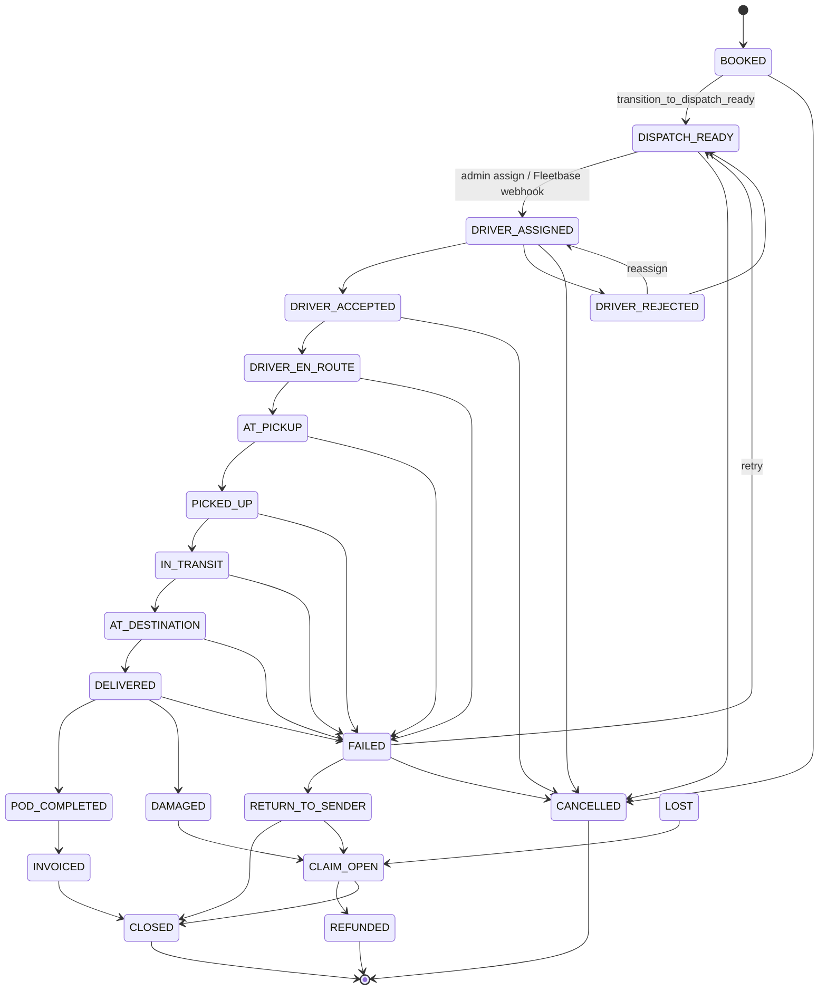

# Order Lifecycle

**Type:** CANONICAL
**masterrule:** [§21](../../masterrule.md#21-simplification--essential-complexity)
**Last verified:** 2026-07-05

**Source:** `domain/states.py`, `booking_engine/order_transitions.py`, `fleetbase_engine/webhook_processor.py`

> **Canonical reference:** [ORDER_LIFECYCLE.md](../../ORDER_LIFECYCLE.md) — full state definitions, quote/payment pre-states, SLAs, Fleetbase mapping, and transition rules.

This document is the **architecture supplement**: code-derived `OrderState` enum and transition diagram from `ORDER_TRANSITIONS`.

---

## OrderState Enum

Defined in `apps/api/src/porterchain_api/domain/states.py`:

`BOOKED` → `DISPATCH_READY` → `DRIVER_ASSIGNED` → `DRIVER_ACCEPTED` → `DRIVER_EN_ROUTE` → `AT_PICKUP` → `PICKED_UP` → `IN_TRANSIT` → `AT_DESTINATION` → `DELIVERED` → `POD_COMPLETED` → `INVOICED` → `CLOSED`

Exception states: `DRIVER_REJECTED`, `FAILED`, `CANCELLED`, `RETURN_TO_SENDER`, `DAMAGED`, `LOST`, `CLAIM_OPEN`, `REFUNDED`

Pre-order states (draft/quote flow): `QUOTE`, `QUOTE_EXPIRED`, `BOOKING_PENDING`, `PAYMENT_PENDING` — see canonical doc.

## Enforcement

- `can_transition_order()` — validates against `ORDER_TRANSITIONS` map
- `transition_order_state()` — writes `OrderEvent` + `DomainEvent` rows
- `transition_to_dispatch_ready()` — emits `order.dispatch_requested` then `order.dispatch_ready`

## Transition Sources

| Source              | Mechanism                                                               |
| ------------------- | ----------------------------------------------------------------------- |
| Retail confirmation | `BookingConfirmationService` → `BOOKED` → `DISPATCH_READY`              |
| Merchant booking    | `MerchantBookingService` → same                                         |
| Admin assign        | `AdminOperationsService.assign_driver()` → `DRIVER_ASSIGNED`            |
| Fleetbase webhooks  | `WebhookProcessor` + `StatusTranslator`                                 |
| Driver app          | `porterchain_driver` stop actions → events                              |
| Merchant cancel     | `MerchantOrdersService.cancel_order()` → `CANCELLED` + Fleetbase cancel |

## Metadata

- `order_source`: WEBSITE, MERCHANT, CSV, API, ADMIN, PHONE, PARTNER
- `order_type`: INSTANT, CONTRACT, RECURRING, EXPRESS, SCHEDULED

## Diagram

## PlantUML

See [plantuml/order_lifecycle.puml](./plantuml/order_lifecycle.puml)
---

## Governance

| Document                                         | Role              |
| ------------------------------------------------ | ----------------- |
| [masterrule.md](../../masterrule.md)             | Architecture SSOT |
| [CTO_AUDIT_REPORT.md](../../CTO_AUDIT_REPORT.md) | Doc vs code audit |
