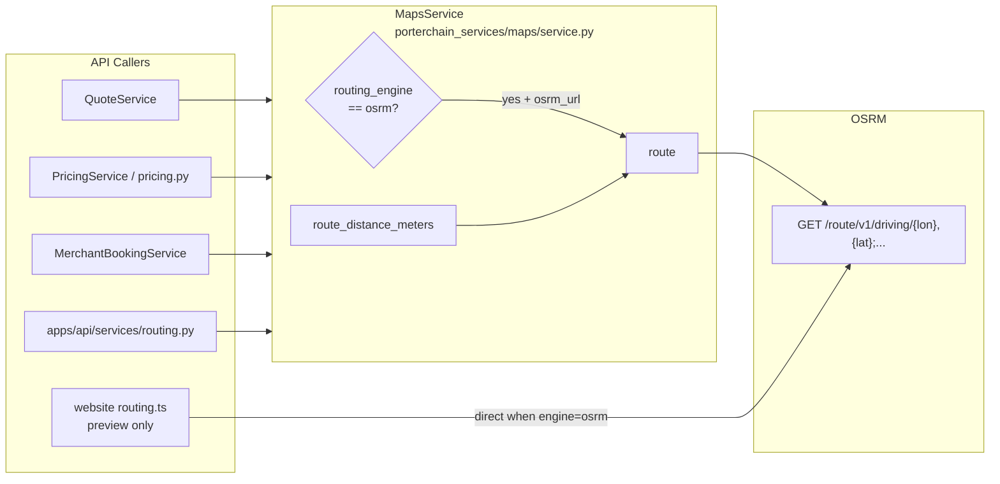

# OSRM Flow


**Type:** CANONICAL
**masterrule:** [§21](../../masterrule.md#21-simplification--essential-complexity)
**Last verified:** 2026-07-05

**Source:** `services/python/porterchain_services/maps/service.py`, `apps/api/src/porterchain_api/services/routing.py`  
**See also:** [OSRM_USAGE.md](../../OSRM_USAGE.md) · [VALHALLA_FLOW.md](./VALHALLA_FLOW.md)

---

## Purpose

OSRM provides **distance and duration** for quote pricing and merchant bookings when selected as the routing engine. It does not handle dispatch or driver routing (Fleetbase responsibility).

## Engine Selection (API)

`MapsService.route()` reads `settings.routing_engine` (default **`valhalla`**):

| Condition | Engine used |
| --------- | ----------- |
| `routing_engine=valhalla` and `valhalla_url` set | Valhalla only for that call |
| `routing_engine=osrm` (or Valhalla URL unset) and `osrm_url` set | OSRM |
| Request fails or URL unset | Returns `None` — **no automatic cross-engine fallback in API** |

Set `OSRM_HOST` / `OSRM_URL` when using OSRM. Default `osrm_url` is empty until configured.

## Website Preview Mismatch

`website/src/lib/quote/routing.ts` defaults `ROUTING_ENGINE` to **`osrm`** (falls back from Valhalla on failure). API defaults to **`valhalla`**. Set `ROUTING_ENGINE=valhalla` in website env for quote preview parity with `POST /v1/quotes`.

## HTTP Call

```
GET {osrm_url}/route/v1/driving/{lon1},{lat1};{lon2},{lat2}
    ?overview=full&geometries=polyline
```

## Callers

| Service | Usage |
| ------- | ----- |
| `QuoteService` | Quote distance for tariff calculation |
| `PricingService` / `pricing.py` | Admin pricing simulation |
| `MerchantBookingService` | B2B shipment distance |
| `services/routing.py` | Legacy wrapper → `MapsService` |
| `website/src/lib/quote/routing.ts` | Local `/api/quote` preview (direct HTTP) |

## Config

- `OSRM_HOST` / `OSRM_URL` in `porterchain_shared/config/settings.py`
- Fleetbase docker overlay may point at public OSRM for dev (`infrastructure/docker/fleetbase.porterchain.override.yml`)

## Diagram



## PlantUML

See [plantuml/osrm_flow.puml](./plantuml/osrm_flow.puml)
---

## Governance

| Document | Role |
| -------- | ---- |
| [masterrule.md](../../masterrule.md) | Architecture SSOT |
| [CTO_AUDIT_REPORT.md](../../CTO_AUDIT_REPORT.md) | Doc vs code audit |
