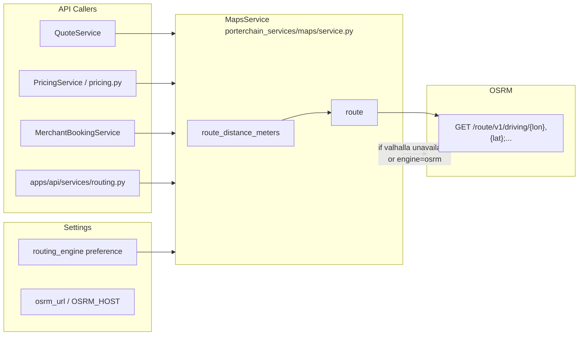

# OSRM Flow

> **Source:** `services/python/porterchain_services/maps/service.py`, `apps/api/src/porterchain_api/services/routing.py`

## Purpose

OSRM provides **distance and duration** for quote pricing and merchant bookings. It does not handle dispatch or driver routing (Fleetbase responsibility).

## Engine Selection

`MapsService.engine` reads `settings.routing_engine`:

- If `valhalla` and `valhalla_url` set → Valhalla preferred
- Else if `osrm_url` set → OSRM
- Returns `None` if unreachable (pricing may fall back)

## HTTP Call

```
GET {osrm_url}/route/v1/driving/{lon1},{lat1};{lon2},{lat2}
    ?overview=full&geometries=polyline
```

## Callers

| Service                         | Usage                                 |
| ------------------------------- | ------------------------------------- |
| `QuoteService`                  | Quote distance for tariff calculation |
| `PricingService` / `pricing.py` | Admin pricing simulation              |
| `MerchantBookingService`        | B2B shipment distance                 |
| `services/routing.py`           | Legacy wrapper → `MapsService`        |

## Website Preview

`website/src/lib/quote/routing.ts` may call OSRM directly for local `/api/quote` preview (server-side, not browser).

## Config

- `OSRM_HOST` / `osrm_url` in `porterchain_shared/config/settings.py`
- Docker: see `integrations.yaml`

## Diagram



## PlantUML

See [plantuml/osrm_flow.puml](./plantuml/osrm_flow.puml)
