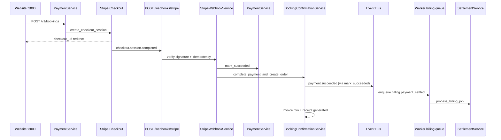

# Payment Flow

**Type:** CANONICAL
**masterrule:** [§21](../../masterrule.md#21-simplification--essential-complexity)
**Last verified:** 2026-07-05

**Source:** `booking_engine/payment_service.py`, `stripe_webhook_service.py`, `services/stripe_service.py`, `billing_engine/settlement_service.py`  
**See also:** [BOOKING_FLOW.md](./BOOKING_FLOW.md) · [MERCHANT_FLOW.md](./MERCHANT_FLOW.md) · [SECURITY.md](../../SECURITY.md)

---

## Retail Payment Path

| Step | Component |
| ---- | --------- |
| Start | `PaymentService.start_payment()` — creates `Payment` PROCESSING, Stripe session |
| Redirect | Browser → Stripe hosted checkout (`checkout_url`) |
| Webhook | `POST /webhooks/stripe` — **only trusted payment completion signal** |
| Verify | `stripe.Webhook.construct_event` + idempotency `stripe:{event_id}` |
| Complete | `mark_succeeded()` → `BookingConfirmationService.complete_payment_and_create_order()` |
| Events | `payment.succeeded`, `receipt.generated`, `invoice.created` |
| Billing | Worker `billing` queue → `SettlementService` ledger entry |

## Failure Paths

- `checkout.session.expired` → `mark_failed()` + `AbandonedCheckout`
- `payment_intent.payment_failed` → `mark_failed()`
- Retry: `POST /v1/payments/retry` → new checkout session
- Background: `DraftReconciliationService` (worker, every 300s) reconciles stuck `PAYMENT_PENDING` drafts

## Merchant Orders

No `Payment` row. `MerchantBookingService` creates orders directly — billing is net-terms (not Stripe).

## Mock (Dev)

`allow_stripe_mock` (`STRIPE_MOCK=true`, local only) → `POST /v1/bookings/mock-complete` bypasses Stripe.

## Diagram

## PlantUML

See [plantuml/payment_flow.puml](./plantuml/payment_flow.puml)
---

## Governance

| Document | Role |
| -------- | ---- |
| [masterrule.md](../../masterrule.md) | Architecture SSOT |
| [CTO_AUDIT_REPORT.md](../../CTO_AUDIT_REPORT.md) | Doc vs code audit |
