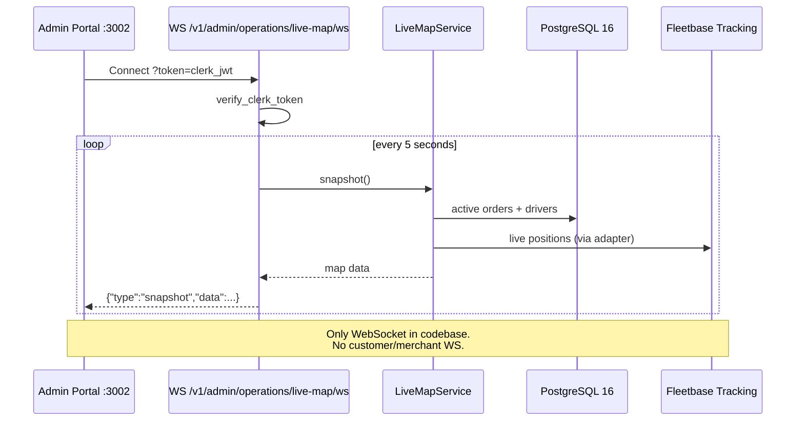

# Realtime Flow

**Type:** CANONICAL
**masterrule:** [§21](../../masterrule.md#21-simplification--essential-complexity)
**Last verified:** 2026-07-08

**Source:** `routers/operations.py`, `admin_engine/live_map_service.py`, `apps/admin/src/lib/maps.ts`  
**See also:** [DISPATCH_FLOW.md](./DISPATCH_FLOW.md) · [REALTIME_COMMUNICATION_REPORT.md](../../REALTIME_COMMUNICATION_REPORT.md)

---

## WebSocket endpoints

| Path                                                    | Auth                      | Multi-instance                                   |
| ------------------------------------------------------- | ------------------------- | ------------------------------------------------ |
| `WS /v1/admin/operations/live-map/ws?token=<clerk_jwt>` | Clerk JWT query param     | Each replica polls independently every 5s        |
| `WS /v1/notifications/ws`                               | Clerk JWT (header/cookie) | **Redis pub/sub** fanout across replicas (DD-11) |

### Admin live map

Push `{"type":"snapshot","data":...}` every **5 seconds**.

Implementation: `operations.py` `@router.websocket("/live-map/ws")` under prefix `/v1/admin/operations` → `LiveMapService.snapshot()`.

Close codes: `4401` auth failure, `1011` server error.

### In-app notifications

`routers/notifications.py` `@router.websocket("/ws")` → `RealtimeHub`. On broadcast, the origin replica delivers locally and publishes to Redis channel `porterchain:notifications:realtime`; other replicas subscribe and deliver to their connected clients. See [ADR-012-scaling.md](./ADR-012-scaling.md).

## Multi-instance scaling (§3.4.2 / §3.5.4)

Porterchain runs **2+ stateless API replicas** behind Caddy (`reverse_proxy api:8001` round-robin). WebSocket behavior differs by endpoint:

| Endpoint                              | Coordination                                                                | Sticky session?                                              | Scale note                                                   |
| ------------------------------------- | --------------------------------------------------------------------------- | ------------------------------------------------------------ | ------------------------------------------------------------ |
| `WS /v1/notifications/ws`             | **Redis pub/sub** (`porterchain:notifications:realtime`)                    | No — any replica can accept; all replicas receive broadcasts | Safe at 2–8 replicas (DD-11)                                 |
| `WS /v1/admin/operations/live-map/ws` | **Per-replica poll loop** — `LiveMapService.snapshot()` every **5 seconds** | Connection stays on one replica until disconnect             | Each open map tab = 1 DB snapshot query / 5s on that replica |

### Notification WebSocket (multi-instance safe)

1. Client connects to any API replica.
2. `RealtimeHub` registers the socket in-process and subscribes to Redis pub/sub on startup (`main.py` lifespan).
3. When any replica calls `realtime_hub.broadcast()`, it delivers locally **and** publishes to Redis so other replicas fan out to their clients.

No additional load balancer sticky cookies required.

### Live-map WebSocket (acceptable at Phase A scale)

Implementation: `operations.py` opens a DB session per snapshot inside the 5s loop (not shared across replicas).

| Replicas | Concurrent admin map tabs | Approx. snapshot queries/sec | Mitigation                                                      |
| -------- | ------------------------- | ---------------------------- | --------------------------------------------------------------- |
| 1        | 5                         | 1.0                          | Default local dev                                               |
| 2        | 10 (5 per replica)        | 2.0                          | Caddy round-robin spreads connections                           |
| 4        | 20                        | 4.0                          | Prefer REST `GET /live-map` polling for dashboards; reduce tabs |

**When to upgrade live-map:** If admin concurrent map sessions exceed ~30, add Redis pub/sub fanout (same pattern as notifications) or move to server-sent snapshots via shared cache. Not required for Phase A (2 replicas).

### Load balancer / Caddy

- **HTTP:** round-robin across `api` service containers (`API_REPLICAS=2` in prod compose).
- **WebSocket:** Caddy upgrades and proxies to one backend per connection; live-map stickiness is implicit.
- **Rate limiting:** Redis-backed, fail-closed — shared across replicas (`platform/rate_limit_middleware.py`, DD-06).

### DB connection budget

Each replica maintains its own SQLAlchemy pool (`db_pool_size=10`, `db_max_overflow=20`). Live-map WS loops acquire short-lived sessions; size pools before adding replicas. See [ADR-012-scaling.md](./ADR-012-scaling.md) connection budget table.

## Admin Client

`apps/admin/src/lib/maps.ts` opens WebSocket to API base URL with Clerk token.

REST fallbacks on the same router: `GET /v1/admin/operations/live-map`, `/live-map/search`, `/live-map/detail/{type}/{id}`, `/live-map/playback`, `/live-map/nearest-drivers`.

## Polling Alternatives

| Client        | Endpoint                                    | Purpose                            |
| ------------- | ------------------------------------------- | ---------------------------------- |
| Website       | `GET /v1/bookings/confirmation?quote_id=`   | Post-checkout confirmation polling |
| Public        | `GET /v1/orders/{tracking_number}/tracking` | Fleetbase-backed tracking          |
| Merchant      | `GET /v1/merchant/orders/{id}/tracking`     | Live tracking dashboard            |
| Driver portal | REST routes under `/driver-api/v1`          | No WebSocket                       |

## No Realtime WebSocket For

- Customer portal (`:3004`) — HTTP only
- Merchant portal (`:3001`) — HTTP only
- Driver portal (`:3003`) — HTTP polling via REST
- Mobile apps — push notifications (FCM), not WS

## Diagram

## PlantUML

See [plantuml/realtime_flow.puml](./plantuml/realtime_flow.puml)
---

## Governance

| Document                                         | Role              |
| ------------------------------------------------ | ----------------- |
| [masterrule.md](../../masterrule.md)             | Architecture SSOT |
| [CTO_AUDIT_REPORT.md](../../CTO_AUDIT_REPORT.md) | Doc vs code audit |
