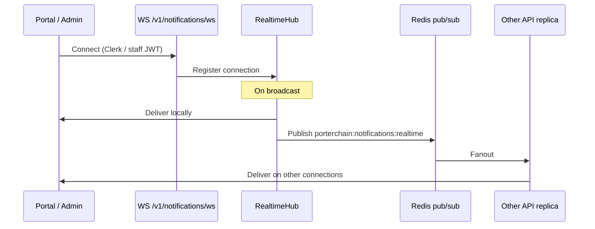

# Realtime Flow

**Type:** CANONICAL  
**masterrule:** [§21](../../masterrule.md#21-simplification--essential-complexity)  
**Last verified:** 2026-08-07

**Source:** notification realtime hub · Fleetbase adapter (execution GPS)  
**See also:** [DISPATCH_FLOW.md](./DISPATCH_FLOW.md) · [NOTIFICATION_FLOW.md](./NOTIFICATION_FLOW.md) · [ADR-012-scaling.md](./ADR-012-scaling.md)

---

## WebSocket endpoints

| Path                      | Auth              | Multi-instance       | Status      |
| ------------------------- | ----------------- | -------------------- | ----------- |
| `WS /v1/notifications/ws` | Clerk / staff JWT | Redis pub/sub fanout | **Current** |

Admin live-map WebSocket and Route Center realtime paths were **removed** (Fleetbase-first). Do not rebuild — use Fleetbase console via Admin SSO for live GPS / fleet views.

## In-app notifications

`routers/notifications.py` → `RealtimeHub`. On broadcast, the origin replica delivers locally and publishes to Redis channel `porterchain:notifications:realtime`; other replicas subscribe and fan out. No sticky sessions required.

## Multi-instance scaling

Porterchain runs **2+ stateless API replicas** behind Caddy (`reverse_proxy api:8001` round-robin).

| Concern         | Behavior                                                        |
| --------------- | --------------------------------------------------------------- |
| Notification WS | Redis pub/sub — any replica accepts connections                 |
| HTTP            | Round-robin                                                     |
| Rate limiting   | Redis-backed, fail-closed (`platform/rate_limit_middleware.py`) |
| DB pools        | Per-replica SQLAlchemy pool — see ADR-012                       |

## Polling alternatives

| Client        | Endpoint                                    | Purpose                    |
| ------------- | ------------------------------------------- | -------------------------- |
| Website       | `GET /v1/bookings/confirmation?quote_id=`   | Post-checkout confirmation |
| Public        | `GET /v1/orders/{tracking_number}/tracking` | Fleetbase-backed tracking  |
| Merchant      | `GET /v1/merchant/orders/{id}/tracking`     | Tracking dashboard         |
| Driver portal | REST under `/driver-api/v1`                 | No WebSocket               |

## No realtime WebSocket for

Customer portal, merchant portal, driver portal, mobile apps (FCM push instead of WS).

## Diagram

