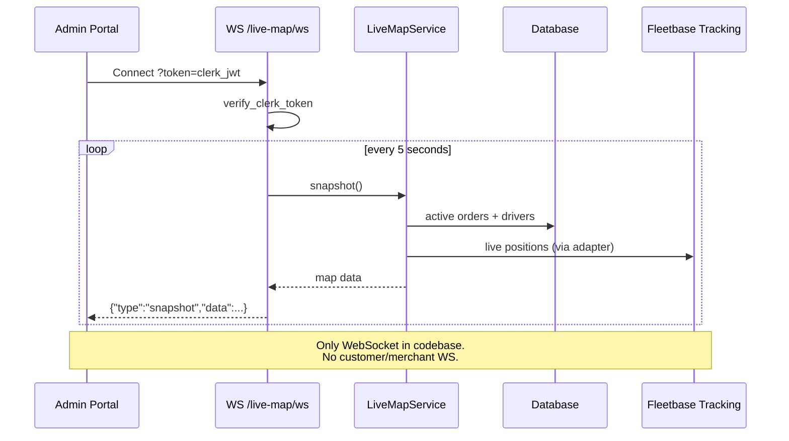

# Realtime Flow

> **Source:** `routers/operations.py`, `admin_engine/live_map_service.py`, `apps/admin/src/lib/maps.ts`

## WebSocket (Only One)

| Path                                                    | Auth                  | Behavior                                                  |
| ------------------------------------------------------- | --------------------- | --------------------------------------------------------- |
| `WS /v1/admin/operations/live-map/ws?token=<clerk_jwt>` | Clerk JWT query param | Push `{"type":"snapshot","data":...}` every **5 seconds** |

Implementation: `operations.py` `@router.websocket("/live-map/ws")` → `LiveMapService.snapshot()`.

Close codes: `4401` auth failure, `1011` server error.

## Admin Client

`apps/admin/src/lib/maps.ts` opens WebSocket to API base URL with Clerk token.

## Polling Alternatives

- Website booking confirmation: `GET /v1/bookings/confirmation?quote_id=` polling
- Public tracking: `GET /v1/orders/{tracking}/tracking` HTTP polling (Fleetbase live data)

## No Realtime For

- Customer portal (HTTP only)
- Merchant portal (HTTP only)
- Driver portal (HTTP polling via REST)

## Diagram

## PlantUML

See [plantuml/realtime_flow.puml](./plantuml/realtime_flow.puml)
