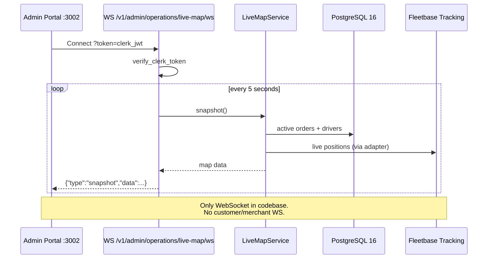

# Realtime Flow

**Type:** CANONICAL
**masterrule:** [§21](../../masterrule.md#21-simplification--essential-complexity)
**Last verified:** 2026-07-06

**Source:** `routers/operations.py`, `admin_engine/live_map_service.py`, `apps/admin/src/lib/maps.ts`  
**See also:** [DISPATCH_FLOW.md](./DISPATCH_FLOW.md) · [REALTIME_COMMUNICATION_REPORT.md](../../REALTIME_COMMUNICATION_REPORT.md)

---

## WebSocket endpoints

| Path | Auth | Multi-instance |
| ---- | ---- | -------------- |
| `WS /v1/admin/operations/live-map/ws?token=<clerk_jwt>` | Clerk JWT query param | Each replica polls independently every 5s |
| `WS /v1/notifications/ws` | Clerk JWT (header/cookie) | **Redis pub/sub** fanout across replicas (DD-11) |

### Admin live map

Push `{"type":"snapshot","data":...}` every **5 seconds**.

Implementation: `operations.py` `@router.websocket("/live-map/ws")` under prefix `/v1/admin/operations` → `LiveMapService.snapshot()`.

Close codes: `4401` auth failure, `1011` server error.

### In-app notifications

`routers/notifications.py` `@router.websocket("/ws")` → `RealtimeHub`. On broadcast, the origin replica delivers locally and publishes to Redis channel `porterchain:notifications:realtime`; other replicas subscribe and deliver to their connected clients. See [ADR-012-scaling.md](./ADR-012-scaling.md).

## Admin Client

`apps/admin/src/lib/maps.ts` opens WebSocket to API base URL with Clerk token.

REST fallbacks on the same router: `GET /v1/admin/operations/live-map`, `/live-map/search`, `/live-map/detail/{type}/{id}`, `/live-map/playback`, `/live-map/nearest-drivers`.

## Polling Alternatives

| Client        | Endpoint                                    | Purpose                            |
| ------------- | ------------------------------------------- | ---------------------------------- |
| Website       | `GET /v1/bookings/confirmation?quote_id=`   | Post-checkout confirmation polling |
| Public        | `GET /v1/orders/{tracking_number}/tracking` | Fleetbase-backed tracking          |
| Merchant      | `GET /v1/merchant/orders/{id}/tracking`     | Live tracking dashboard            |
| Driver portal | REST routes under `/driver-api/v1`          | No WebSocket                       |

## No Realtime WebSocket For

- Customer portal (`:3004`) — HTTP only
- Merchant portal (`:3001`) — HTTP only
- Driver portal (`:3003`) — HTTP polling via REST
- Mobile apps — push notifications (FCM), not WS

## Diagram

## PlantUML

See [plantuml/realtime_flow.puml](./plantuml/realtime_flow.puml)
---

## Governance

| Document                                         | Role              |
| ------------------------------------------------ | ----------------- |
| [masterrule.md](../../masterrule.md)             | Architecture SSOT |
| [CTO_AUDIT_REPORT.md](../../CTO_AUDIT_REPORT.md) | Doc vs code audit |
