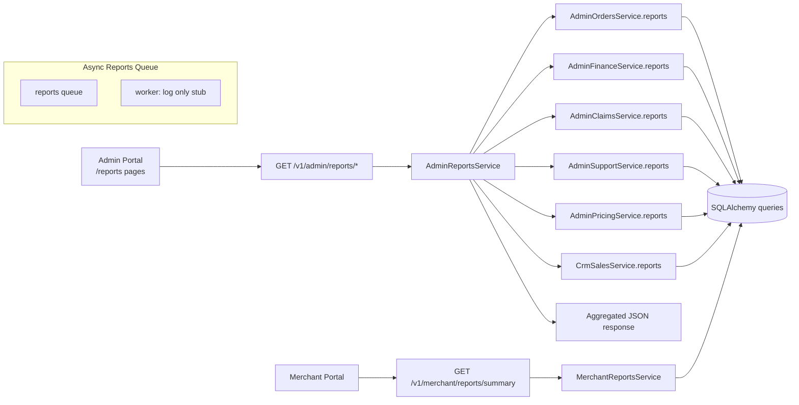

# Reporting Flow

> **Source:** `admin_engine/reports_service.py`, `merchant_engine/reports_service.py`, `apps/admin/src/lib/reports.ts`

## Admin Reports (Synchronous)

Admin portal calls `GET /v1/admin/reports/*` → `AdminReportsService` aggregates from existing module services:

| Submodule | Source Service |
|-----------|----------------|
| Orders | `AdminOrdersService.reports()` |
| Finance / revenue | `AdminFinanceService.reports()` |
| Claims | `AdminClaimsService.reports()` |
| Support | `AdminSupportService.reports()` |
| Pricing | `AdminPricingService.reports()` |
| CRM | `CrmSalesService.reports()` |
| Merchants / drivers | Faceted counts from respective services |

No separate reporting database or OLAP layer — reports are **live SQL aggregates**.

## Merchant Reports

`GET /v1/merchant/reports/summary` → `MerchantReportsService` — order volume, spend summary for authenticated merchant.

## Async Reports Queue

`QueueName.REPORTS` exists in `porterchain_shared/queue/names.py`. Worker processor **logs only** (stub) — no scheduled report generation implemented.

## Export

Admin reports endpoints return JSON; CSV export where implemented in `AdminReportsService` export helpers.

## Diagram

## PlantUML

See [plantuml/reporting_flow.puml](./plantuml/reporting_flow.puml)
