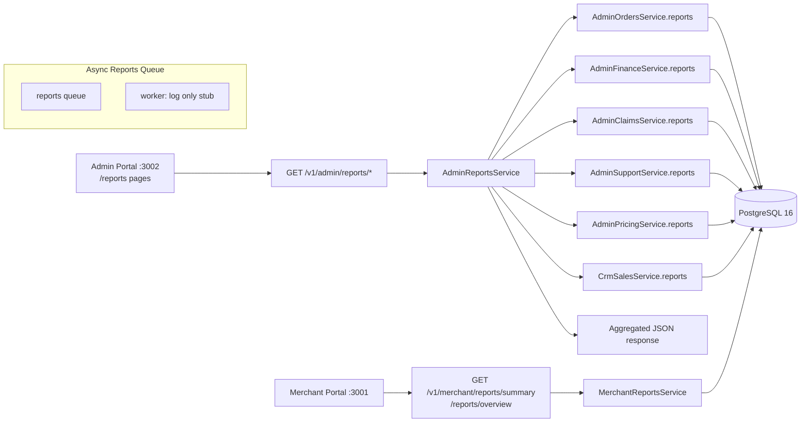

# Reporting Flow

**Type:** REPORT
**masterrule:** [§21](../../masterrule.md#21-simplification--essential-complexity)
**Last verified:** 2026-07-05

> **Snapshot report** — point-in-time audit. Current truth: [SYSTEM_ARCHITECTURE.md](SYSTEM_ARCHITECTURE.md) (canonical doc).

**Source:** `admin_engine/reports_service.py`, `merchant_engine/reports_service.py`, `apps/admin/src/lib/reports.ts`  
**See also:** [APPLICATION_FLOW.md](./APPLICATION_FLOW.md) · [MERCHANT_FLOW.md](./MERCHANT_FLOW.md)

---

## Admin Reports (Synchronous)

Admin portal calls `GET /v1/admin/reports/*` → `AdminReportsService` aggregates from existing module services. No separate reporting database or OLAP layer — reports are **live PostgreSQL 16 aggregates**.

| Area | Example endpoints | Source service |
| ---- | ----------------- | -------------- |
| Reports Center | `/reports/center`, `/reports/executive`, `/reports/categories` | `AdminReportsService` |
| Module reports | `/orders/reports`, `/finance/reports`, `/claims/reports`, `/support/reports`, `/pricing/reports` | Respective `Admin*Service.reports()` |
| Builder / export | `/reports/builder/preview`, `/reports/export-audit` | `AdminReportsService` |
| Saved / scheduled | `/reports/saved`, `/reports/scheduled` | Persisted in admin models; **scheduled worker not implemented** |

## Merchant Reports

| Endpoint | Service | Output |
| -------- | ------- | ------ |
| `GET /v1/merchant/reports/summary` | `MerchantReportsService.summary()` | Order volume, spend summary |
| `GET /v1/merchant/reports/overview` | `MerchantReportsService.overview()` | Extended dashboard metrics |

Requires merchant RBAC module `reports`.

## Async Reports Queue

`QueueName.REPORTS` exists in `porterchain_shared/queue/names.py`. Worker processor **logs only** (stub) — no scheduled report generation runs yet despite saved/scheduled API endpoints.

## Export

Admin reports endpoints return JSON; CSV export where implemented in `AdminReportsService` export helpers (`/reports/export-audit`).

## Diagram

## PlantUML

See [plantuml/reporting_flow.puml](./plantuml/reporting_flow.puml)
---

## Governance

| Document | Role |
| -------- | ---- |
| [masterrule.md](../../masterrule.md) | Architecture SSOT |
| [CTO_AUDIT_REPORT.md](../../CTO_AUDIT_REPORT.md) | Doc vs code audit |
