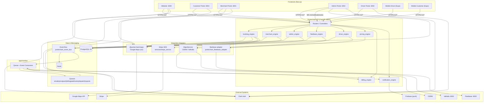

# System Architecture

**Type:** CANONICAL
**masterrule:** [§21](../../masterrule.md#21-simplification--essential-complexity)
**Last verified:** 2026-07-05  
**Reference:** [masterrule.md](../../masterrule.md) §21

## Overview

Porterchain is a logistics orchestration platform. All commercial logic lives in the **Porterchain API** (`apps/api`, port **8001**). **Fleetbase** (`:8000`) is the execution engine for dispatch, GPS, routes, and POD. Frontends never call Fleetbase HTTP directly.

## Components

| Layer             | Path                                    | Port | Role                                                    |
| ----------------- | --------------------------------------- | ---- | ------------------------------------------------------- |
| Website           | `website/`                              | 3000 | Marketing + guest track; CTAs → customer portal `:3004` |
| Merchant Portal   | `apps/merchant-portal/`                 | 3001 | B2B bookings, bulk, billing, API keys                   |
| Admin Portal      | `apps/admin/`                           | 3002 | Ops control tower — dispatch, orders, finance (not CRM) |
| Driver Portal     | `apps/driver-portal/`                   | 3003 | Driver web UI (proxied to `/driver-api/v1`)             |
| Customer Portal   | `apps/customer/`                        | 3004 | Retail quote/book/pay, dashboard, support, rebook       |
| Mobile Driver     | `apps/mobile-driver/`                   | —    | Expo app → `/driver-api/v1/*`                           |
| Mobile Customer   | `apps/mobile-customer/`                 | —    | Expo app → `/v1/*`                                      |
| Porterchain API   | `apps/api/`                             | 8001 | FastAPI orchestrator, all `*_engine` services           |
| Worker            | `apps/worker/`                          | —    | Redis event bus + queue consumer                        |
| Fleetbase Adapter | `services/fleetbase-adapter/`           | —    | Sole Fleetbase HTTP boundary                            |
| Event Bus         | `services/event-bus/`                   | —    | `porterchain_event_bus` + handler registry              |
| Pricing Engine    | `services/pricing-engine/`              | —    | `porterchain_pricing` library                           |
| Shared Services   | `services/python/porterchain_services/` | —    | Stripe, maps, notifications                             |
| Shared Python     | `shared/python/porterchain_shared/`     | —    | Config, events catalog, queue names                     |

## Data Stores

| Store         | Usage                                            |
| ------------- | ------------------------------------------------ |
| PostgreSQL 18 | Primary domain DB (`porterchain_api/models*.py`) |
| Redis         | Event bus transport, task queues, idempotency    |
| Fleetbase DB  | Operational drivers, dispatch, GPS (external)    |

## Diagram

## Source Files

- App entry: `apps/api/src/porterchain_api/main.py`
- Settings: `shared/python/porterchain_shared/config/settings.py`
- Integrations: `integrations.yaml`, `INTEGRATIONS.md`

## PlantUML

See [plantuml/system_architecture.puml](./plantuml/system_architecture.puml)
---
