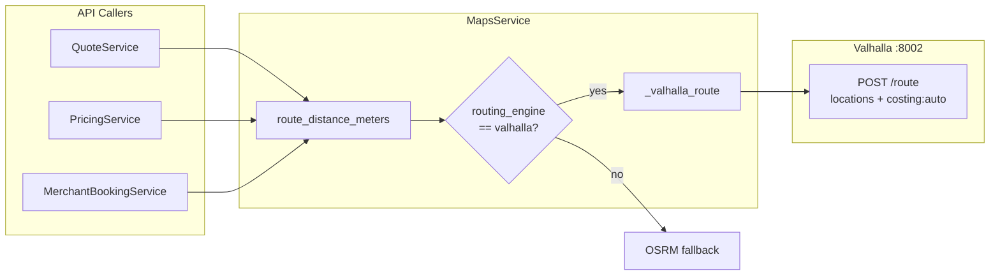

# Valhalla Flow

> **Source:** `services/python/porterchain_services/maps/service.py`, `integrations.yaml`

## Purpose

Valhalla is the **preferred routing engine** for distance/ETA when `routing_engine=valhalla`. Used for quote pricing and optimization path — **not** for Fleetbase dispatch execution.

## HTTP Call

```
POST {valhalla_url}/route
{
  "locations": [{"lat": ..., "lon": ...}, ...],
  "costing": "auto"
}
```

Response parsed: `trip.summary.length` (km → meters), `trip.summary.time` (seconds).

## Fallback

If Valhalla unreachable or `routing_engine != valhalla`, `MapsService` falls back to OSRM.

## Event Catalog

`route.optimized` exists in `DomainEventType` but is **not actively emitted** in current booking flow — reserved for future route optimization.

## Config

- `VALHALLA_BASE_URL` / `valhalla_url` — default `http://localhost:8002`
- Docker compose overlay in `infrastructure/docker/`

## Diagram



## PlantUML

See [plantuml/valhalla_flow.puml](./plantuml/valhalla_flow.puml)
