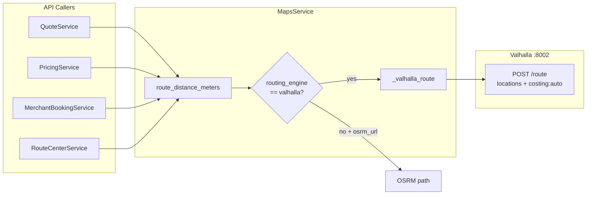

# Valhalla Flow


**Type:** CANONICAL
**masterrule:** [§21](../../masterrule.md#21-simplification--essential-complexity)
**Last verified:** 2026-07-05

**Source:** `services/python/porterchain_services/maps/service.py`, `integrations.yaml`  
**See also:** [VALHALLA_USAGE.md](../../VALHALLA_USAGE.md) · [OSRM_FLOW.md](./OSRM_FLOW.md)

---

## Purpose

Valhalla is the **default routing engine** (`routing_engine=valhalla`) for distance/ETA in the Porterchain API. Used for quote pricing and route-center optimization paths — **not** for Fleetbase dispatch execution.

## HTTP Call

```
POST {valhalla_url}/route
{
  "locations": [{"lat": ..., "lon": ...}, ...],
  "costing": "auto"
}
```

Response parsed: `trip.summary.length` (km → meters), `trip.summary.time` (seconds).

## Selection Logic

```python
if routing_engine == "valhalla" and valhalla_url:
    use Valhalla
elif osrm_url:
    use OSRM
else:
    return None
```

When `routing_engine=valhalla`, a failed Valhalla HTTP response returns `None` — the API does **not** auto-fallback to OSRM on the same request. Website preview (`routing.ts`) does try OSRM after Valhalla failure.

## Event Catalog

`route.optimized` exists in `DomainEventType` but is **not actively emitted** in current booking flow — reserved for future route optimization.

## Config

| Variable | Default |
| -------- | ------- |
| `VALHALLA_BASE_URL` / `valhalla_url` | `http://localhost:8002` |
| `ROUTING_ENGINE` | `valhalla` (API) |

Docker: `pnpm docker:up:routing` — see [PORT_CONFIGURATION.md](../../PORT_CONFIGURATION.md) port **8002**.

## Diagram



## PlantUML

See [plantuml/valhalla_flow.puml](./plantuml/valhalla_flow.puml)
---

## Governance

| Document | Role |
| -------- | ---- |
| [masterrule.md](../../masterrule.md) | Architecture SSOT |
| [CTO_AUDIT_REPORT.md](../../CTO_AUDIT_REPORT.md) | Doc vs code audit |
