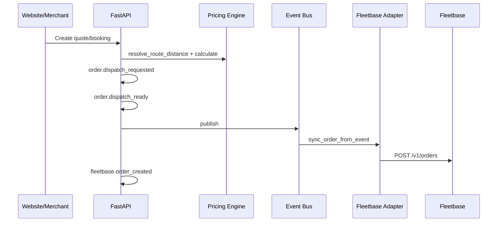
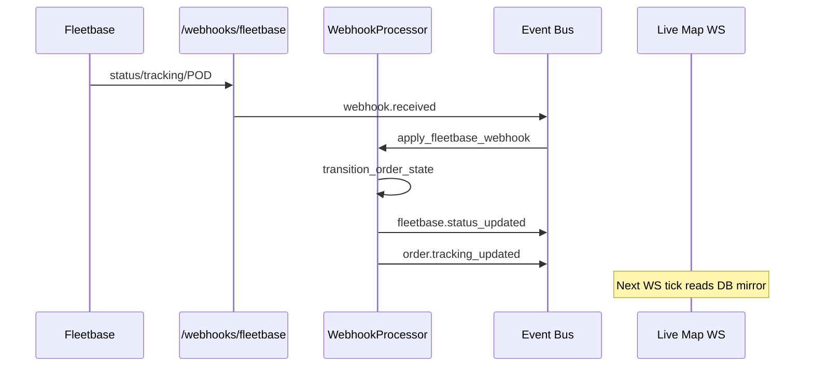

# Porterchain — Event Flow Diagram

**Last verified:** 2026-07-04 · **Status:** Historical audit snapshot  
**Catalog:** `shared/python/porterchain_shared/events/catalog.py`

> Canonical event docs: [EVENT_CATALOG.md](./EVENT_CATALOG.md), [EVENT_FLOW.md](./EVENT_FLOW.md), [docs/architecture/EVENT_BUS_FLOW.md](./docs/architecture/EVENT_BUS_FLOW.md). This file captures a point-in-time emission audit.

---

## Driver lifecycle events (audit checklist)

| Event            | String                     | Emitted? | Source                                          |
| ---------------- | -------------------------- | -------- | ----------------------------------------------- |
| Driver Assigned  | `order.driver_assigned`    | ✅       | Admin ops, Fleetbase webhook                    |
| Driver Accepted  | `order.driver_accepted`    | ✅       | driver-platform availability                    |
| Driver Rejected  | `order.driver_rejected`    | ✅       | driver-platform                                 |
| Pickup Started   | `order.arrived_pickup`     | ✅       | driver stops, webhooks                          |
| Picked Up        | `order.pickup_completed`   | ✅       | driver stops, webhooks                          |
| Transit          | `order.in_transit`         | ⚠️       | Webhooks primarily                              |
| Near Delivery    | `order.near_delivery`      | ✅       | **Fixed** — driver arrive at dropoff            |
| Delivered        | `order.delivered`          | ✅       | driver stops, webhooks                          |
| Proof Completed  | `order.pod_completed`      | ✅       | POD service, webhooks                           |
| Location Updated | `order.tracking_updated`   | ✅       | Fleetbase tracking webhooks                     |
| Fleetbase Sync   | `fleetbase.status_updated` | ✅       | WebhookProcessor                                |
| Route Optimized  | `route.optimized`          | ❌       | Catalog only — Fleetbase orchestrator not wired |

---

## Booking → dispatch event chain



---

## Inbound Fleetbase webhook chain



---

## Payment → billing

```
payment.succeeded → billing queue → SettlementService
booking.confirmed → notification handler
invoice.created + order.invoiced → audit
```

---

## Registered bus handlers

| Event                    | Handler                        |
| ------------------------ | ------------------------------ |
| `order.dispatch_ready`   | Fleetbase order sync           |
| `order.driver_assigned`  | Fleetbase dispatch assign      |
| `order.booked`           | Email notification             |
| `booking.confirmed`      | Confirmation email             |
| `payment.succeeded`      | Billing queue                  |
| `webhook.received`       | Fleetbase processor            |
| `notification.queued`    | Email / SMS (log-only) / push queues |
| `claim.opened`           | Claim notification             |
| `support.ticket_created` | Support notification           |
| `order.*`                | Merchant webhook fanout (stub) |

---

## Webhooks (ingress only)

| Provider    | Endpoint                   | Status                                          |
| ----------- | -------------------------- | ----------------------------------------------- |
| Stripe      | `POST /webhooks/stripe`    | ✅                                              |
| Fleetbase   | `POST /webhooks/fleetbase` | ✅                                              |
| Firebase    | —                          | ❌ Push outbound only (FCM), no ingress webhook |
| Google Maps | —                          | ✅ Correctly absent                             |
