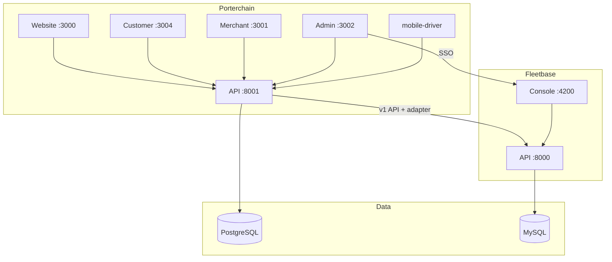

# Fleetbase Analysis — Porterchain Integration

**Original analysis:** June 29, 2026  
**Last verified:** 2026-07-04  
**Fleetbase version:** v0.7.40 (OSS, AGPL-3.0)  
**Location:** `apps/fleetbase/` (upstream vendor — do not modify)  
**Status:** Historical vendor analysis + July 2026 integration status

> **Operational integration:** [FLEETBASE_INTEGRATION.md](./FLEETBASE_INTEGRATION.md) · **Adapter:** [FLEETBASE_ADAPTER_ARCHITECTURE.md](./FLEETBASE_ADAPTER_ARCHITECTURE.md)

---

## Executive summary

Fleetbase is a **modular logistics operating system** (Laravel API + Ember console). For Porterchain it is the **internal dispatch and fleet-execution engine** — not a customer-facing product.

| Layer | Porterchain role |
| ----- | ---------------- |
| Customer / merchant / retail | Porterchain UX, Clerk auth, pricing, billing |
| Operations / dispatch | Fleetbase console (:4200) + FleetOps |
| Integration | Porterchain API (:8001) → `fleetbase-adapter` → Fleetbase (:8000) |
| Data | PostgreSQL (Porterchain) + MySQL (Fleetbase) |

---

## July 2026 integration status

| Item | June 2026 analysis | July 2026 status |
| ---- | ------------------ | ---------------- |
| Order sync | Planned bridge routes | ✅ **`POST /v1/orders`** via adapter |
| Webhooks | To build | ✅ **`POST /webhooks/fleetbase`** |
| Driver sync | Planned | ✅ Admin approval → adapter |
| Event mapping | Gaps | ✅ Expanded in `fleetbase-adapter/events/` |
| SSO extension | Planned `/int/v1/porterchain/sso/*` | ⚠️ Client exists; extension deploy required |
| Driver mobile | Navigator (Fleetbase auth) | ✅ Porterchain **`apps/mobile-driver/`** uses Clerk + Porterchain JWT — not Navigator |

---

## Strategic recommendation (unchanged)

| Action | Scope |
| ------ | ----- |
| **Keep unchanged** | Upstream Fleetbase OSS, Docker stack, console for ops |
| **Use directly** | Dispatch, routing (Valhalla/VROOM), live map, GPS, POD, orchestration |
| **Extend (not fork)** | Porterchain bridge extension for SSO; webhook consumers |
| **Replace in Porterchain** | End-user auth, merchant CRM, pricing, invoicing, public tracking UX |

---

## Runtime architecture

---

## Porterchain bridge routes

| Route | Purpose | Status |
| ----- | ------- | ------ |
| `POST /v1/orders` | Order sync | ✅ **Production path** |
| `POST /v1/drivers`, `/v1/vehicles` | Fleet sync | ✅ Production |
| `POST /int/v1/porterchain/sso/exchange` | Console SSO | ⚠️ Extension required |
| `POST /int/v1/porterchain/orders` | Tailored payloads | Optional — v1 API sufficient today |

Implementation: `services/fleetbase-adapter/` + `apps/api/.../fleetbase_engine/`.

---

## AGPL compliance

- Do not expose Fleetbase console to merchants or end customers
- Keep Fleetbase as internal infrastructure
- Prefer **extensions** and **API integration** over embedding Fleetbase UI

---

## Open risks

| Risk | Mitigation |
| ---- | ---------- |
| Dual order truth | Porterchain canonical state + `fleetbase_order_id`; webhooks sync |
| SSO extension not deployed | Porterchain issues SSO JWT; console handler must consume it |
| Separate auth systems | Clerk for Porterchain users; Fleetbase IAM for console only |
| Vendor not in git | Use Docker image + `composer.lock`; `pnpm docker:fleetbase:install` |

---

## Related documents

| Document | Contents |
| -------- | -------- |
| [FLEETBASE_MODULES.md](./FLEETBASE_MODULES.md) | Per-module decisions |
| [FLEETBASE_APIS.md](./FLEETBASE_APIS.md) | Route catalog |
| [FLEETBASE_EXTENSION_POINTS.md](./FLEETBASE_EXTENSION_POINTS.md) | Extension pattern |
| [DOCKER_SETUP.md](./DOCKER_SETUP.md) | Fleetbase Docker install |

---

_Full June 2026 module tables and package version inventory archived in git history._
