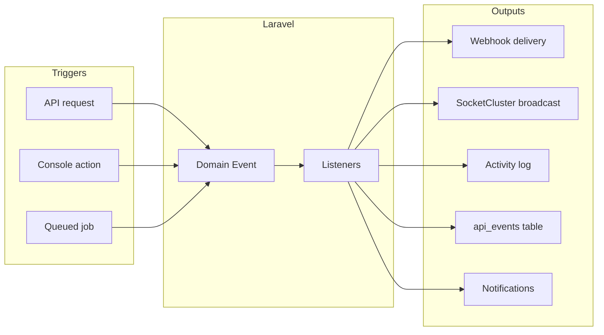

# Fleetbase Events — System Reference

**Last verified:** 2026-07-04  
**Packages:** core-api 1.6.47, fleetops-api 0.6.48 (Docker image)  
**Transports:** Laravel events, SocketCluster broadcast, outbound webhooks, activity log

> **Porterchain mapping:** `services/fleetbase-adapter/porterchain_fleetbase_adapter/events/` · **Webhooks:** [FLEETBASE_WEBHOOKS.md](./FLEETBASE_WEBHOOKS.md)

---

## Event architecture



---

## Resource lifecycle events (webhook + broadcast)

Base class: `Fleetbase\Events\ResourceLifecycleEvent`

**Event name format:** `{model_snake}.{event_name}` via `broadcastAs()`  
Example: `order.dispatched`, `driver.created`, `order.driver_assigned`

**Webhook payload structure:**

```json
{
  "id": "event_...",
  "api_version": "...",
  "event": "order.dispatched",
  "created_at": "2026-06-29T12:00:00",
  "data": {}
}
```

`data` contains the resource serialized via HTTP Resource (`toWebhookPayload()` or `toArray()`).

### Standard CRUD lifecycle events

Fired for most Eloquent models on create/update/delete via core observers:

| Pattern           | Example                                              |
| ----------------- | ---------------------------------------------------- |
| `{model}.created` | `order.created`, `driver.created`, `vehicle.created` |
| `{model}.updated` | `order.updated`                                      |
| `{model}.deleted` | `order.deleted`                                      |

Models include: orders, drivers, vehicles, fleets, places, contacts, payloads, entities, users, companies, files, etc.

---

## FleetOps domain events

Registered in `Fleetbase\FleetOps\Providers\EventServiceProvider` (v0.6.48):

| Event class           | `eventName` / broadcast | Listeners                                                                       |
| --------------------- | ----------------------- | ------------------------------------------------------------------------------- |
| `OrderCanceled`       | `order.canceled`        | `HandleOrderCanceled`, `SendResourceLifecycleWebhook`, `NotifyOrderEvent`       |
| `OrderDispatched`     | `order.dispatched`      | `HandleOrderDispatched`, `SendResourceLifecycleWebhook`, `NotifyOrderEvent`     |
| `OrderDispatchFailed` | `order.dispatch_failed` | `HandleOrderDispatchFailed`, `SendResourceLifecycleWebhook`, `NotifyOrderEvent` |
| `OrderDriverAssigned` | `order.driver_assigned` | `HandleOrderDriverAssigned`, `SendResourceLifecycleWebhook`, `NotifyOrderEvent` |
| `OrderCompleted`      | `order.completed`       | `SendResourceLifecycleWebhook`, `NotifyOrderEvent`, `HandleDeliveryCompletion`  |
| `OrderFailed`         | `order.failed`          | `SendResourceLifecycleWebhook`, `NotifyOrderEvent`                              |
| `OrderReady`          | `order.ready`           | `HandleOrderReady`                                                              |
| `GeofenceEntered`     | `geofence.entered`      | `HandleGeofenceEntered`, `SendResourceLifecycleWebhook`                         |
| `GeofenceExited`      | `geofence.exited`       | `HandleGeofenceExited`, `SendResourceLifecycleWebhook`                          |
| `GeofenceDwelled`     | `geofence.dwelled`      | `HandleGeofenceDwelled`, `SendResourceLifecycleWebhook`                         |

### Porterchain-critical FleetOps events (implemented mapping)

Source: `FLEETBASE_EVENT_TO_DOMAIN_EVENT` in `fleetbase-adapter/events/__init__.py`

| Fleetbase event | Porterchain domain event |
| --------------- | ------------------------ |
| `order.dispatched` | `order.driver_assigned` |
| `order.driver_assigned` | `order.driver_assigned` |
| `order.started` | `order.in_transit` |
| `order.arrived_pickup` / `order.at_pickup` | `order.arrived_pickup` |
| `order.picked_up` / `order.loaded` | `order.pickup_completed` |
| `order.arrived_dropoff` / `order.at_dropoff` | `order.near_delivery` |
| `order.completed` / `order.delivered` | `order.delivered` |
| `proof.uploaded` | `order.pod_completed` |
| `order.canceled` / `order.cancelled` | `order.cancelled` |
| `order.failed` | `order.failed` |
| `order.return_to_sender` | `refund.requested` |

Processed by `fleetbase_engine/WebhookProcessor` after `POST /webhooks/fleetbase`.

---

## Core platform events

Registered in `Fleetbase\Providers\EventServiceProvider` (v1.6.47):

| Event class              | Purpose                                         |
| ------------------------ | ----------------------------------------------- |
| `AccountCreated`         | New account onboarding → `HandleAccountCreated` |
| `UserRemovedFromCompany` | IAM → `HandleUserRemovedFromCompany` (FleetOps) |
| `ScheduleItemCreated`    | Shift created → `NotifyDriverOnShiftChange`     |
| `ScheduleItemUpdated`    | Shift updated → `NotifyDriverOnShiftChange`     |

Generic model lifecycle events also trigger `SendResourceLifecycleWebhook`.

---

## Webhook infrastructure events

| Event class                   | Listener                 |
| ----------------------------- | ------------------------ |
| `WebhookCallSucceededEvent`   | `LogSuccessfulWebhook`   |
| `WebhookCallFailedEvent`      | `LogFailedWebhook`       |
| `FinalWebhookCallFailedEvent` | `LogFinalWebhookAttempt` |

Logged to `fleetbase_webhook_request_logs`.

---

## Broadcasting (SocketCluster)

| Setting        | Value                                              |
| -------------- | -------------------------------------------------- |
| Driver         | `BROADCAST_DRIVER=socketcluster`                   |
| Service        | SocketCluster v17, port 38000                      |
| Provider       | `Fleetbase\Providers\SocketClusterServiceProvider` |
| Console client | `load-socketcluster-client.js`                     |

### Channel patterns

From `ResourceLifecycleEvent::broadcastOn()`:

| Channel            | Example                  |
| ------------------ | ------------------------ |
| Company            | `company.{company_uuid}` |
| Model by UUID      | `order.{uuid}`           |
| Model by public_id | `order.{public_id}`      |
| Driver             | `driverAssigned.{uuid}`  |
| API credential     | `api.{credential_uuid}`  |
| User               | `user.{user_uuid}`       |
| Chat               | `chat.{channel_uuid}`    |

### Live ops endpoints (HTTP polling alternative)

`GET /int/v1/fleet-ops/live/coordinates|orders|drivers|vehicles|routes|places`

---

## Notifications

| Path                           | Mechanism                             |
| ------------------------------ | ------------------------------------- |
| `NotifyOrderEvent` listener    | Order lifecycle push/email/SMS        |
| `NotifyDriverOnShiftChange`    | Schedule change alerts                |
| `BroadcastNotificationCreated` | `TriggerPublicNotificationBroadcast`  |
| FCM / APN / Twilio             | Via `laravel-notification-channels/*` |

Tables: `fleetbase_notifications`

---

## Activity log

| Package                      | Table                |
| ---------------------------- | -------------------- |
| `spatie/laravel-activitylog` | `fleetbase_activity` |

Records user actions in console with subject/causer polymorphic relations.

---

## API event audit

Every webhook-eligible lifecycle event creates a row in `fleetbase_api_events`:

| Column                | Purpose                              |
| --------------------- | ------------------------------------ |
| `event`               | Event name (e.g. `order.dispatched`) |
| `company_uuid`        | Tenant                               |
| `source`              | `api` or `console`                   |
| `data`                | Event payload snapshot               |
| `api_credential_uuid` | If triggered via API key             |

---

## Porterchain event bus (separate)

Porterchain domain events: `shared/python/porterchain_shared/events/catalog.py` (+ `packages/events/`)

| Porterchain event         | Fleetbase relation                             |
| ------------------------- | ---------------------------------------------- |
| `order.dispatch_ready`    | Triggers Fleetbase sync                        |
| `fleetbase.order_created` | After successful bridge                        |
| `fleetbase.sync_failed`   | Bridge failure + retry queue                   |
| `order.driver_assigned`   | From Fleetbase webhook `order.driver_assigned` |
| `order.pickup_completed`  | From Fleetbase activity/start                  |
| `order.delivered`         | From `order.completed`                         |
| `order.pod_completed`     | From proof capture + complete                  |

### Integration pattern

```
Fleetbase order.completed
  → webhook POST → Porterchain POST /webhooks/fleetbase
  → WebhookIngressService → WebhookProcessor
  → map via EventTranslator → order.delivered / order.pod_completed
  → emit_event() → Porterchain event bus
  → notification handlers + merchant webhook fan-out
```

---

## Sandbox vs live

| Mode    | DB connection         | API keys     |
| ------- | --------------------- | ------------ |
| Live    | `mysql` → `fleetbase` | `flb_live_*` |
| Sandbox | `fleetbase_sandbox`   | `flb_test_*` |

Events and webhooks respect `api_environment` and `is_sandbox` session flags.

---

## Subscribing to events (Porterchain checklist)

1. Create API credential in Fleetbase dev console (`@fleetbase/dev-engine`)
2. Register webhook endpoint: `int/v1/webhook-endpoints`
3. Select events: minimum `order.dispatched`, `order.driver_assigned`, `order.completed`, `order.canceled`
4. Point URL to Porterchain API webhook handler
5. Verify HMAC signature using API secret
6. Log to Porterchain event store; idempotent on `event.id`

---

## Event discovery

Webhook-eligible events list: `GET /int/v1/webhook-endpoints/events`  
Returns `config('api.events')` from deployed image.

For full listener map in development:

```bash
docker exec porterchain-fleetbase-application php artisan event:list
```

---

## Related documents

- [FLEETBASE_WEBHOOKS.md](./FLEETBASE_WEBHOOKS.md) — delivery mechanics
- [FLEETBASE_APIS.md](./FLEETBASE_APIS.md) — HTTP endpoints
- [FLEETBASE_EXTENSION_POINTS.md](./FLEETBASE_EXTENSION_POINTS.md) — custom event listeners
