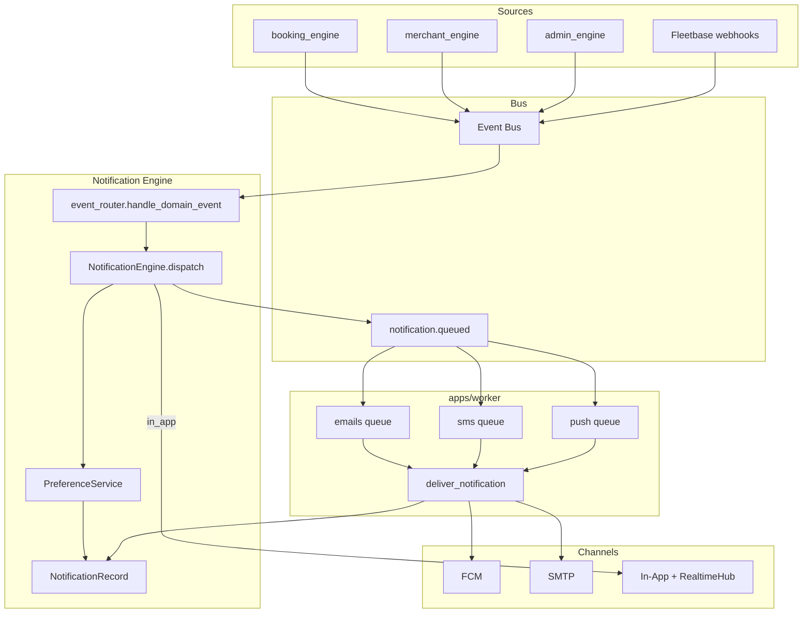

# Notification Delivery Flow

**Type:** CANONICAL
**masterrule:** [§21](../../masterrule.md#21-simplification--essential-complexity)
**Last verified:** 2026-07-05

**See also:** [NOTIFICATION_ARCHITECTURE.md](./NOTIFICATION_ARCHITECTURE.md) · [EVENT_BUS_FLOW.md](../architecture/EVENT_BUS_FLOW.md)

---

## End-to-End Flow



## Status Lifecycle

```
queued → sent → (delivered / opened / clicked)
         ↓
       failed → schedule_retry → dead_letter (max retries)
```

| Status               | Meaning                               |
| -------------------- | ------------------------------------- |
| `queued`             | Record created; async job pending     |
| `sent`               | Provider accepted or in-app delivered |
| `failed`             | Delivery error; may retry             |
| `dead_letter`        | `retry_count >= max_retries`          |
| `opened` / `clicked` | User interaction timestamps on record |

In-app records skip the worker — status set to `sent` immediately on create.

## Retry Policy

Implemented in `NotificationEngine.schedule_retry()` (`engine.py`):

| Setting                    | Default                                   |
| -------------------------- | ----------------------------------------- |
| `NOTIFICATION_MAX_RETRIES` | 5 (on record)                             |
| Delays                     | 30s, 2m, 8m, 32m, 2h (`RETRY_DELAYS_SEC`) |

Failed deliveries call `schedule_retry` from `DeliveryService._mark_failed`. There is no separate `notifications_retry` worker queue — retries are record-based (background drain may be added later).

Admin manual retry: `POST /v1/admin/notifications/retry/{notification_id}`.

## Worker Payload

```json
{
  "notification_id": "uuid",
  "channel": "push",
  "template": "driver_assigned",
  "recipient_type": "driver",
  "recipient_id": "driver-uuid",
  "recipient": "",
  "context": { "order_number": "PC-1234", "title": "…", "body": "…" }
}
```

## In-App Realtime

1. `NotificationEngine` creates record with `channel=in_app`
2. `RealtimeHub.broadcast_sync(recipient_type, recipient_id, payload)`
3. WebSocket clients at `WS /v1/notifications/ws?token=` receive `{ "type": "notification", "data": {...} }`
4. Bell unread count from `GET /v1/notifications/inbox`

## Log-Only Modes (local / unset providers)

| Channel | When                                   |
| ------- | -------------------------------------- |
| Email   | `smtp_host` empty                      |
| SMS     | Always log-only (no Twilio)            |
| Push    | No Firebase creds or `push_send=false` |

## Architecture Rules

1. **No direct sends** from routers or adapters (except orchestrator for checkout recovery)
2. **All event-driven paths** go through `EventRouter` → `NotificationEngine.dispatch()`
3. **FCM** only in `fcm_service.py`
4. **Recipients** resolved in `EventRouter`, not in source modules

---

## Governance

| Document                                                              | Role              |
| --------------------------------------------------------------------- | ----------------- |
| [masterrule.md](../../masterrule.md)                                  | Architecture SSOT |
| [CTO_AUDIT_REPORT.md](../archive/reports-2026-08/CTO_AUDIT_REPORT.md) | Doc vs code audit |
