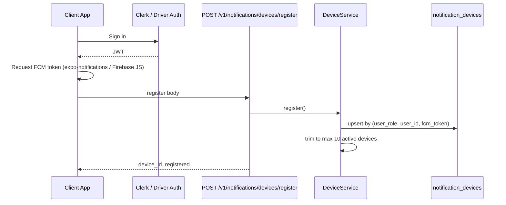

# Device Registration Flow

**Type:** CANONICAL
**masterrule:** [§21](../../masterrule.md#21-simplification--essential-complexity)
**Last verified:** 2026-07-05

**See also:** [FCM_CONFIGURATION.md](./FCM_CONFIGURATION.md) · [NOTIFICATION_ARCHITECTURE.md](./NOTIFICATION_ARCHITECTURE.md)

Every authenticated client registers FCM tokens with the Notification Engine. Tokens are stored in `notification_devices` — not ad-hoc JSON on domain models.

---

## Primary Endpoint

```
POST /v1/notifications/devices/register
Authorization: Bearer <Clerk JWT | Driver JWT>
X-Merchant-Org-Id: <org>   (merchant principals only)
```

### Request Body

```json
{
  "fcm_token": "ExponentPushToken[…] or FCM web token",
  "platform": "android | ios | web",
  "device_name": "iPhone 15 Pro",
  "app_version": "1.2.0",
  "os_version": "iOS 18.2",
  "language": "en-CA",
  "timezone": "America/Toronto",
  "notification_permission": "granted | denied | default"
}
```

### Response

```json
{
  "device_id": "uuid",
  "registered": true
}
```

Implementation: `routers/notifications.py` → `DeviceService.register()`.

## Driver Legacy Alias

Mobile driver app may also call:

```
POST /driver-api/v1/push/register
Authorization: Bearer <Porterchain driver JWT>
```

This delegates to `porterchain_driver/push.py` → same `DeviceService.register()` (`user_role=driver`).

---

## Flow



## User Resolution

Resolved in `notification_engine/principal.py` → `get_notification_user()`:

| Portal   | Principal           | `user_role` | `user_id`        |
| -------- | ------------------- | ----------- | ---------------- |
| Admin    | Clerk + admin_users | `admin`     | `admin_users.id` |
| Merchant | Clerk + org         | `merchant`  | `merchants.id`   |
| Customer | Clerk               | `customer`  | `customers.id`   |
| Driver   | Porterchain JWT     | `driver`    | `drivers.id`     |

WebSocket auth uses the same resolution via `resolve_notification_ws_user()` on `WS /v1/notifications/ws?token=`.

## Multi-Device

- One user may register phone, tablet, and web browser
- Unique on `(user_role, user_id, fcm_token)`
- Max **10** active devices per user — oldest deactivated (`MAX_DEVICES_PER_USER`)

## Logout / Revoke

```
DELETE /v1/notifications/devices/{device_id}
```

`DeviceService.revoke_all()` exists in code but **no HTTP route** is exposed yet — use per-device DELETE.

## Invalid Token Cleanup

When FCM returns `registration-token-not-registered` or invalid token:

1. `FCMService.send()` flags invalid token
2. `DeviceService.invalidate_token()` sets `is_active=false`, `invalidated_at`

## Legacy Migration

`DeviceService.migrate_legacy_driver_tokens()` reads `drivers.performance.push_devices` on next register; legacy JSON path is deprecated.

## Client Status (July 2026)

| App                               | Registration path                    | Library                                 |
| --------------------------------- | ------------------------------------ | --------------------------------------- |
| mobile-driver                     | `/driver-api/v1/push/register`       | `expo-notifications` ✅ in package.json |
| Admin portal                      | `/v1/notifications/devices/register` | Firebase JS (when wired)                |
| Merchant portal                   | Same unified endpoint                | Roadmap                                 |
| Customer portal / mobile-customer | Same unified endpoint                | Roadmap                                 |

Push delivery resolves tokens from `notification_devices` when the delivery payload has no explicit token.
---

## Governance

| Document                                         | Role              |
| ------------------------------------------------ | ----------------- |
| [masterrule.md](../../masterrule.md)             | Architecture SSOT |
| [CTO_AUDIT_REPORT.md](../../CTO_AUDIT_REPORT.md) | Doc vs code audit |
