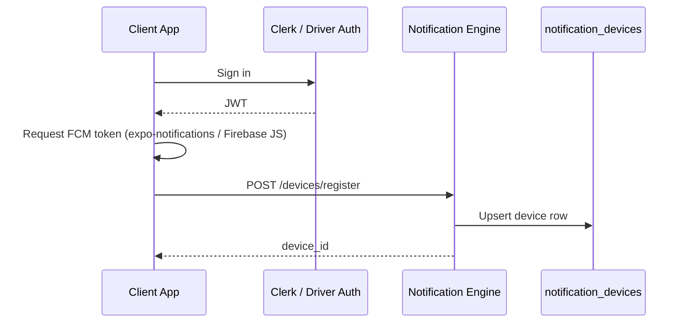

# Device Registration Flow

## Principle

Every authenticated client registers its FCM token with the Notification Engine. Tokens are **never** stored in ad-hoc JSON blobs on domain models.

## Endpoint

```
POST /v1/notifications/devices/register
Authorization: Bearer <Clerk JWT | Driver JWT>
```

### Request Body

```json
{
  "fcm_token": "ExponentPushToken[…] or FCM web token",
  "platform": "android | ios | web",
  "device_name": "iPhone 15 Pro",
  "app_version": "1.2.0",
  "os_version": "iOS 18.2",
  "language": "en-CA",
  "timezone": "America/Toronto",
  "notification_permission": "granted | denied | default"
}
```

### Response

```json
{
  "device_id": "uuid",
  "registered": true,
  "active_devices": 2
}
```

## Flow



## User Resolution

| Portal   | Principal           | `user_role` | `user_id`      |
| -------- | ------------------- | ----------- | -------------- |
| Admin    | Clerk + admin_users | `admin`     | admin_users.id |
| Merchant | Clerk + merchant    | `merchant`  | merchant.id    |
| Customer | Clerk / guest       | `customer`  | customer.id    |
| Driver   | Driver JWT          | `driver`    | drivers.id     |

## Multi-Device

- One user may register Android phone, iPhone, web browser, tablet
- Each row is unique on `(user_role, user_id, fcm_token)`
- Max 10 active devices per user (oldest deactivated)

## Logout / Revoke

```
DELETE /v1/notifications/devices/{device_id}
POST /v1/notifications/devices/revoke-all
```

## Invalid Token Cleanup

When FCM returns `registration-token-not-registered`:

1. `FCMService` marks device `is_active=false`
2. Sets `invalidated_at` timestamp
3. Audit log entry

## Migration from Legacy

Driver tokens previously stored in `drivers.performance.push_devices` are migrated on next register; legacy path delegates to `DeviceService`.

## Client Requirements

| App             | Status    | Library                      |
| --------------- | --------- | ---------------------------- |
| Driver mobile   | Roadmap   | `expo-notifications`         |
| Admin portal    | Supported | Firebase JS + service worker |
| Merchant portal | Roadmap   | Firebase JS                  |
| Customer portal | Roadmap   | Firebase JS                  |
