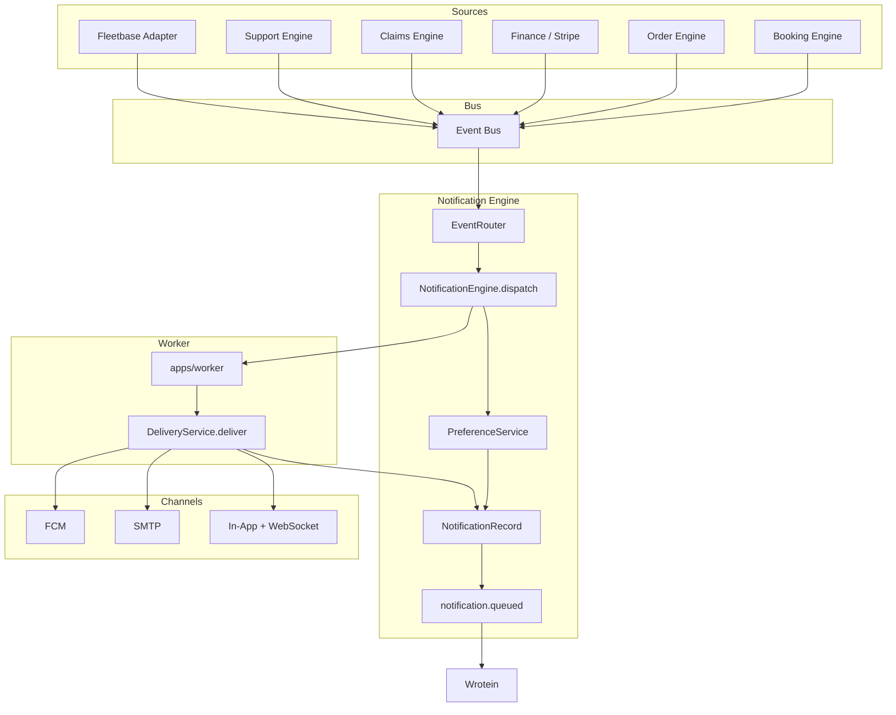

# Notification Delivery Flow

## End-to-End Flow



## Status Lifecycle

```
queued → sent → delivered → opened → clicked
         ↓
       failed → retry (exponential backoff) → dead_letter
         ↓
      expired
```

| Status        | Meaning                               |
| ------------- | ------------------------------------- |
| `queued`      | Record created, job enqueued          |
| `sent`        | Provider accepted (SMTP/FCM API 200)  |
| `delivered`   | FCM delivery receipt (when available) |
| `opened`      | User opened in-app / push tap         |
| `clicked`     | Deep link clicked                     |
| `failed`      | Delivery error                        |
| `expired`     | Max retries exceeded                  |
| `dead_letter` | Moved to DLQ                          |

## Retry Policy

| Setting                    | Default                            |
| -------------------------- | ---------------------------------- |
| `NOTIFICATION_MAX_RETRIES` | 5                                  |
| Base delay                 | 30s                                |
| Backoff                    | exponential (30s, 2m, 8m, 32m, 2h) |
| DLQ queue                  | `notifications_dlq`                |

Retry worker runs on `notifications_retry` queue.

## Worker Payload

```json
{
  "notification_id": "uuid",
  "channel": "push",
  "template": "driver_assigned",
  "recipient": "fcm-token-or-email",
  "recipient_type": "driver",
  "recipient_id": "driver-uuid",
  "context": { "order_number": "PC-1234", "title": "…", "body": "…" }
}
```

## In-App Realtime

1. `NotificationEngine` creates record with `channel=in_app`
2. `RealtimeHub.broadcast(user_role, user_id, notification)`
3. WebSocket clients at `WS /v1/notifications/ws` receive `{ type: "notification", data: {...} }`
4. Bell unread count updates instantly

## Audit

Every notification writes to `notification_records` with full lifecycle timestamps. Per-attempt traces in `notification_delivery_logs`.

## Architecture Rules

1. **No direct sends** from routers or adapters
2. **All paths** go through `NotificationEngine.dispatch()`
3. **FCM** only in `fcm_service.py`
4. **Recipients** resolved in `EventRouter` / `NotificationEngine`, not in source modules
