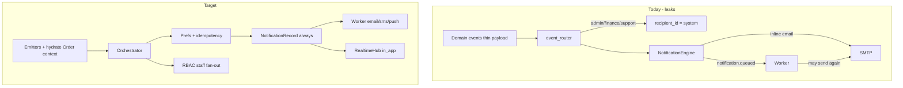

# Notification System — Detailed Upgrade Plan

**Type:** PLAN (execution SSOT)  
**Last verified:** 2026-08-07  
**Status:** Phase 3 polish shipped (quiet hours, fallback, receipts, aliases)  
**Related:** [NOTIFICATION_ARCHITECTURE.md](./NOTIFICATION_ARCHITECTURE.md) · [EXCEPTION_WORKFLOWS.md](../../EXCEPTION_WORKFLOWS.md)

---

## Verdict (from audit)

**Plumbing is real** (`notification_engine` → `NotificationRecord` → SMTP/FCM/in-app WS → worker). Trust fails on:

1. **Identity** — ops fan-out uses `recipient_id="system"` (staff never see alerts)
2. **Anemic event payloads** — missing `customer_id` / `merchant_id` / `email` → specs skipped
3. **Exception silence** — delay/failed/SLA promised in docs; Control Tower mostly uses poll toasts
4. **Double-send / retry gaps** — API can inline-email while worker also processes `notification.queued`

Settings → Channels staying **env-status-only** is correct (secrets in Doppler).

---

## Design principles

1. **Emit context, don’t guess** — lifecycle events carry `customer_id`, `merchant_id`, `driver_id`, `email`, `order_number`, `tracking_number`, `deep_link` (or router hydrates from Order).
2. **Real people, not `"system"`** — ops topics fan out to active `AdminUser`s by role/module.
3. **One delivery path** — API creates records + queues; worker delivers email/SMS/push (auth-critical mail may stay sync).
4. **Idempotent** — unique key per `(event_type, aggregate_id, template, channel, recipient)`.
5. **Exceptions are first-class** — delay / failed / SLA emit domain events the router maps.
6. **Preferences that bind** — merchant UI prefs must hit `PreferenceService`.
7. **Fleetbase-first for GPS** — notifications are PorterChain UX; live tracking stays Fleetbase.

---

## Current configuration (baseline)

| Channel                | Config                               | Reality                            |
| ---------------------- | ------------------------------------ | ---------------------------------- |
| Email                  | SMTP env (Mailpit local / Zoho prod) | Works when `smtp_host` set         |
| Push                   | Firebase / FCM env                   | Path exists; dry-run without creds |
| SMS                    | —                                    | Log-only (no provider)             |
| In-app                 | DB inbox + `WS /v1/notifications/ws` | Works for correct `recipient_id`   |
| Settings → Channels    | Status only                          | Correct                            |
| Admin `/notifications` | Dashboard, failed, retry             | Operational                        |
| Templates              | Code `TEMPLATES`                     | Not CMS-editable                   |
| Merchant prefs UI      | Merchant profile JSON                | **Not read** by engine             |

**Owner code**

| Layer     | Path                                                |
| --------- | --------------------------------------------------- |
| Engine    | `apps/api/src/porterchain_api/notification_engine/` |
| Router    | `.../event_router.py`                               |
| User API  | `apps/api/.../routers/notifications.py`             |
| Admin API | `apps/api/.../routers/notifications_admin.py`       |
| Worker    | `apps/worker/processors/notifications.py`           |
| Admin UI  | `apps/admin/src/app/(ops)/notifications/page.tsx`   |

---

## Target trigger matrix (after Phase 1)

| Event                                           | Customer            | Merchant       | Driver      | Ops                 |
| ----------------------------------------------- | ------------------- | -------------- | ----------- | ------------------- |
| `booking.confirmed`                             | email, push, in_app | in_app         | —           | in_app (staff)      |
| `order.driver_assigned`                         | push, in_app        | in_app         | push        | in_app              |
| Fleetbase status / pickup / transit / delivered | push, in_app        | in_app         | —           | in_app (key states) |
| `payment.failed`                                | email, in_app       | —              | —           | —                   |
| receipt / invoice                               | email               | email / in_app | —           | finance in_app      |
| `exception.opened` / delayed / `sla.breached`   | email, push         | in_app         | —           | in_app              |
| claim / support                                 | email               | —              | conditional | support in_app      |

---

## Phase 0 — Contract & inventory

**Goal:** Shared context contract + emitter list before changing fan-out.

### Work items

| ID   | Task                                      | Detail                                                                                  |
| ---- | ----------------------------------------- | --------------------------------------------------------------------------------------- |
| P0-1 | Add `NotificationContext`                 | New `notification_engine/context.py` — TypedDict/Pydantic with required/optional fields |
| P0-2 | Add `hydrate_order_context(db, order_id)` | Load order → customer/merchant/driver/emails/numbers/deep_links                         |
| P0-3 | Emit-site inventory                       | Grep/list every `emit_event` for booking/order/payment/claim/fleetbase/exception        |
| P0-4 | Update architecture doc                   | Refresh trigger matrix TODAY vs TARGET in `NOTIFICATION_ARCHITECTURE.md`                |

### Exit criteria

- Helper unit-tested with a sample order
- Inventory checklist attached to this plan (or PR description)

---

## Phase 1 — P0 trust (must ship first)

### 1A. Staff / finance / support fan-out

**Problem:** `event_router.py` uses `add(..., "admin"|"finance"|"support", "system")` — real staff bells stay empty.

**Implementation**

1. Add `resolve_staff_recipients(db, topic: Literal["ops","finance","support"])` in `principal.py` or `staff_fanout.py`.
2. Map topics → roles via existing RBAC / `MODULE_PERMISSIONS` (dispatch/operations, finance, support).
3. Replace every `"system"` in_app (and admin email-to-system) with a loop over active `AdminUser`s.
4. Cap fan-out (e.g. 50); skip `is_active=False`.
5. Tag records with `search_tags.fanout_topic` for audit.

**Tests**

- Unit: topic → expected roles
- Integration: `booking.confirmed` creates ≥1 in_app row per active admin; **zero** rows with `recipient_id="system"`

### 1B. Event payload enrichment

**Problem:** Thin payloads (e.g. `order.driver_assigned` ≈ `{driver_id}`; Fleetbase status without `customer_id`) skip customer/merchant specs.

**Implementation**

1. Patch emitters (minimum):
   - Assign driver / assign-batch (`operations_service.py`)
   - Booking confirmed / order booked (`confirmation_service.py` and peers)
   - Fleetbase webhook status (`webhook_processor.py` or equivalent)
   - Payment succeeded / receipt / invoice
   - Claim opened / support ticket
2. Router defense: if `order_id` present but `customer_id` missing → call `hydrate_order_context` before `_specs_for_event`.
3. Set `deep_link` on specs:

| Audience | Deep link                    |
| -------- | ---------------------------- |
| Customer | Public/customer track URL    |
| Merchant | `/orders/{id}`               |
| Driver   | Driver portal / app route    |
| Admin    | `/orders/{id}` or operations |

**Tests**

- Assign driver with hydrated order → customer + merchant + driver specs created
- Fleetbase status with linked order → customer push/in_app specs created

### 1C. Exception / delay / SLA → engine

**Problem:** Docs promise customer email/push; Control Tower uses `OpsAlertToast` only.

**Implementation**

1. Confirm/add catalog events: `exception.opened`, `exception.resolved`, `order.delayed`, `sla.breached` (reuse existing names if present).
2. Emit from control tower / exception create with hydrated context.
3. Router cases:
   - Customer: email + push + in_app
   - Merchant: in_app (+ email if address)
   - Ops: in_app via staff fan-out (1A)
4. Keep OpsAlertToast as UX sugar; engine is source of record.

**Tests**

- Creating an exception queues customer email (Mailpit) when SMTP configured + ops in_app for real admin

### 1D. Stop double email + idempotency

**Problem:** `engine.dispatch` inline-delivers email/SMS when `recipient_address` is set **and** emits `notification.queued`.

**Implementation**

1. Transactional path: create record `queued` → emit `notification.queued` only (no inline SMTP).
2. Document sync bypass for auth-critical mail (`staff_mail` / activate).
3. Idempotency: before insert, lookup `(event_type, correlation_id|aggregate_id, template_key, channel, recipient_type, recipient_id)`; on hit return existing.
4. Optional DB unique constraint / partial index if schema allows (Alembic).
5. Worker: no-op if status already `sent` / `delivered`.

**Tests**

- Single booking confirm → exactly one Mailpit message
- Re-dispatch same event/correlation → no second record (or same id returned)

### Phase 1 exit criteria

| Check                                                  | Pass |
| ------------------------------------------------------ | ---- |
| Admin bell shows lifecycle alert for real admin        | Yes  |
| driver_assigned creates customer notification specs    | Yes  |
| Fleetbase status can notify customer when order linked | Yes  |
| Exception → customer email queued + ops in_app         | Yes  |
| No duplicate booking confirm email                     | Yes  |

---

## Phase 2 — P1 product grade

| ID   | Work               | Detail                                                                      |
| ---- | ------------------ | --------------------------------------------------------------------------- |
| P1-1 | Preference binding | Merchant portal toggles → `PreferenceService`; customer prefs UI if missing |
| P1-2 | Defaults           | Transactional email/push ON; SMS OFF until provider; marketing OFF          |
| P1-3 | Retry sweeper      | Job: `next_retry_at <= now` → re-enqueue; cap then DLQ                      |
| P1-4 | Admin WS bell      | Replace/augment 45s poll with `WS /v1/notifications/ws`                     |
| P1-5 | SMS adapter        | Twilio/MessageBird behind `PORTERCHAIN_SMS_ENABLED`; Clerk stays OTP-only   |
| P1-6 | Send-test          | Admin “Send test” for `template_key` → Mailpit/email                        |

### Phase 2 exit criteria

- Toggling merchant email OFF blocks merchant booking email
- Failed notification auto-retries within 5–15 minutes
- Admin bell updates without full page refresh

---

## Phase 3 — P2 Silicon Valley polish

| Item                 | Notes                                                                                                       | Status   |
| -------------------- | ----------------------------------------------------------------------------------------------------------- | -------- |
| Quiet hours          | Device timezone + `notification_user_settings`; mutes push/SMS (not email/in_app); critical/security exempt | Done     |
| Channel fallback     | push fail → SMS → email when prefs/addresses allow                                                          | Done     |
| Delivery receipts    | Admin history “View” → delivery logs                                                                        | Done     |
| Editable templates   | Versioned later — not blocking reliability                                                                  | Deferred |
| Event name alignment | `merchant.invoice_generated` aliased to `merchant.billed` router path                                       | Done     |
| Retire parallel path | `porterchain_services.notifications` deprecated (warn + log)                                                | Done     |

---

## Implementation order (checklist)

1. [x] `NotificationContext` + `hydrate_order_context`
2. [x] Staff fan-out replace `"system"`
3. [x] Enrich top emitters + router hydrate fallback
4. [x] Exception events + router cases
5. [x] Remove inline transactional email; idempotency
6. [x] Unit tests (`test_notification_phase1.py` + matrix)
7. [x] Docs matrix update (`NOTIFICATION_ARCHITECTURE.md`)
8. [x] Phase 2: prefs bind, retry sweeper, admin WS, SMS flag, send-test
9. [x] Phase 3: quiet hours, fallback, receipts, event alias, deprecate legacy service

---

## Explicit non-goals

- Rebuilding live GPS / dispatch alerts inside Settings
- Storing Stripe/FCM/SMTP secrets in SystemConfig
- WhatsApp in Phase 1–2
- Full CMS template editor before P0 reliability
- Changing Stripe webhook/billing config

---

## Success metrics

| Metric                             | Target                                            |
| ---------------------------------- | ------------------------------------------------- |
| Ops in_app for `booking.confirmed` | ≥1 row per active dispatcher/admin (not `system`) |
| `driver_assigned` → customer spec  | 100% when order has `customer_id`                 |
| Mailpit duplicate booking emails   | 0 per single confirm                              |
| Exception → customer email queued  | Yes when SMTP configured                          |
| Failed queue auto-retry (Phase 2)  | Within 5–15 minutes                               |

---

## Key files to touch

| Area                 | Path                                                                     |
| -------------------- | ------------------------------------------------------------------------ |
| Router               | `apps/api/src/porterchain_api/notification_engine/event_router.py`       |
| Engine               | `apps/api/src/porterchain_api/notification_engine/engine.py`             |
| Context (new)        | `apps/api/src/porterchain_api/notification_engine/context.py`            |
| Fan-out (new/extend) | `apps/api/src/porterchain_api/notification_engine/principal.py`          |
| Delivery             | `apps/api/src/porterchain_api/notification_engine/delivery_service.py`   |
| Prefs                | `apps/api/src/porterchain_api/notification_engine/preference_service.py` |
| Assign emit          | `apps/api/src/porterchain_api/admin_engine/operations_service.py`        |
| Exceptions           | `apps/api/src/porterchain_api/admin_engine/control_tower/exceptions.py`  |
| Fleetbase WH         | `apps/api/src/porterchain_api/fleetbase_engine/` (webhook processor)     |
| Worker               | `apps/worker/processors/notifications.py`                                |
| Admin UI             | `apps/admin/src/app/(ops)/notifications/page.tsx`                        |
| Docs                 | `docs/notifications/NOTIFICATION_ARCHITECTURE.md`                        |

---

## Effort sketch

| Phase   | Scope                                     | Rough effort    |
| ------- | ----------------------------------------- | --------------- |
| Phase 0 | Contract + inventory                      | 0.5–1 day       |
| Phase 1 | Fan-out, hydrate, exceptions, idempotency | 3–5 days        |
| Phase 2 | Prefs, retry, WS, SMS flag, send-test     | 3–5 days        |
| Phase 3 | Quiet hours, fallback, receipts, CMS      | Later / backlog |

---

## How to execute

Say **execute Phase 1** (or Phase 0+1) to start implementation against this plan. Do not start Phase 2 until Phase 1 exit criteria pass.
